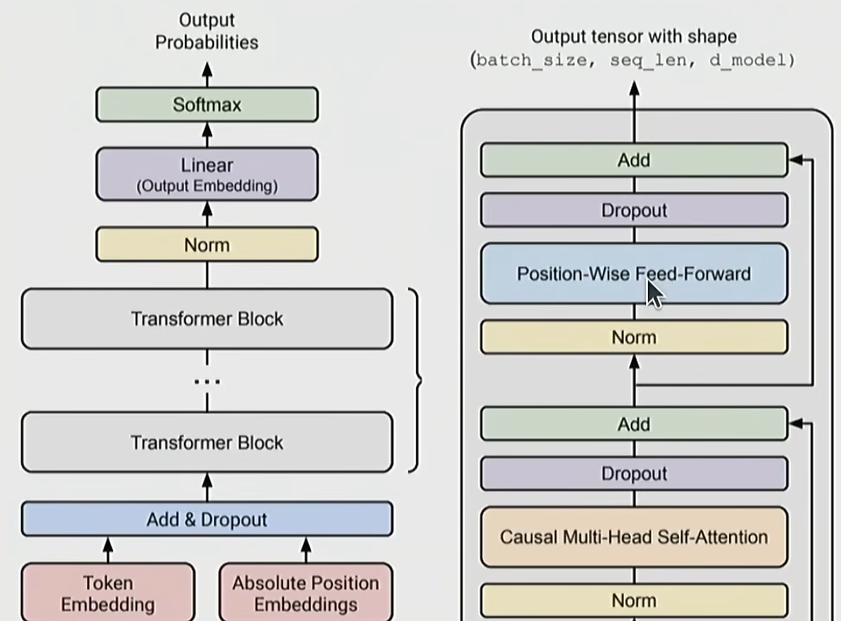
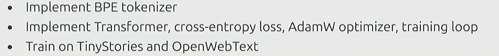
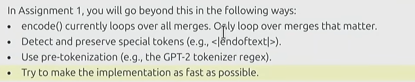

# CS 336 Lecture 1: 绪论与分词 (Introduction and Tokenization)

## 目录

- [1. 语言模型架构 (Architecture)](#1-语言模型架构-architecture)
- [2. 训练流程 (Training)](#2-训练流程-training)
- [3. 分词技术 (Tokenization)](#3-分词技术-tokenization)

## 1. 语言模型架构 (Architecture)

大语言模型（LLM）的性能不仅取决于规模，还取决于架构组件的选择。以下是当前主流架构的组成部分：

激活函数 (Activation Functions):

- **ReLU**: 传统激活函数。
- **SwiGLU**: 现代 Transformer（如 Llama）常用的门控激活函数，性能优于 ReLU。

位置编码 (Positional Encodings):

- **Sinusoidal**: 原始 Transformer 使用的正弦位置编码。
- **RoPE (Rotary Positional Embedding)**: 旋转位置嵌入，目前最流行的 position encoding，支持外推。

归一化层 (Normalization):

- **LayerNorm**: 标准归一化。
- **RMSNorm**: Root Mean Square Layer Normalization，计算更高效，被广泛采用。

归一化位置 (Placement of Norm):

- **Pre-norm**: 归一化在残差连接之前（更稳定，现代主流）。
- **Post-norm**: 归一化在残差连接之后（原始设计）。

多层感知机 (MLP):

- **Dense**: 稠密全连接层。
- **MoE (Mixture of Experts)**: 混合专家模型，通过稀疏激活提高参数量同时保持计算量可控。

注意力机制 (Attention):

- **Full Attention**: 全量注意力。
- **Sliding Window**: 滑动窗口注意力，减少计算复杂度。
- **Linear Attention**: 线性复杂度注意力。

低维注意力优化:

- **GQA (Grouped-Query Attention)**: 权衡速度与性能，缓存 KV 的折中方案。
- **MLA (Multi-head Latent Attention)**: DeepSeek 采用的低秩压缩 KV 缓存技术。

状态空间模型 (SSM):

- **Hyena**: 用于处理超长序列的非 Transformer 尝试。

## 2. 训练流程 (Training)

训练的稳定性和效率由优化器和超参数共同决定。

- **优化器 (Optimizer)**: AdamW (标配), Muon, SOAP。
- **学习率调度 (Learning Rate Schedule)**:
  - **Cosine**: 余弦退火调度。
  - **WSD (Warmup-Stable-Decay)**: 预热-稳定-衰减三段式。
- **批大小 (Batch Size)**: 寻找 **临界批大小 (Critical Batch Size)**，以平衡并行度与收敛效率。
- **正则化 (Regularization)**: Dropout (现代大模型用得较少), Weight Decay (权重衰减)。
- **超参数搜索**: 对 Number of heads (头数), Hidden dimension (隐藏层维度) 进行网格搜索。

## 3. 分词技术 (Tokenization)

分词是将原始字符转换为模型可理解的 Token (词元) 的过程。

常见的策略：

- **基于字节 (Byte-based)**: 粒度最细，词表小，但序列极长。
- **基于单词 (Word-based)**:
  - 缺点: 词表巨大、无法处理罕见词 (OOV 问题)、没有固定的词表大小。
- **子词分词 (Subword-level)**: 权衡方案，如 GPT-2 使用的 BPE (Byte-Pair Encoding)。

### BPE (Byte-Pair Encoding) 算法

核心思路 (Sketch):
1. 从每个字节作为一个 Token 开始。
2. 统计语料库中相邻 Token 对出现的频率。
3. 循环合并出现频率最高的 Token 对，形成新的 Token。
4. 稀有序列将由多个较短的 Token 表示。

BPE 示例：
首先按字分词，统计所有二元 Token 对频率，将最频繁的对合并（例如：i, t -> it）。此操作会将新词加入词表，逐步扩展 Vocabulary。

### 压缩比 (Compression Ratio)

Tokenization 的效率可以用压缩比来衡量：

$false\text{Compression Ratio} = \frac{\text{原始总字节数 (Bytes)}}{\text{分词后的 Token 数 (Tokens)}}$false

词表越大，通常压缩比越高，模型处理相同内容所需的序列长度就越短。

