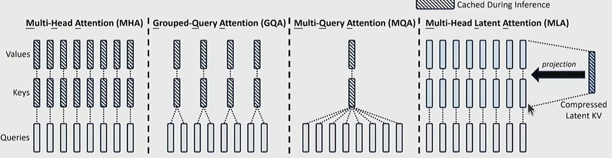

# Lecture 10 Inference

**核心命题**：对于给定的大模型，如何根据提示词（Prompts）高效地生成回复？ **训练与推理的根本差异**：训练是“一次性成本”，可以高度并行化（看到所有Token）；而推理是“持续性成本”，必须**自回归（逐个Token）顺序生成**，难以充分利用算力。

## Metric

- **TTFT (Time-to-first-token，首字延迟)**：用户等待第一个字符出现的时间。针对交互式应用非常关键。
- **Latency (延迟，seconds/token)**：生成每个 token 需要多少秒。决定了字符弹出的流畅度。
- **Throughput (吞吐量，tokens/second)**：服务器整体每秒能处理的 token 数。对于批处理（Batch processing）或系统成本极为重要。

**推测与权衡**： 较小的 Batch Size（批次大小）会有更好的 Latency（延迟低），但 Throughput 差；较大的 Batch Size 会有更好的 Throughput，但 Latency 会变差。

## Arithmetic Intensity and Memory resource counting 
### 2.1 为什么要计算“算术强度”？解决什么问题？

**问题**：GPU 有很强的计算能力（FLOPs），但也有内存读取带宽限制。如果数据搬运得太慢，GPU 算力再高也会闲置。 **指标引入**：**算术强度 (Arithmetic Intensity) = 浮点运算数 (FLOPs) / 传输的字节数 (Bytes)**。

- **计算受限 (Compute-limited)**：算术强度 > 硬件算术强度。这是**好现象**，说明 GPU 正在全力计算。
- **内存受限 (Memory-limited)**：算术强度 < 硬件算术强度。这是**坏现象**，说明 GPU 在干等数据从显存搬运过来。

### 2.2 基础矩阵乘法的内存计算步骤 (以 X * W 为例)

```
符号定义：
B: 批次大小 (Batch Size)
D: 隐藏层维度 (Hidden dimension)
F: MLP中的投影维度 (Up-projection dimension)

步骤与记账 (Accounting)：
1. 从显存(HBM)读取矩阵 X (B x D)           -> Bytes: 2 * B * D   (假设使用16位/2字节浮点数)
2. 从显存(HBM)读取权重 W (D x F)           -> Bytes: 2 * D * F
3. 计算 Y = X @ W                        -> FLOPs: 2 * B * D * F
4. 将结果 Y (B x F) 写回显存(HBM)          -> Bytes: 2 * B * F

总 FLOPs = 2 * B * D * F
总 Bytes = 2*B*D + 2*D*F + 2*B*F

算术强度 (Intensity) = FLOPs / Bytes
假设 B 远小于 D 和 F，化简后：算术强度 ≈ B
```

**结论**：如果 B（Batch Size）极大（例如 >295），我们就是“计算受限”；如果 B=1（每次只生成一个token的极端情况），算术强度极低（约为1），这就是**严重内存受限**。推理的生成阶段正是如此！

### 2.3 推理过程的内存与算力分析：Prefill vs Generation

推理被分为两个阶段：

1. **Prefill (预填充阶段)**：处理用户的 Prompt，可以像训练一样并行计算（此时生成序列长度 T = 历史长度 S）。
2. **Generation (生成阶段)**：一次只生成 1 个新 token（此时 T = 1）。

为了避免每次生成新 token 都要重算历史，我们引入了 **KV Cache**，将其缓存在显存中。以下是具体的计算细节：

```
符号定义补充：
S: 历史/上下文 token 数
T: 正在生成的 token 数
N: 注意力头数 (Query)
K: KV 注意力头数
H: 每个头的维度 (D = N*H)

【一、 MLP 层的计算分析】
步骤：
1. 读取 X (B x T x D)                        -> Bytes: 2 * B * T * D
2. 读取 Wup, Wgate, Wdown (各 D x F)          -> Bytes: 3 * (2 * D * F)
3. 计算 U = X @ Wup                          -> FLOPs: 2 * B * T * D * F
4. 写入 U 到 HBM                             -> Bytes: 2 * B * T * F
5. 计算 G = X @ Wgate                        -> FLOPs: 2 * B * T * D * F
6. 写入 G 到 HBM                             -> Bytes: 2 * B * T * F
7. 计算 Y = GeLU(G)*U @ Wdown                -> FLOPs: 2 * B * T * D * F
8. 写入 Y 到 HBM                             -> Bytes: 2 * B * T * D

化简后的算术强度 ≈ B * T
分析：
- Prefill阶段 (T很大)：算术强度高，属于“计算受限”(好)。
- Generation阶段 (T=1)：除非 B (并发请求数) 极大，否则依然偏向内存受限。

【二、 Attention (注意力) 层的计算分析】
步骤：
1. 读取 Q(B x T x D), K(B x S x D), V(B x S x D) -> Bytes: 2*B*T*D + 4*B*S*D
2. 计算 A = Q @ K^T                            -> FLOPs: 2 * B * S * T * D
3. 计算 Y = softmax(A) @ V                     -> FLOPs: 2 * B * S * T * D
4. 写入 Y (B x T x D) 到 HBM                   -> Bytes: 2 * B * T * D

化简后的算术强度 ≈ S * T / (S + T)
分析：
- Prefill阶段 (T=S)：算术强度 = S/2。通常很大，属于“计算受限”(好)。
- Generation阶段 (T=1)：算术强度 = S / (S + 1) < 1。属于严重的“内存受限”(极差)！

注意：在 Attention 层，算术强度与 B 无关！因为每个请求都有自己独立的 KV Cache，无法像共享 MLP 权重那样摊销内存读取成本。
```


## 有损优化 (Lossy Shortcuts)

由于 **Generation 阶段被内存（尤其是 KV Cache）严重限制**，我们需要减少显存读写，哪怕牺牲极小的一点点精度。

### 减少 KV Cache 体积 (解决 Attention 内存受限问题)



- **GQA (Grouped-Query Attention)**：将多个 Query 头分组，共享一组 K 和 V 头（例如 Llama 2 采用的 1:5 比例）。降低了 KV Cache 体积，使更大的 Batch Size 能够塞入显存。
- **MLA (Multi-head Latent Attention, DeepSeek v2 采用)**：将高维度的 KV 向量投影（压缩）到极低维度（如 16384 维压缩到 512 维）。
- **CLA (Cross-layer Attention)**：不仅仅跨头共享，甚至在**不同层(Layers)** 之间共享 KV Cache。
- **Local Attention (局部注意力)**：只关注局部的上下文历史，丢弃全局，这样 KV Cache 大小就与总序列长度无关了（常与全局注意力交替使用以保准精度）。

### 减少模型权重体积

- **Quantization (量化)**：降低数字精度。从 fp32/bf16 降低到 fp8、int8 甚至 int4。包含 LLM.int8() (处理离群值) 和 AWQ (激活感知量化，根据激活值动态保留重要权重的高精度)。
- **Model Pruning (模型剪枝)**：直接移除模型中不重要的层、注意力头或隐藏维度，然后再通过蒸馏（Distillation）修复精度。

### 替换 Transformer 架构

- **问题**：Transformer 的 Attention + 自回归机制天生就不适合推理（O(T)的KV Cache，O(T^3)的总复杂度）。
- **技术方案**：
  - **SSM (状态空间模型，如 Mamba, Jamba)**：使用固定大小的隐状态（O(1)）代替 KV Cache，极大提升长文本推理效率。
  - **Diffusion Models (扩散模型)**：非自回归生成，并行生成所有 token 并通过多次时间步迭代细化。

------

## 无损优化 (Lossless Shortcuts)

### Speculative Sampling (投机采样)

- **问题**：大模型生成 token 太慢了（因为是自回归且内存受限），但判断/验证一串 token 是否正确却非常快（并行计算，计算受限）。
- **技术方案**：
  - 找一个非常小的、便宜的“草稿模型” (Draft Model，如 8B) 快速生成几个猜测的 token。
  - 用庞大的“目标模型” (Target Model，如 70B) 一次性并行评估这些猜测的 token。
  - 基于修改后的拒绝采样（Rejection Sampling）算法决定是否接受。数学上保证最终输出严格等价于目标模型自身的输出（无损）。

------

## 应对动态负载与系统的技术 (Handling Dynamic Workloads)

实际的线上流量（Live traffic）并不像我们在公式里假设的那样完美。

### Continuous Batching (连续批处理/迭代级调度)

- **问题**：请求在不同时间到达，且生成长度不同（变成了一个不规则的参差不齐的数组）。如果强行等待凑齐一个 Batch，先到的请求就会被严重延迟。
- **技术方案**：不在 Request 级别做批处理，而是在 Iteration（步/Token）级别做批处理。新请求一到达就立刻插进当前正在生成的 Batch 中（Selective Batching）。

### PagedAttention (分页注意力, vLLM的核心)

- **问题**：按传统方式，一开始就需要给 KV Cache 预先分配一大块连续的显存（基于 Max Length）。结果很多人话没说完就停了（内部碎片），或者由于预留块导致显存中间千疮百孔（外部碎片），就像早期操作系统的内存或硬盘碎片一样。极大浪费了极其宝贵的 KV Cache 空间。
- **技术方案**：借鉴操作系统的**虚拟内存分页机制 (Paging)**。
  - 将一个序列的 KV Cache 分割成非连续的 **Blocks (块)**。
  - 不仅消除了碎片，还允许多个请求（如共享的 System Prompt、同一个 Prompt 生成多个候选回答）在 Block 层面实现 **Copy-on-write (写时复制)**，极大节省了显存，成倍提升了系统的并发能力（Throughput）。