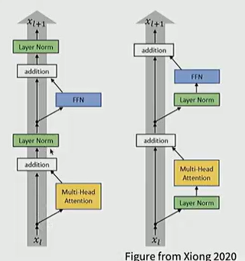
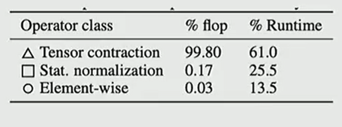
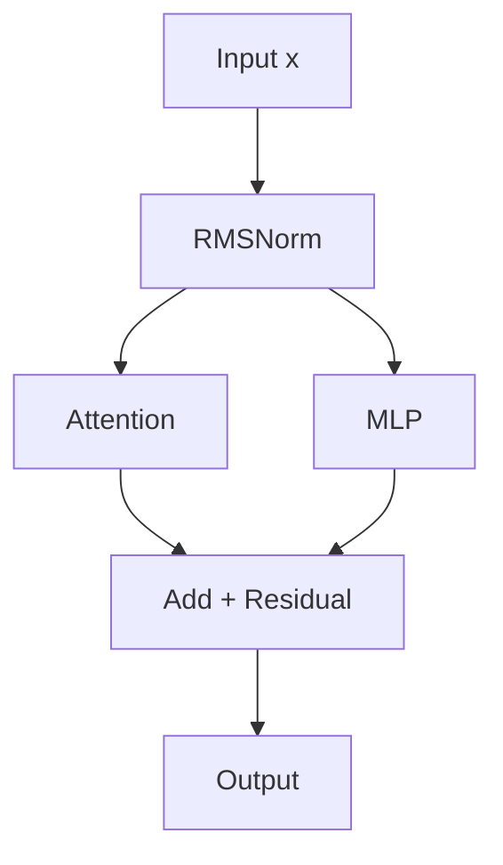
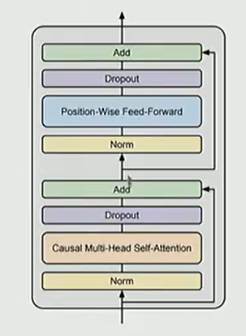
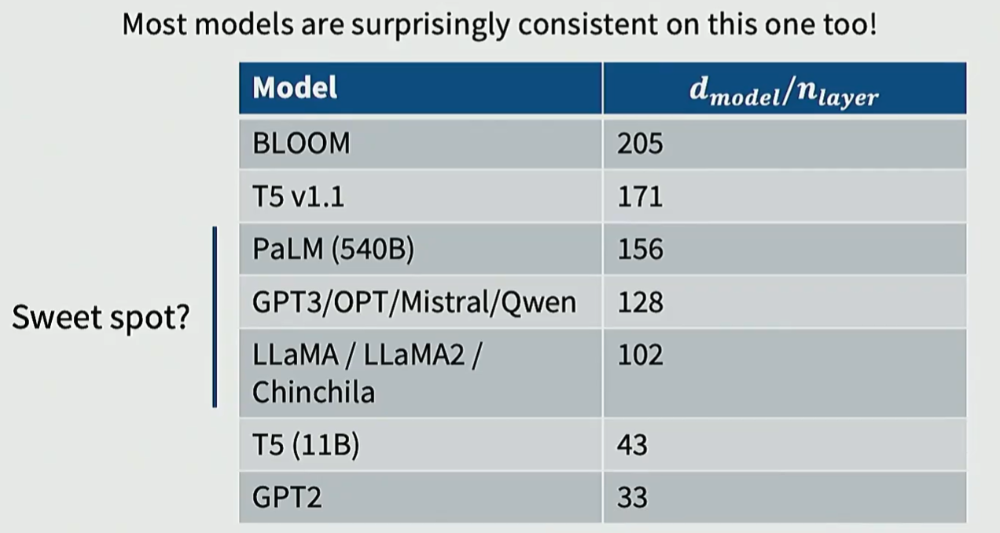
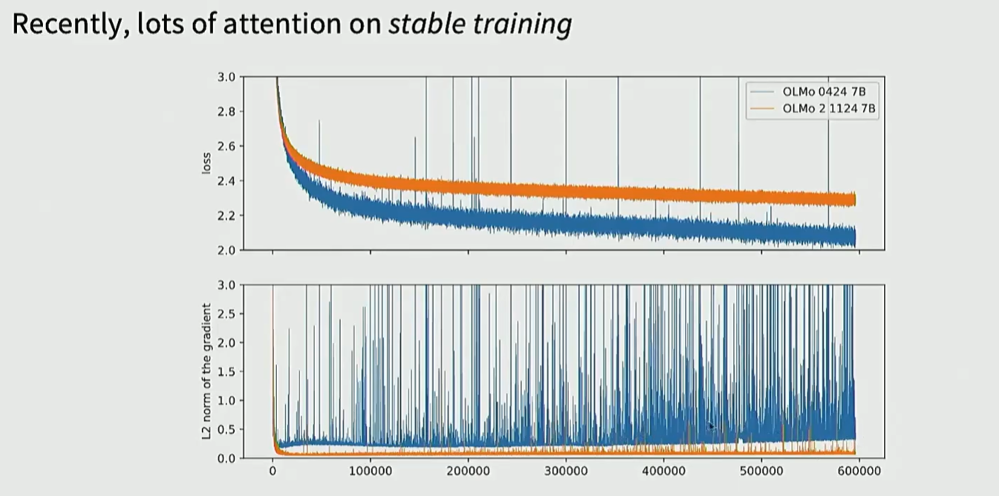

# CS 336 Lecture 3: 架构与超参数 (Architecture and Hyperparameters)

## 归一化与层结构 (Normalization and Layers)

### Pre-norm vs Post-norm

在深层 Transformer 训练中，归一化层的位置直接影响梯度的稳定性。

- **Post-norm**: 原始 Transformer 设计，Norm 置于残差连接之后。
- **Pre-norm**: 现代 LLM (Llama, GPT-3) 的标配，Norm 置于残差分支起始。

> [!IMPORTANT] 
> **稳定性差异**：Pre-norm 允许梯度更直接地通过恒等路径（Identity Path）传播，显著提高了训练的鲁棒性，减少了对精细 Learning Rate Warmup 的依赖。

### LayerNorm vs RMSNorm

- **LayerNorm**: 包含均值中心化和方差缩放。
- **RMSNorm**: 仅保留均方根缩放，不计算均值偏移。

> [!TIP]
> **效率优势**：RMSNorm 减少了约 40% 的归一化计算量，且因为去除了均值计算，减少了同步和数据移动开销。现代模型通常采用 **Bias-free** 架构，即移除所有线性层和 Norm 层的偏置项（$\beta$）。

## 激活函数演进 (Activation Functions)

### GELU 与门控机制

**GELU (Gaussian Error Linear Unit)** 相比 ReLU 在 0 附近更加平滑，能够提供更好的非线性表达。

$$\text{GeLU}(x) := x \Phi(x)$$

### SwiGLU 的崛起

现代大模型（如 Llama 系列）广泛采用门控线性单元（GLU）的变体。

| 激活函数   | 公式定义                             | 备注                     |
| ---------- | ------------------------------------ | ------------------------ |
| **SwiGLU** | $(\text{Swish}_1(xW) \otimes xV)W_2$ | **Llama 标配**，性能最优 |
| **GeGLU**  | $(\text{GELU}(xW) \otimes xV)W_2$    | 早期被广泛探索           |

> [!IMPORTANT]
> **计算代价**：使用 GLU 变体时，通常需要将 FFN 的隐藏层维度进行调整（如缩小为原来的 2/3），以保持与普通 ReLU FFN 相同的总参数量 and 计算量。

## 位置编码与层排列

### 串联与并联层 (Serial vs Parallel)

为了进一步提升硬件利用率，一些模型开始尝试并联结构：

- **Parallel Layers**: GPT-J 和 PaLM 采用，Attention 和 MLP 同时计算，减少串行等待。

### 位置嵌入 (Positional Embeddings)

- **Absolute**: 绝对位置编码。
- **RoPE (Rotary Positional Embedding)**：通过旋转矩阵将位置信息注入。具备良好的**相对位置感应**和**长度外推性**。

## Part 4: 超参数配置与缩放定律 (Hyperparameters)

### 维度配比与头数

- **FFN Expansion**: 通常 $d_{ff} = 4d_{model}$。
- **Vocab Size**: 随语言数量增加而增大，通常在 32k - 128k 之间。

### 深度与宽度的权衡 (Aspect Ratio)

> [!IMPORTANT] 
> **深度 vs 宽度**：Scaling Law 研究表明，固定计算量下，模型深度和宽度的比例应保持相对稳定。
>
> - 增加深度通常比增加宽度带来更持久的 Loss 下降，但会增加推理延迟和优化难度。

## 训练稳定性技巧

### 避免 Spikes (训练崩溃)

当模型规模扩大时，训练容易出现不稳定的“尖峰”（Loss Spikes）。

> [!WARNING]
> **风险因素**：Softmax 后的值过大、权重初始化不当、或者混合精度训练中的溢出都是潜在诱因。

- **权重衰减 (Weight Decay)**：现代模型依然使用，它能抑制权重过快增长，维持模型的动态范围。
- **Softmax Variance**: 控制 Attention 分数的缩放比例（$1/\sqrt{d_k}$）是维持稳定性的关键。
