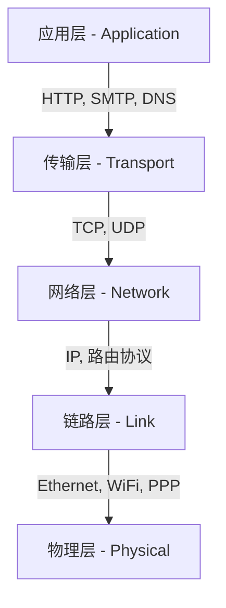

# 第一章：计算机网络和因特网

## 1.1 什么是因特网？

### 1.1.1 “螺母和螺栓”视角 (Nuts and Bolts view)
*   **节点 (Nodes):** 数十亿台互联的计算设备，称为**主机 (hosts)** 或**终端系统 (end systems)**。
*   **通信链路 (Communication links):** 光纤、铜线、无线电、卫星等。
    *   **传输速率:** 链路的**带宽 (bandwidth)**，衡量比特传输的速度。
*   **分组交换 (Packet switching):** 转发数据包（data packets）的设备。
    *   **路由器 (Routers)** 和 **交换机 (Switches)**。
*   **协议 (Protocols):** 控制消息的发送与接收。例如：HTTP, TCP, IP, WiFi, 4G, Ethernet。
*   **因特网标准:**
    *   **IETF (Internet Engineering Task Force):** 互联网工程任务组。
    *   **RFC (Request for Comments):** 请求评议文档。

### 1.1.2 “服务”视角 (Service view)
*   **为应用程序提供服务的基础设施:** Web, 流媒体视频, 电子邮件, 游戏, 电子商务, 社交媒体等。
*   **为分布式应用程序提供编程接口 (API):** 允许应用程序“连接”到互联网传输服务，类似于邮政服务。

### 1.1.3 什么是协议？
*   **定义:** 协议定义了两个或多个通信实体之间交换报文的**格式**、**顺序**，以及在报文传输/接收或其他事件方面所采取的**行动**。

---

## 1.2 网络边缘 (Network Edge)

*   **端系统 (End Systems):** 运行应用程序的主机（如客户端、服务器）。服务器通常位于大型**数据中心**中。
*   **接入网络 (Access Networks):** 将端系统连接到其**边缘路由器 (edge router)** 的物理链路。
    *   **住宅接入:** DSL (数字用户线), 电缆 (HFC), FTTP (光纤到户)。
    *   **机构接入 (学校、公司):** 以太网 (Ethernet)。
    *   **移动接入:** WiFi, 4G/5G。

### 1.2.1 物理介质 (Physical Media)
*   **引导型介质 (Guided media):** 信号沿固体介质传播（双绞线、同轴电缆、光纤）。
*   **非引导型介质 (Unguided media):** 信号在空间中自由传播（无线电、卫星）。

---

## 1.3 网络核心 (Network Core)

网络核心是由互联路由组成的网状网。其主要功能是**分组交换**。

### 1.3.1 分组交换 (Packet Switching)
*   **存储转发 (Store-and-forward):** 路由器必须在转发某个分组的第一个比特之前，完整地接收该分组。
    *   **传输延迟:** 发送一个 $L$ 位的分组，链路速率为 $R$ bps，则传输延迟时间为 $L/R$。
*   **排队延迟与丢包:** 如果分组到达速率超过链路输出速率，分组将进入**队列**等待。如果路由器缓冲区已满，则会发生**丢包 (packet loss)**。

### 1.3.2 转发 vs. 路由
*   **转发 (Forwarding):** 将分组从路由器的输入链路转移到适当的输出链路（本地动作）。
*   **路由 (Routing):** 确定分组从源到目的地的路径（全局动作，由路由算法决定）。

### 1.3.3 电路交换 (Circuit Switching)
*   端到端资源被分配给源和目的地之间的通信，资源是**独占**的。
*   **方法:** 频分复用 (FDM) 或 时分复用 (TDM)。
*   **对比:** 分组交换允许更多用户使用网络，更适合突发数据，但可能产生拥塞。

---

## 1.4 分组交换网中的延迟、丢包和吞吐量

### 1.4.1 四种延迟来源
1.  **节点处理时延 (Nodal Processing Delay):** 检查位错误、确定输出链路，通常 $< \mu s$。
2.  **排队时延 (Queueing Delay):** 在输出链路等待传输的时间，取决于拥塞程度。
3.  **传输时延 (Transmission Delay):** $d_{trans} = L/R$ (L: 分组长度, R: 链路带宽)。
4.  **传播时延 (Propagation Delay):** $d_{prop} = d/s$ (d: 链路距离, s: 传播速度 $\approx 2 \times 10^8 m/s$)。

### 1.4.2 流量强度 (Traffic Intensity)
*   流量强度 $I = La/R$ (a: 分组到达率)。
    *   $I \approx 0$: 平均排队时延小。
    *   $I \to 1$: 排队时延迅速增大。
    *   $I > 1$: 缓冲区溢出，延迟趋于无穷大，发生丢包。

---

## 1.5 协议层及其服务模型

### 1.5.1 分层架构
协议分层允许识别系统各部分之间的关系，并简化维护。

#### TCP/IP 协议栈 (5层模型)



1.  **应用层 (Application):** 支持网络应用 (HTTP, SMTP, DNS)。
2.  **传输层 (Transport):** 进程间的数据传输 (TCP, UDP)。
3.  **网络层 (Network):** 数据报的路由 (IP, 路由协议)。
4.  **链路层 (Link):** 相邻网络单元之间的数据传输 (Ethernet, WiFi, PPP)。
5.  **物理层 (Physical):** 在链路上通过物理信号传输比特。

#### ISO/OSI 参考模型 (7层模型)
*   比特流通过物理信号传输。
*   比 TCP/IP 多出：**表示层** (加密、压缩、数据解释) 和 **会话层** (同步、检查点)。

### 1.5.2 封装 (Encapsulation)

在数据向下传输的过程中，每一层都会添加特定的头部信息（Header）：

```mermaid
sequenceDiagram
    participant App as "应用层 (Message M)"
    participant Trans as "传输层 (Segment Ht|M)"
    participant Net as "网络层 (Datagram Hn|Ht|M)"
    participant Link as "链路层 (Frame Hl|Hn|Ht|M)"
    participant Phys as "物理层 (Bits)"

    App->>Trans: 封装
    Trans->>Net: 封装
    Net->>Link: 封装
    Link->>Phys: 转换成比特流
```

*   应用层报文 (Message) $\to$ 传输层报文段 (Segment) $\to$ 网络层数据报 (Datagram) $\to$ 链路层帧 (Frame)。

---

## 1.6 网络安全
*   **安全威胁:** 分组嗅探 (Sniffing), IP 欺骗 (Spoofing), 拒绝服务攻击 (DoS)。
*   **防御机制:** 身份验证、机密性（加密）、完整性检查、防火墙。

---

## 1.7 互联网发展史
*   **1961-1972:** 早期分组交换原理研究 (ARPAnet)。
*   **1972-1980:** 网络互联 (TCP/IP 诞生)。
*   **1980-1990:** 新协议出现 (SMTP, DNS, FTP, TCP拥塞控制)。
*   **1990-2000s:** 商业化、Web出现。
*   **2005-至今:** 宽带普及、移动网络 (4G/5G)、云计算、SDN。
