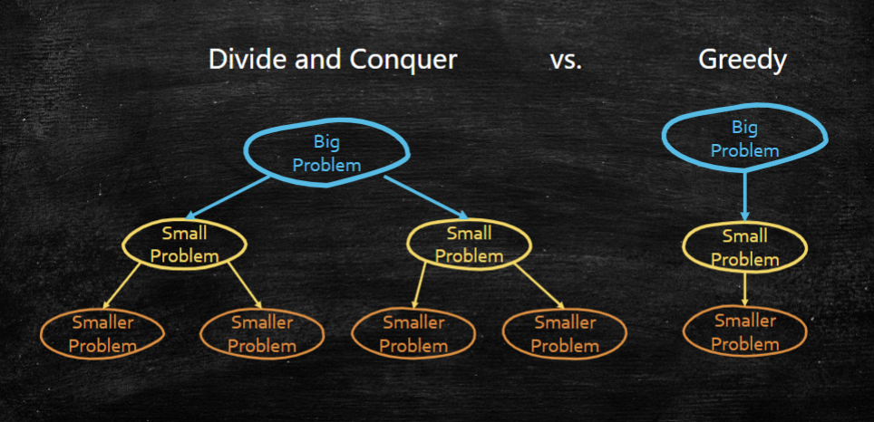
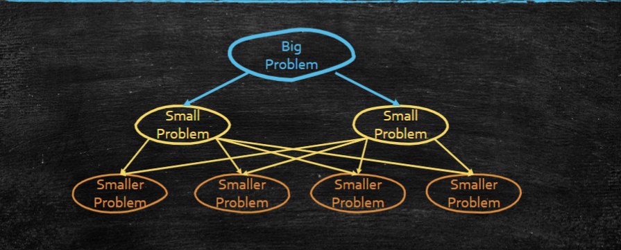
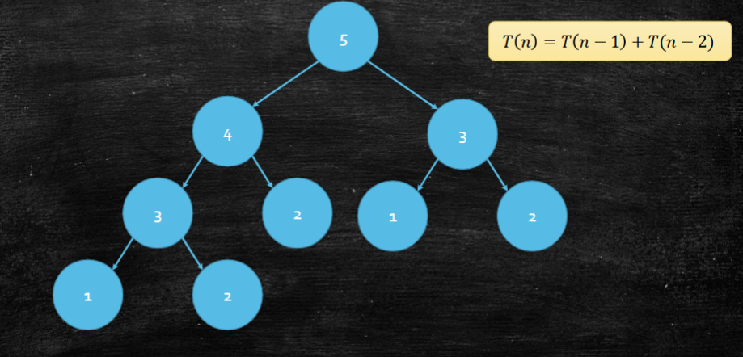
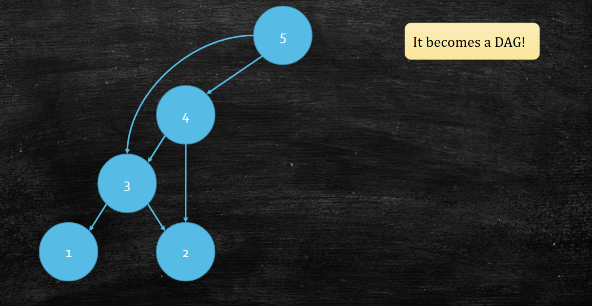
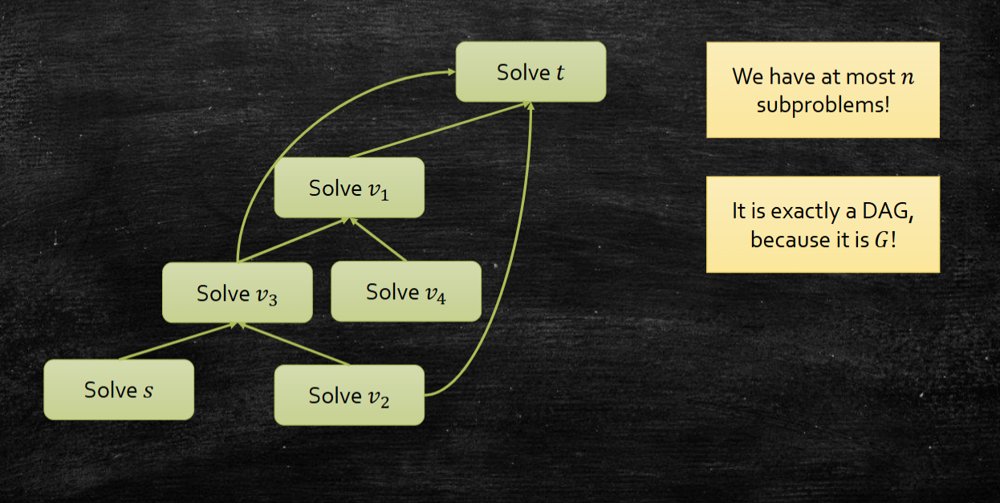

# Dynamic programming



## Base case: Fibonacci recursion

动态规划最基本的思路：**记忆化搜索**， 重复的子问题将结果存储起来，避免重复计算。Fibonacci递归优化之后：


## Guideline for DP design
根据上面的子问题记忆化优化之后，我们可看到，DP的流程已经被简化成了一个DAG，接下来只需要将边逆向，按照拓扑序从小问题开始计算即可。
```
1. 设计 递归 算法
2. 合并相同子问题
3. 得到合并后得到的DAG， 根据拓扑序计算子问题
```

## Shortest Path in DAG

递归描述
$$
dist[t] = min_{v}{dist[v] + d(v,t)}
$$


```text
// Input: DAG G = (V, E), source s, edge weight w(u, v)
// Output: dist[v] = shortest distance from s to v
Function DAG_Shortest_Path(G, s):
    order = TopologicalSort(G)
    
    for each v in V:
        dist[v] = infinity
        pre[v] = NIL
    dist[s] = 0
    
    for each u in order:
        if dist[u] == infinity:
            continue
        for each edge (u, v) in E:
            if dist[u] + w(u, v) < dist[v]:
                dist[v] = dist[u] + w(u, v)
                pre[v] = u
                
    return dist, pre
```

这里的 DP 状态就是 `dist[v]`。由于图本身是 DAG，拓扑序保证在处理一条边 $(u,v)$ 时，`dist[u]` 已经是最终值，所以每条边只需要被松弛一次。

**Time Complexity**: $O(|V|+|E|)$。

## Longest increasing subsequence 最长上升子序列
**Input**: a sequence $a_1, a_2, a_3, ...$

**Output**: the longest increasing subsequence (LIS)

$$
a_{i_1} < a_{i_2} < \cdots < a_{i_k}
\quad \text{and} \quad
i_1 < i_2 < \cdots < i_k
$$

递归角度：先枚举 LIS 的最后一个元素。如果 LIS 以 $a_i$ 结尾，那么它前面的元素只能来自 $a_j$，其中 $j<i$ 且 $a_j<a_i$。

定义状态：

$$
LIS[i] = \text{the length of the longest increasing subsequence ended by } a_i
$$

为了统一边界，可以加入一个虚拟起点：

$$
a_0 = -\infty,\quad LIS[0] = 0
$$

递推式：

$$
LIS[i] = 1 + \max_{\substack{0 \le j < i \\ a_j < a_i}} LIS[j]
$$

最终答案：

$$
\max_{1 \le i \le n} LIS[i]
$$

也可以把它看成 DAG 上的最长路：如果 $j<i$ 且 $a_j<a_i$，就连一条边 $a_j \to a_i$。因为所有边都从小下标指向大下标，所以 $1,2,\dots,n$ 本身就是拓扑序。

```text
// Input: sequence a[1..n]
// Output: length of the longest increasing subsequence
Function LIS(a):
    a[0] = -infinity
    lis[0] = 0
    
    for i from 1 to n:
        lis[i] = 1
        pre[i] = NIL
        for j from 0 to i - 1:
            if a[j] < a[i] and lis[j] + 1 > lis[i]:
                lis[i] = lis[j] + 1
                pre[i] = j
                
    ans = max_{1 <= i <= n} lis[i]
    return ans, pre
```

**Time Complexity**: $O(n^2)$。外层枚举终点 $i$，内层枚举所有可能前驱 $j<i$。

## Edit Distance
How many operations are needed to change one string to the other?
**Allowed operations:**
- insertion
- deletion
- replacement

可以写成等价操作：
- alignment: 插入空格使得两个string长度一样
- insertion: 将空格处写成character
- deletion: 将char写成空格
- replacement: 重写char

设两个字符串分别为 $X=x_1,x_2,\dots,x_m$ 和 $Y=y_1,y_2,\dots,y_n$。

定义状态：
$$
ED[i][j] = \text{the edit distance between } X[1..i] \text{ and } Y[1..j]
$$

递推时只看最佳 alignment 的最后一列，有三种情况：

$$
ED[i][j] =
\min
\begin{cases}
ED[i-1][j-1] + \mathbf{1}_{x_i \neq y_j} & \text{match / replacement}\\
ED[i][j-1] + 1 & \text{insertion}\\
ED[i-1][j] + 1 & \text{deletion}
\end{cases}
$$

```text
// Input: strings X[1..m], Y[1..n]
// Output: edit distance between X and Y
Function Edit_Distance(X, Y):
    m = length(X)
    n = length(Y)
    
    for i from 0 to m:
        ED[i][0] = i
    for j from 0 to n:
        ED[0][j] = j
        
    for i from 1 to m:
        for j from 1 to n:
            replace = ED[i - 1][j - 1]
            if X[i] != Y[j]:
                replace = replace + 1
                
            insert = ED[i][j - 1] + 1
            delete = ED[i - 1][j] + 1
            ED[i][j] = min(replace, insert, delete)
            
    return ED[m][n]
```

表格从左上到右下填，等价于在 `ED[i][j]` 的子问题 DAG 上按拓扑序计算。

**Time Complexity**: $O(mn)$。如果只需要距离值，可以只保留当前行和上一行，把空间复杂度降到 $O(n)$。
