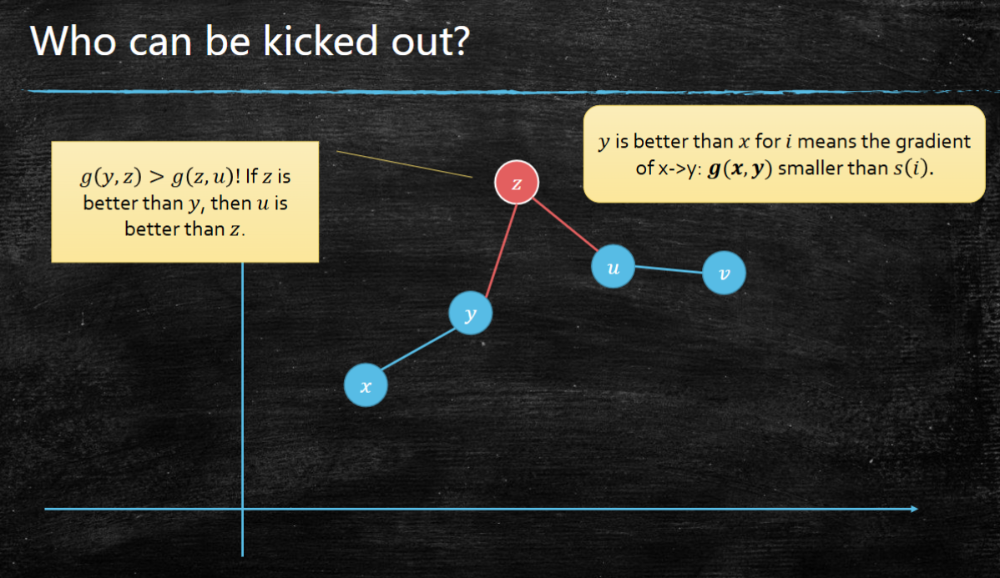

<NoteVisual topic="manufacturing-dp" />

## Minimize Manufacturing Cost

Input: a sequence of items with cost $a_1,a_2,\dots,a_n$.

Operation:

- `man(l, r)`: manufacture items from $l$ to $r$ in one batch.
- Batch cost:

$$
cost(l,r)=C+\left(\sum_{k=l}^{r}a_k\right)^2
$$

Goal: manufacture all items with minimum total cost.

### Basic DP

Let

$$
s(i)=\sum_{k=1}^{i}a_k,\quad s(0)=0
$$

and let $f[i]$ be the minimum cost for manufacturing item $1$ to item $i$.

If the last batch is $(j+1,\dots,i)$, then the previous items $1,\dots,j$ have already been manufactured with cost $f[j]$.

So:

$$
f[0]=0
$$

$$
f[i]=\min_{0\le j<i}\left\{f[j]+C+(s(i)-s(j))^2\right\}
$$

The direct DP enumerates every $j<i$ for each $i$, so the time complexity is:

$$
O(n^2)
$$

### Why this case needs optimization

The slides compare three cost functions:

1. $C+\left(\sum a_i\right)^2$
2. $C+\sum a_i$
3. $\left(\sum a_i\right)^2$, namely $C=0$

Only the first one is interesting.

- If the cost is $C+\sum a_i$, the sum of all $a_i$ is fixed, so when $C>0$ we simply use one batch.
- If $C=0$ and all $a_i\ge 0$, splitting is always no worse because $(x+y)^2\ge x^2+y^2$.
- When both $C$ and the square term exist, there is a trade-off: fewer batches save fixed cost $C$, but larger batches increase the square term.

### Math Time

For fixed $i$, compare two possible last split points $x<y<i$.

$y$ is better than $x$ when:

$$
f[x]+C+(s(i)-s(x))^2 > f[y]+C+(s(i)-s(y))^2
$$

Cancel $C$ and expand:

$$
f[x]-f[y] > (s(i)-s(y))^2-(s(i)-s(x))^2
$$

$$
f[x]-f[y] > s(y)^2-s(x)^2-2s(i)(s(y)-s(x))
$$

Move terms:

$$
\frac{f[y]+s(y)^2-f[x]-s(x)^2}{2(s(y)-s(x))}<s(i)
$$

Define:

$$
g(x,y)=\frac{f[y]+s(y)^2-f[x]-s(x)^2}{2(s(y)-s(x))}
$$

Then:

$$
y\text{ is better than }x \Longleftrightarrow g(x,y)<s(i)
$$

Intuition: view each split point $j$ as a point

$$
P_j=(2s(j),\ f[j]+s(j)^2)
$$

Then $g(x,y)$ is the slope between $P_x$ and $P_y$. We only need candidates on the lower convex hull.

### Convex Hull Maintenance

Maintain a deque of candidate split points:

$$
j_1,j_2,\dots,j_m
$$

The deque keeps useful candidates only.



#### Query $f[i]$

Since $s(i)$ is non-decreasing when $a_i\ge 0$, the best candidate also moves monotonically from left to right.

While the second candidate is already better than the first:

$$
g(j_1,j_2)\le s(i)
$$

pop $j_1$ from the front.

After this process, $j_1$ is the best split point for $i$:

$$
f[i]=f[j_1]+C+(s(i)-s(j_1))^2
$$

#### Insert $i$

After computing $f[i]$, insert $i$ into the convex hull.

Suppose the current last two candidates are $j_{m-1}$ and $j_m$. If

$$
g(j_{m-1},j_m)\ge g(j_m,i)
$$

then $j_m$ is useless: once $j_m$ becomes better than $j_{m-1}$, the new point $i$ is already better than $j_m$. So pop $j_m$ from the back.

Repeat this until the slopes are increasing, then push $i$.

### Algorithm

```text
s[0] = 0
for i = 1 to n:
    s[i] = s[i - 1] + a[i]

f[0] = 0
deque = [0]

for i = 1 to n:
    while deque has at least 2 elements
          and g(deque[0], deque[1]) <= s[i]:
        pop front

    j = deque[0]
    f[i] = f[j] + C + (s[i] - s[j])^2

    while deque has at least 2 elements
          and g(deque[-2], deque[-1]) >= g(deque[-1], i):
        pop back

    push back i

answer = f[n]
```

### Running Time

Each index is:

- inserted once,
- popped from the front at most once,
- popped from the back at most once.

So the total amortized time is:

$$
O(n)
$$

The space complexity is:

$$
O(n)
$$

## Bellman-Ford as DP

The DP guideline for graph problems is still the same:

1. Define subproblems.
2. Check the DAG structure and find a topological order.
3. Solve and store subproblems in that order.

Bellman-Ford can be understood as a DP on the number of edges used in the path.

Let

$$
dist[k,v]
$$

be the shortest distance from source $s$ to vertex $v$ among all paths using at most $k$ edges.

Initialization:

$$
dist[0,s]=0
$$

$$
dist[0,x]=+\infty\quad (x\ne s)
$$

Transition:

$$
dist[k,v]=\min\left\{
dist[k-1,v],
\min_{(u,v)\in E}\{dist[k-1,u]+w(u,v)\}
\right\}
$$

Interpretation:

- Case 1: the best path to $v$ uses at most $k-1$ edges.
- Case 2: the best path to $v$ uses one last edge $(u,v)$ after a path from $s$ to $u$ using at most $k-1$ edges.

After $k$ rounds, $dist[k,v]$ is the shortest distance among all paths using at most $k$ edges.

If the graph has no negative cycle, every shortest path can be chosen as a simple path, so it uses at most $|V|-1$ edges. Therefore:

$$
dist[|V|-1,v]
$$

is the final shortest distance.

If one more round still improves some distance:

$$
dist[|V|,v]<dist[|V|-1,v]
$$

then there is a negative cycle reachable from the source.

The running time is:

$$
O(|V||E|)
$$

With rolling arrays, the space can be reduced to:

$$
O(|V|)
$$

## Extending Bellman-Ford to All-Pairs Shortest Path

All-pairs shortest path asks for:

$$
dist(u,v)
$$

for every ordered pair of vertices $(u,v)$.

A naive plan is to run Bellman-Ford once from every source:

$$
O(|V|^2|E|)
$$

### Natural Generalization

A direct extension of the Bellman-Ford state is:

$$
dist[k,u,v]
$$

meaning the shortest distance from $u$ to $v$ among all paths using at most $k$ edges.

Transition:

$$
dist[k,u,v]=\min\left\{
dist[k-1,u,v],
\min_{(x,v)\in E}\{dist[k-1,u,x]+w(x,v)\}
\right\}
$$

This is correct, but it does not really improve the algorithm.

Reason:

- For each fixed start vertex $u$, the recurrence is just Bellman-Ford from $u$.
- Different start vertices are independent.
- In each round, every edge can update distances for every possible start vertex.

So the time is still:

$$
O(|V|^2|E|)
$$

This is the same as running Bellman-Ford $|V|$ times.

The problem is not the recurrence itself. The problem is that the state definition does not create useful interaction between different starting vertices.

## Floyd-Warshall: A Better DP State

Floyd-Warshall changes the meaning of the DP dimension.

Label the vertices:

$$
v_1,v_2,\dots,v_n
$$

Define:

$$
dist[k,u,v]
$$

as the shortest distance from $u$ to $v$ whose intermediate vertices can only be chosen from:

$$
\{v_1,v_2,\dots,v_k\}
$$

Here, intermediate vertices exclude the two endpoints $u$ and $v$.

Initialization:

$$
dist[0,u,v]=
\begin{cases}
0 & u=v\\
w(u,v) & (u,v)\in E\\
+\infty & \text{otherwise}
\end{cases}
$$

When $k=n$, every vertex is allowed as an intermediate vertex, so $dist[n,u,v]$ is the all-pairs shortest-path answer.

### Transition

To compute $dist[k,u,v]$, consider whether the shortest path uses vertex $v_k$ as an intermediate vertex.

Case 1: it does not use $v_k$.

$$
dist[k,u,v]=dist[k-1,u,v]
$$

Case 2: it uses $v_k$.

If there is no negative cycle, a shortest path does not need to visit $v_k$ more than once. So the path can be split into:

$$
u\to v_k
$$

and

$$
v_k\to v
$$

Both subpaths only use intermediate vertices from $\{v_1,\dots,v_{k-1}\}$.

So:

$$
dist[k,u,v]
=
\min\left\{
dist[k-1,u,v],
dist[k-1,u,v_k]+dist[k-1,v_k,v]
\right\}
$$

### Topological Order

The state $dist[k,u,v]$ only depends on:

$$
dist[k-1,u,v],\quad dist[k-1,u,v_k],\quad dist[k-1,v_k,v]
$$

Therefore the topological order is:

```text
for k = 1 to n:
    for each u in V:
        for each v in V:
            compute dist[k, u, v]
```

The running time is:

$$
O(|V|^3)
$$

If we store every layer, the space is:

$$
O(|V|^3)
$$

### Simpler In-Place Implementation

We can keep only one matrix:

```text
function floyd_warshall(G):
    for u in V:
        for v in V:
            if u == v:
                dist[u][v] = 0
            else if (u, v) in E:
                dist[u][v] = w(u, v)
            else:
                dist[u][v] = infinity

    for k in V:
        for u in V:
            for v in V:
                dist[u][v] = min(dist[u][v], dist[u][k] + dist[k][v])
```

The time is still:

$$
O(|V|^3)
$$

but the space becomes:

$$
O(|V|^2)
$$

The in-place version is correct because, during phase $k$, the entries $dist[u][v_k]$ and $dist[v_k][v]$ do not need vertex $v_k$ as an intermediate vertex. So they already represent the previous-layer values needed by the transition.

## Traveling Salesman Problem

Input: a complete weighted undirected graph $G=(V,E)$, where

$$
w(u,v)>0\quad (u\ne v)
$$

Goal: find a minimum-weight cycle that visits every vertex exactly once.

This is the Traveling Salesman Problem, or TSP.

旅行商问题是NP-HARD 问题，Brute force enumerates all possible visiting orders, so the running time is:

$$
O(n!)
$$

where $n=|V|$.

### Why Floyd-Warshall's state is not enough

For shortest path, Floyd-Warshall uses:

$$
dist[k,u,v]
$$

meaning the shortest path from $u$ to $v$ whose intermediate vertices are chosen from $v_1,\dots,v_k$.

For TSP, a tempting idea is:

$$
f[k,u,v]
$$

meaning the shortest path from $u$ to $v$ whose intermediate vertices are exactly:

$$
\{v_1,v_2,\dots,v_k\}
$$

except endpoints $u$ and $v$.

Then the answer seems to be:

$$
\min_u f[V,u,u]
$$

But this state is not enough.

If we try to split the path through some vertex $x$, the two subpaths

$$
u\to x
$$

and

$$
x\to v
$$

must use disjoint sets of intermediate vertices. The state $f[k,u,v]$ only says the whole path uses the first $k$ vertices. It does not tell us which vertices are used on the left subpath and which are used on the right subpath.

So we need to remember the exact set of visited vertices.

### Plan B: Set DP

Define:

$$
f[S,u,v]
$$

as the shortest path from $u$ to $v$ whose intermediate vertices are exactly the set $S\subseteq V$, excluding the endpoints $u$ and $v$.

To solve it, choose the last intermediate vertex $x\in S$ before reaching $v$.

Then:

$$
f[S,u,v]= \min_{x\in S}
\left\{
f[S-\{x\},u,x]+w(x,v)
\right\}
$$

The topological order is by the size of $S$:

```text
for size = 0 to n:
    for each set S with |S| = size:
        compute states using smaller sets S - {x}
```

This DP is correct, but it has too many endpoint choices. We can simplify it by fixing the starting vertex.

### Fix one start vertex

In an undirected TSP cycle, the starting point is arbitrary. So fix one vertex $r$ as the start.

Define:

$$
dp[S,v]
$$

as the minimum cost of a path that:

- starts from $r$,
- visits exactly the vertices in $S$,
- ends at $v$.

Here $r\in S$ and $v\in S$.

Base case:

$$
dp[\{r\},r]=0
$$

Transition:

$$
dp[S,v]
=
\min_{x\in S,\ x\ne v}
\{dp[S-\{v\},x]+w(x,v)\}
$$

The final answer closes the cycle by returning to $r$:

$$
\min_{v\ne r}
\{dp[V,v]+w(v,r)\}
$$

### Bitmask Implementation

The set $S$ can be represented by a bitmask from $0$ to $2^n-1$.

```text
function tsp(G):
    choose start vertex r = 0
    dp[mask][v] = infinity
    dp[1 << r][r] = 0

    for mask = 0 to (1 << n) - 1:
        if r not in mask:
            continue

        for v = 0 to n - 1:
            if v not in mask:
                continue

            for x = 0 to n - 1:
                if x in mask and x != v:
                    dp[mask][v] =
                        min(dp[mask][v],
                            dp[mask without v][x] + w(x, v))

    answer = infinity
    full = (1 << n) - 1
    for v = 0 to n - 1:
        if v != r:
            answer = min(answer, dp[full][v] + w(v, r))

    return answer
```

### Complexity

There are:

$$
O(n2^n)
$$

states, because there are $2^n$ possible sets and $n$ possible ending vertices.

Each state enumerates the previous endpoint $x$, costing $O(n)$.

So the total running time is:

$$
O(n^2 2^n)
$$

The space complexity is:

$$
O(n2^n)
$$

This is still exponential, but it is much better than brute force:

$$
O(n^2 2^n)\ll O(n!)
$$

The improvement comes from merging repeated subproblems. Many different visiting orders can have the same visited set $S$ and the same endpoint $v$, so DP stores only the best one among them.

