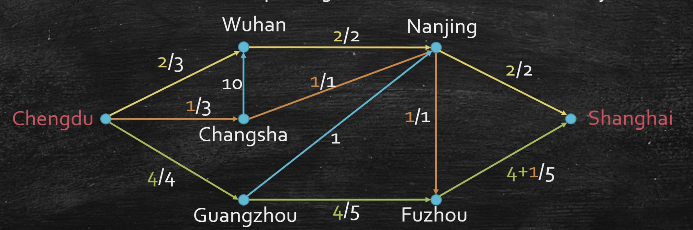

<NoteVisual topic="tree-dp" />

# DP Problem on Trees

## Maximize Independent Set on Trees 最大独立集

**Input:** an undirected tree $G=(V,E)$.

**Output:** an independent set with maximum cardinality, namely the largest possible number of selected vertices.

**Independent Set:** a set $S\subseteq V$ such that no two selected vertices are adjacent:

$$
\forall u,v\in S,\quad (u,v)\notin E
$$

最大独立集在一般图上是 NP-hard 的；但是当图是一棵树时，结构足够简单，可以用 DP 或者等价的 greedy idea 在线性时间解决。

## Recursive View

Root the tree at an arbitrary vertex $r$.

对于某个节点 $v$，考虑它的 subtree rooted at $v$。我们有两个选择：

1. Choose $v$.
2. Do not choose $v$.

如果选择 $v$，那么它的所有 children 都不能被选；下一层可以重新自由选择，所以问题会落到 grandchildren 的子树上。

如果不选择 $v$，那么它的 children 可以自由决定是否选择，所以问题会落到 children 的子树上。

## Subproblem Definition

先定义一个单状态 DP：

$$
f[v]=\text{maximum size of independent set in the subtree rooted at }v
$$

Then:

$$
f[v]=\max\left\{
\sum_{u\in children(v)} f[u],
1+\sum_{g\in grandchildren(v)} f[g]
\right\}
$$

含义：

- 第一项：不选 $v$，所以每个 child 的 subtree 都可以取最优。
- 第二项：选 $v$，拿到 $1$，但是不能选 children，只能从 grandchildren 的 subtree 继续取最优。

The topological order is bottom-up, usually postorder traversal.

### A Cleaner Two-State DP

实际写代码时，更常用 two-state DP：

$$
take[v]=1+\sum_{u\in children(v)} skip[u]
$$

$$
skip[v]=\sum_{u\in children(v)} \max\{take[u],skip[u]\}
$$

Answer:

$$
\max\{take[r],skip[r]\}
$$

这里：

- $take[v]$: max independent set size in subtree $v$ when $v$ is selected.
- $skip[v]$: max independent set size in subtree $v$ when $v$ is not selected.

This avoids explicitly iterating over grandchildren, but it is the same idea.

### Complexity

每个 vertex 只会被处理一次，每条 parent-child 关系也只参与常数次转移。

$$
Time=O(|V|)
$$

$$
Space=O(|V|)
$$

## Greedy View on Trees

这个 tree DP 也可以从 greedy 的角度理解。

Greedy idea:

1. Choose all current leaves.
2. Remove all leaves' parents.
3. Repeat on the remaining forest.

为什么可以这样做？

If a leaf $\ell$ has parent $p$, then choosing $\ell$ only conflicts with $p$. If a solution chooses $p$, we can often replace $p$ by its leaf children without making the solution smaller. So there exists an optimal solution containing the current leaves.

The process is equivalent to solving the DP bottom-up:

- leaves are selected,
- their parents become blocked,
- then the remaining graph decomposes into smaller trees.

Implementation can be $O(|V|)$ by maintaining degrees and a queue of current leaves.

```text
queue = all leaves
while queue is not empty:
    take all current leaves into answer
    mark their parents as removed
    update degrees of the remaining neighbors
    newly created leaves enter queue
```

This greedy formulation is useful for intuition, while the DP formulation is safer to generalize.

## Independent Set on General Graphs

一般图不像树，因为 cycle 和 clique 会让“父子子树独立”这个结构消失。

但是有些图看起来 almost like a tree。如果我们把一个小的 dense part, such as a triangle, 看成一个 **super node**，图可能重新变成 tree-like。

For a super node with $k$ vertices:

- there are at most $2^k$ ways to choose vertices inside it;
- each way creates different restrictions for adjacent super nodes;
- we can design a DP state like $f[i, way]$.

If the largest super node has size $k$, many problems can be solved in:

$$
O(2^{O(k)}\cdot n)
$$

This motivates treewidth.

## Treewidth Idea

Treewidth measures how close a graph is to a tree.

Informally:

- 把图拆成一棵 tree of bags；
- each bag contains several original vertices;
- smaller bags mean the graph is more tree-like.

If the largest bag has size $k+1$, then:

$$
treewidth=k
$$

Examples:

- Tree: treewidth $1$.
- Cycle: treewidth $2$.
- Clique on $n$ vertices: treewidth $n-1$.
- Series-parallel graphs: treewidth at most $2$.

Many optimization problems become:

$$
O(2^{O(k)}\cdot poly(n))
$$

when parameterized by treewidth $k$.

This is called **Fixed-Parameter Tractable**, or **FPT**:

$$
O(f(k)\cdot n^c)
$$

Here $f(k)$ can be exponential, but the exponent of $n$ is constant.

## Tree Decomposition

A tree decomposition is a tree whose nodes are bags of vertices.

Let $B(t)$ be the bag at tree node $t$.

Requirements:

1. Every graph vertex appears in at least one bag.
2. For every graph edge $(u,v)$, there is a bag containing both $u$ and $v$.
3. For every graph vertex $x$, all bags containing $x$ form a connected subtree.

The treewidth of this decomposition is:

$$
\max_t |B(t)|-1
$$

The treewidth of the graph is the minimum value over all possible decompositions.

## Separation Property

Root the tree decomposition.

For a decomposition node $u$, its bag $B(u)$ separates different child subtrees.

Intuition:

- vertices inside one child subtree can interact with the parent side only through $B(u)$;
- two different child subtrees are independent once $B(u)$ is fixed.

This is exactly why DP works: once we decide which vertices in the boundary bag are selected, each child subtree can be solved independently.

Notation:

- $B(u)$: bag at decomposition node $u$.
- $T(u)$: subtree of the decomposition rooted at $u$.
- $B(T(u))$: union of all bags inside $T(u)$.

## DP on Tree Decomposition for MIS

Goal: solve Maximum Independent Set on a graph with treewidth $k$.

Root the tree decomposition.

Define:

$$
f[S,u]
$$

as the maximum size of an independent set $I\subseteq B(T(u))$, under the condition:

$$
I\cap B(u)=S
$$

where:

$$
S\subseteq B(u)
$$

If $S$ itself is not an independent set, then:

$$
f[S,u]=-\infty
$$

### Base Case

If $u$ is a leaf in the tree decomposition:

$$
f[S,u]=|S|
$$

if $S$ is independent; otherwise:

$$
f[S,u]=-\infty
$$

### Transition

Suppose $a$ is a child of $u$ in the tree decomposition.

The parent state fixes $S\subseteq B(u)$. For child $a$, we need to choose a child bag state:

$$
S'\subseteq B(a)
$$

that is compatible with $S$ on the overlap:

$$
S'\cap B(u)=S\cap B(a)
$$

Then the best contribution from child $a$ is:

$$
\max_{\substack{S'\subseteq B(a)\\S'\cap B(u)=S\cap B(a)}}
\left(f[S',a]-|S\cap B(a)|\right)
$$

The subtraction avoids double counting the vertices in the overlap between parent and child bags.

Therefore:

$$
f[S,u]
=
|S|+
\sum_{a\in children(u)}
\max_{\substack{S'\subseteq B(a)\\S'\cap B(u)=S\cap B(a)}}
\left(f[S',a]-|S\cap B(a)|\right)
$$

The final answer at root $r$ is:

$$
\max_{S\subseteq B(r)} f[S,r]
$$

### Complexity

If treewidth is $k$, then every bag has at most $k+1$ vertices.

Number of states per bag:

$$
2^{k+1}
$$

For each parent state, checking compatible child states can cost another factor $2^{k+1}$. So the charged transition cost is:

$$
O(4^k)
$$

Total running time, given a tree decomposition:

$$
O(4^k n)
$$

The important takeaway:

> Tree DP works not only on trees, but also on graphs that can be decomposed into small bags arranged as a tree.


# Network Flow
在多项式时间内精确求解问题的算法，不断迭代求解

## 问题描述
以轨道运输为例，对一个有向图$G(V,E)$, 每条边上有 **Edge capacity**，用来表述该边最多可以承载多少passenger。



## 问题的formalize
Given a directed graph $G=(V,E)$, source $s\in V$, sink $t\in V$, and capacity function

$$
c:E\to \mathbb{R}_{\ge 0}
$$

a **Flow** is a function

$$
f:E\to \mathbb{R}_{\ge 0}
$$

where $f(e)$ means the amount of flow sent through edge $e$.

For $f$ to be a feasible flow, it must satisfy:

### Capacity Constraint

For each edge $e\in E$,

$$
0\le f(e)\le c(e)
$$

### Flow Conservation

For each vertex $u\in V\setminus\{s,t\}$, the total incoming flow equals the total outgoing flow:

$$
\sum_{v:(v,u)\in E} f(v,u)
=
\sum_{w:(u,w)\in E} f(u,w)
$$

### Total Flow

The value of a flow is the total flow leaving the source:

$$
v(f)=\sum_{v:(s,v)\in E} f(s,v)
$$

Equivalently, for any feasible flow,

$$
v(f)=\sum_{u:(u,t)\in E} f(u,t)
$$

So the **Maximum Flow Problem** is:

$$
\max_f\ v(f)
$$

subject to the capacity constraint and flow conservation.

## Ford-Fulkerson Algorithm

一个自然的 greedy idea 是：

> 不断找一条从 $s$ 到 $t$ 的路径，然后沿着这条路径尽可能多地 push flow。

但是这个做法如果只在原图 $G$ 上找路径，会遇到问题：前面选错的路径可能占用了某些边的容量，导致后面无法继续增广。  
所以我们需要允许算法 **cancel** 一部分已经送出去的 flow，也就是在残量网络里加入 backward edge。

### Residual Network

Given a feasible flow $f$, the **residual network** $G_f=(V,E_f)$ describes how we can still adjust the current flow.

For each original edge $(u,v)\in E$:

- If $f(u,v)<c(u,v)$, add a forward residual edge $(u,v)$ with residual capacity

$$
c_f(u,v)=c(u,v)-f(u,v)
$$

- If $f(u,v)>0$, add a backward residual edge $(v,u)$ with residual capacity

$$
c_f(v,u)=f(u,v)
$$

Intuition:

- forward edge means we can send more flow on the original edge;
- backward edge means we can cancel part of the flow already sent on the original edge.

### Augmenting Path

An **augmenting path** is an $s$-$t$ path $P$ in the residual network $G_f$.

The amount of flow we can push through $P$ is limited by the bottleneck residual capacity:

$$
b=\min_{e\in P} c_f(e)
$$

Then for every residual edge on $P$:

- if it is a forward edge $(u,v)$, update

$$
f(u,v)\leftarrow f(u,v)+b
$$

- if it is a backward edge $(v,u)$ corresponding to original edge $(u,v)$, update

$$
f(u,v)\leftarrow f(u,v)-b
$$

### Algorithm

```text
FordFulkerson(G=(V,E), s, t, c):
    initialize f(e) = 0 for every e in E
    construct the residual network G_f

    while there exists an s-t path P in G_f:
        b = min residual capacity of edges on P

        for each residual edge e on P:
            if e is a forward edge (u,v):
                f(u,v) = f(u,v) + b
            if e is a backward edge (v,u) for original edge (u,v):
                f(u,v) = f(u,v) - b

        update G_f

    return f
```

The algorithm stops when there is no $s$-$t$ path in $G_f$. At this point, no more flow can be pushed from $s$ to $t$.

### Small Bug: Anti-parallel Edges

If the original graph contains both $(u,v)$ and $(v,u)$, then a residual edge direction alone is not enough to distinguish:

- a real forward edge;
- a backward edge used to cancel flow.

One standard fix is to transform the graph so that no anti-parallel edges exist, or explicitly tag each residual edge as forward/backward.

### Termination

If all capacities are integers, then each augmentation increases $v(f)$ by at least $1$. Therefore Ford-Fulkerson halts in at most $f_{\max}$ iterations.

With a DFS/BFS search for each augmenting path, one iteration costs $O(|E|)$, so for integer capacities:

$$
O(|E|\cdot f_{\max})
$$

For rational capacities, we can rescale them into integers. For irrational capacities, Ford-Fulkerson may not halt depending on how augmenting paths are chosen.
