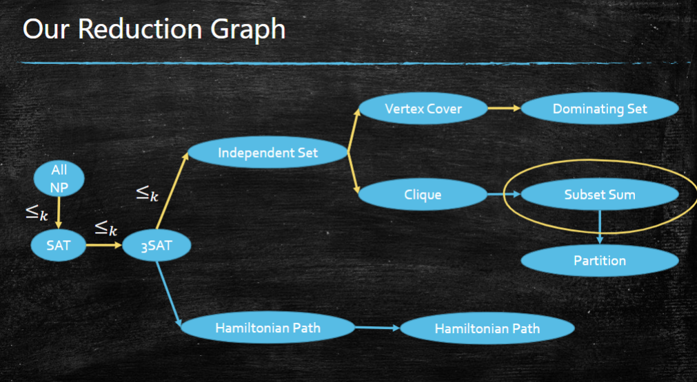

# More NP-Complete Problems

这一讲继续 NP-completeness，重点不是重新定义 P、NP，而是练习如何写 reduction proof，以及如何从已有 NP-complete 问题推出更多 NP-complete problems。

这份笔记先补充课件中的 reduction graph，再补上一个很常用的基本归约：

$$
IndependentSet \le_K VertexCover
$$

## Reduction Graph

课件中的 reduction graph 表达的是：从已经知道的 NP-complete 问题出发，沿着 Karp reduction 的箭头，可以证明更多问题 NP-complete。

可以直接看课件中的 reduction graph：

这里每条箭头：

$$
A\to B
$$

表示：

$$
A\le_K B
$$

也就是：如果能在多项式时间内解决 $B$，就能在多项式时间内解决 $A$。因此 $B$ 至少和 $A$ 一样难。

结合 Cook-Levin Theorem：

$$
SAT \text{ is NP-complete}
$$

以及 reduction 的传递性，就能得到图中后续问题的 NP-hardness。若再证明目标问题本身在 NP 中，就得到 NP-completeness。

常见主线包括：

$$
SAT \le_K 3SAT \le_K IndependentSet
$$

$$
IndependentSet \le_K VertexCover
$$

$$
IndependentSet \le_K Clique
$$

$$
VertexCover \le_K DominatingSet
$$

$$
VertexCover \le_K SubsetSum
$$

以及 Hamiltonian path / cycle 相关归约。

## How to Prove NP-completeness

证明一个问题 $f$ 是 NP-complete，通常写四步：

1. 证明 $f\in NP$。
2. 选一个已知 NP-complete 问题 $g$。
3. 给出多项式时间归约：

$$
g\le_K f
$$

4. 证明 yes/no instance 被正确保持：

$$
x \text{ is yes for } g
\iff
R(x) \text{ is yes for } f
$$

一个常见错误是把方向写反。要证明 $f$ 难，应该把已知难问题 $g$ reduce 到 $f$，而不是把 $f$ reduce 到 $g$。

## Independent Set Reduces to Vertex Cover

这一节补充：

$$
IndependentSet \le_K VertexCover
$$

### Problems

**Independent Set**：

> 给定无向图 $G=(V,E)$ 和整数 $k$，判断 $G$ 中是否存在大小为 $k$ 的 independent set。

一个点集 $S\subseteq V$ 是 independent set，意思是 $S$ 中任意两个点之间都没有边。

**Vertex Cover**：

> 给定无向图 $G=(V,E)$ 和整数 $k'$，判断 $G$ 中是否存在大小为 $k'$ 的 vertex cover。

一个点集 $C\subseteq V$ 是 vertex cover，意思是每条边都至少有一个端点在 $C$ 中。

### Key Observation

核心观察是：

$$
S \text{ is an independent set of } G
\iff
V\setminus S \text{ is a vertex cover of } G
$$

直观解释：

- 如果 $S$ 是 independent set，那么 $S$ 内部没有边；
- 所以任意一条边不可能两个端点都落在 $S$；
- 因此每条边至少有一个端点在 $V\setminus S$；
- 这正说明 $V\setminus S$ 是 vertex cover。

反过来，如果 $C$ 是 vertex cover，那么每条边至少有一个端点在 $C$。于是 $V\setminus C$ 中不可能包含一条边的两个端点，所以 $V\setminus C$ 是 independent set。

### Reduction

给定 Independent Set instance：

$$
(G,k)
$$

构造 Vertex Cover instance：

$$
(G, |V|-k)
$$

也就是说，图不变，只把参数从 $k$ 改成 $|V|-k$。

这个构造显然可以在多项式时间内完成。

### Correctness

先证 yes instance 会变成 yes instance。

如果 $G$ 中存在大小为 $k$ 的 independent set $S$，那么由 key observation：

$$
V\setminus S
$$

是 vertex cover，并且大小是：

$$
|V\setminus S|=|V|-k
$$

所以构造出的 Vertex Cover instance：

$$
(G, |V|-k)
$$

是 yes instance。

再证反方向。

如果构造出的 Vertex Cover instance 是 yes，也就是 $G$ 中存在大小为 $|V|-k$ 的 vertex cover $C$，那么由 key observation：

$$
V\setminus C
$$

是 independent set，并且大小是：

$$
|V\setminus C|=k
$$

所以原来的 Independent Set instance：

$$
(G,k)
$$

也是 yes instance。

因此 no instance 也会变成 no instance。

反证：如果原来的 Independent Set instance $(G,k)$ 是 no，但构造出的 Vertex Cover instance $(G,|V|-k)$ 是 yes，那么由上面的反方向证明，可以推出 $(G,k)$ 也是 yes instance，矛盾。

所以：

$$
(G,k)\notin IndependentSet
\Rightarrow
(G,|V|-k)\notin VertexCover
$$

因此：

$$
(G,k)\in IndependentSet
\iff
(G,|V|-k)\in VertexCover
$$

即：

$$
IndependentSet \le_K VertexCover
$$

## Why This Proves Vertex Cover Is NP-complete

上一讲已经有：

$$
SAT \le_K 3SAT \le_K IndependentSet
$$

并且 $SAT$ 是 NP-complete，所以 $IndependentSet$ 是 NP-complete。

现在又有：

$$
IndependentSet \le_K VertexCover
$$

因此 $VertexCover$ 是 NP-hard。

还需要证明：

$$
VertexCover\in NP
$$

certificate 可以是一个点集 $C$。Verifier 检查：

1. $|C|=k$；
2. 对每条边 $(u,v)\in E$，检查是否 $u\in C$ 或 $v\in C$。

这可以在多项式时间内完成。

所以：

$$
VertexCover \text{ is NP-complete}
$$

## Independent Set Reduces to Clique

证明：

$$
IndependentSet\le_K Clique
$$

### Clique

$k$-Clique Problem：

> 给定无向图 $G=(V,E)$ 和整数 $k$，判断 $G$ 是否存在大小为 $k$ 的 clique。

clique 指任意两个点之间都有边的点集。

### Key Observation

令 $\overline G$ 表示 $G$ 的 complement graph：

- $G$ 中有边的点对，在 $\overline G$ 中没有边；
- $G$ 中没有边的点对，在 $\overline G$ 中有边。

那么：

$$
S \text{ is an independent set in } G
\iff
S \text{ is a clique in } \overline G
$$

### Reduction

给定 Independent Set instance：

$$
(G,k)
$$

构造 Clique instance：

$$
(\overline G,k)
$$

### Correctness

先证 yes instance 会变成 yes instance。

如果 $G$ 中存在大小为 $k$ 的 independent set $S$，那么 $S$ 中任意两个点在 $G$ 中都没有边。
根据 complement graph 的定义，这些点在 $\overline G$ 中两两相连。
所以 $S$ 是 $\overline G$ 中大小为 $k$ 的 clique。

因此：

$$
(G,k)\in IndependentSet
\Rightarrow
(\overline G,k)\in Clique
$$

再证 no instance 会变成 no instance。

反证：假设 $(G,k)$ 是 Independent Set 的 no instance，但 $(\overline G,k)$ 是 Clique 的 yes instance。
那么 $\overline G$ 中存在大小为 $k$ 的 clique $S$。

因为 $S$ 中任意两个点在 $\overline G$ 中都有边，所以它们在 $G$ 中都没有边。
于是 $S$ 是 $G$ 中大小为 $k$ 的 independent set。

这说明 $(G,k)$ 是 Independent Set 的 yes instance，矛盾。

所以：

$$
(G,k)\notin IndependentSet
\Rightarrow
(\overline G,k)\notin Clique
$$

综上：

$$
(G,k)\in IndependentSet
\iff
(\overline G,k)\in Clique
$$

因此：

$$
IndependentSet\le_K Clique
$$

如果 Clique 也在 NP，那么 Clique 是 NP-complete。

## Vertex Cover Reduces to Dominating Set

证明：

$$
VertexCover\le_K DominatingSet
$$

这里使用常见的 decision 版本：判断是否存在大小 **至多** 为 $k$ 的解。

如果 $k=0$ 或 $E=\emptyset$，Vertex Cover instance 可以直接在多项式时间内判断，然后输出一个固定的 yes/no Dominating Set instance。
例如，yes instance 可以输出单点图配参数 $1$；no instance 可以输出单点图配参数 $0$。
所以下面的构造只讨论非平凡情形：$k\ge 1$ 且 $E\ne\emptyset$。

### Dominating Set

Dominating Set Problem：

> 给定无向图 $H=(U,F)$ 和整数 $k$，判断 $H$ 是否存在大小至多为 $k$ 的 dominating set。

一个点集 $D\subseteq U$ 是 dominating set，意思是每个点要么在 $D$ 中，要么至少有一个邻居在 $D$ 中。

换句话说，$D$ 可以“覆盖”所有点：

$$
\forall u\in U,\quad u\in D\text{ or }N(u)\cap D\ne\emptyset
$$

### Construction

给定 Vertex Cover instance：

$$
(G=(V,E),k)
$$

构造一个 Dominating Set instance：

$$
(H,k)
$$

其中 $H$ 的构造如下：

1. 保留 $G$ 中的每个原始点 $v\in V$；
2. 把所有原始点 $V$ 两两相连，使它们形成一个 clique；
3. 对 $G$ 中每条边 $e=(u,v)$，新增一个点 $x_e$；
4. 只把 $x_e$ 连到这条边的两个端点 $u$ 和 $v$。

也就是说：

$$
U=V\cup\{x_e:e\in E\}
$$

并且每个新增点 $x_{(u,v)}$ 只和 $u,v$ 相邻。

这个构造显然可以在多项式时间内完成。

### Key Observation

核心观察是：

- 原始点 $V$ 被做成了 clique，所以只要选中任意一个原始点，就能 dominate 所有原始点；
- 每个新增点 $x_{(u,v)}$ 只能被 $u$、$v$ 或它自己 dominate；
- 如果 dominating set 里选了某个新增点 $x_{(u,v)}$，可以把它换成 $u$，不会让 domination 变差。

因此，如果 $H$ 有大小至多为 $k$ 的 dominating set，那么可以假设这个 dominating set 只包含原始点 $V$。

在这种情况下，要 dominate 每个新增点 $x_{(u,v)}$，就必须从 $u,v$ 中至少选一个点。

这正是 vertex cover 的条件。

### Correctness

先证正方向。

如果 $G$ 有大小至多为 $k$ 的 vertex cover $C$，那么 $C$ 也是 $H$ 的 dominating set：

- 在非平凡情形下 $C$ 非空；因为 $C\subseteq V$，而 $V$ 在 $H$ 中是 clique，所以 $C$ dominate 所有原始点；
- 对每个新增点 $x_{(u,v)}$，因为 $C$ 是 vertex cover，所以 $u,v$ 至少有一个在 $C$ 中，因此 $x_{(u,v)}$ 也被 dominate。

所以：

$$
(G,k)\in VertexCover
\Rightarrow
(H,k)\in DominatingSet
$$

再证反方向。

如果 $H$ 有大小至多为 $k$ 的 dominating set $D$，根据 key observation，可以把其中的新增点都替换成对应的原始端点，得到一个只包含原始点的 dominating set $D'\subseteq V$，并且：

$$
|D'|\le |D|\le k
$$

由于 $D'$ dominate 每个新增点 $x_{(u,v)}$，而 $x_{(u,v)}$ 只和 $u,v$ 相邻，所以 $u,v$ 中至少有一个在 $D'$ 中。

因此 $D'$ 覆盖了 $G$ 中的每条边，也就是 $G$ 的 vertex cover。

所以：

$$
(H,k)\in DominatingSet
\Rightarrow
(G,k)\in VertexCover
$$

因此 no instance 也会变成 no instance。

反证：如果原来的 Vertex Cover instance $(G,k)$ 是 no，但构造出的 Dominating Set instance $(H,k)$ 是 yes，那么由上面的反方向证明，可以推出 $(G,k)$ 也是 Vertex Cover 的 yes instance，矛盾。

所以：

$$
(G,k)\notin VertexCover
\Rightarrow
(H,k)\notin DominatingSet
$$

综上：

$$
(G,k)\in VertexCover
\iff
(H,k)\in DominatingSet
$$

即：

$$
VertexCover\le_K DominatingSet
$$

由于 $VertexCover$ 是 NP-complete，并且 $DominatingSet\in NP$，所以：

$$
DominatingSet \text{ is NP-complete}
$$

## Take Home Messages

1. Reduction graph 的箭头方向表示 $A\le_K B$，即 $B$ 至少和 $A$ 一样难。
2. 证明目标问题 NP-complete 时，必须从已知 NP-complete 问题归约到目标问题。
3. $IndependentSet \le_K VertexCover$ 的核心是补集关系：

$$
S \text{ independent}
\iff
V\setminus S \text{ vertex cover}
$$

4. 输入转换非常简单：

$$
(G,k)\mapsto (G,|V|-k)
$$

5. 由于 $IndependentSet$ 是 NP-complete，且 $VertexCover\in NP$，所以 $VertexCover$ 也是 NP-complete。
6. $VertexCover\le_K DominatingSet$ 的核心是：给每条边新增一个点，逼迫 dominating set 至少选择这条边的一个端点。

## Cook-Levin Theorem

**Cook-Levin Theorem**：

> SAT is NP-complete.

也就是说：

1. $SAT\in NP$；
2. 对任意 $f\in NP$，都有：

$$
f\le_K SAT
$$

### Proof Sketch

已经知道 $SAT\in NP$，关键是证明任意 NP 问题都能 reduce 到 SAT。

设 $f\in NP$。根据 NP 的定义，存在 polynomial time verifier $\mathcal A$。

对于 instance $x$：

- 如果 $x$ 是 yes instance，则存在 polynomial length certificate $y$，使得 $\mathcal A(x,y)$ accepts；
- 如果 $x$ 是 no instance，则所有 $y$ 都不能让 $\mathcal A(x,y)$ accepts。

Cook-Levin 的核心想法：

> 用一个 Boolean formula 模拟 verifier $\mathcal A$ 在输入 $(x,y)$ 上的整段计算过程。

可以把 Turing Machine 的计算过程写成 tableau：

| 时间步 | tape 内容 | head 位置 | state |
| --- | --- | --- | --- |
| step 0 | 输入 $x$ 和未知 certificate $y$ | 初始位置 | start |
| step 1 | 下一步 tape | 新位置 | 新状态 |
| $\cdots$ | $\cdots$ | $\cdots$ | $\cdots$ |
| final step | 最终 tape | 最终位置 | accept/reject |

然后为 tableau 中的每个 cell、每个时间步、每个状态建立 Boolean variables，并用 CNF 约束表达：

1. step 0 中固定了输入 $x$；
2. certificate $y$ 可以自由选择；
3. final step 必须是 accept；
4. 每一步到下一步必须符合 $\mathcal A$ 的 transition function。

这些约束可以在 polynomial size 内写成 CNF formula。

于是构造出的 formula 可满足，当且仅当存在 certificate $y$ 让 $\mathcal A(x,y)$ accepts。

因此：

$$
x\in f
\iff
\phi_x\in SAT
$$

这给出了：

$$
f\le_K SAT
$$

因为 $f$ 是任意 NP 问题，所以 SAT 是 NP-hard；又因为 SAT 本身在 NP，所以 SAT 是 NP-complete。

## More NP-complete Problems

有了 Cook-Levin Theorem 和 reduction 传递性，可以证明大量问题都是 NP-complete。

课件中涉及的典型关系：

$$
SAT\le_K 3SAT\le_K IndependentSet
$$

还包括：

$$
IndependentSet\le_K VertexCover
$$

以及：

$$
IndependentSet\le_K Clique
$$

因为 SAT 是 NP-complete，如果我们能从 SAT 一路 reduce 到某个问题 $H$，并且 $H\in NP$，那么 $H$ 也是 NP-complete。

## 3SAT Reduces to Hamiltonian Path

目标是证明：

$$
3SAT\le_K HamiltonianPath
$$

课件里常用一个中间问题：

$$
3SAT\le_K DirectedHamiltonianPath\le_K HamiltonianPath
$$

### Directed Hamiltonian Path

**Directed Hamiltonian Path**：

> 给定有向图 $G=(V,E)$、source $s$ 和 sink $t$，判断是否存在一条从 $s$ 到 $t$ 的 directed path，恰好经过每个顶点一次。

### Step 1: 3SAT to Directed Hamiltonian Path

给定一个 3SAT instance：

$$
\phi=C_1\land C_2\land\cdots\land C_m
$$

变量为：

$$
x_1,x_2,\ldots,x_n
$$

我们构造一个有向图，使得：

$$
\phi \text{ is satisfiable}
\iff
G_\phi \text{ has an }s\text{-}t\text{ directed Hamiltonian path}
$$

构造包含两类 gadget。

### Variable Gadget

对每个变量 $x_i$，构造一个 variable gadget。

这个 gadget 有一个 entrance 和一个 exit，中间放 $3m+1$ 个顶点：

$$
r_{i,0},p_{i,1},q_{i,1},r_{i,1},p_{i,2},q_{i,2},r_{i,2},\ldots,p_{i,m},q_{i,m},r_{i,m}
$$

每个 clause $C_j$ 对应中间的一对顶点：

$$
p_{i,j},q_{i,j}
$$

具体连边可以这样做。
设这个 gadget 的 entrance 是 $a_i$，exit 是 $b_i$。
把上面 $3m+1$ 个中间顶点排成一条链，相邻顶点之间加入两个方向的有向边。
再加入：

$$
a_i\to r_{i,0},\quad a_i\to r_{i,m},\quad r_{i,m}\to b_i,\quad r_{i,0}\to b_i
$$

gadget 的作用是让 Hamiltonian path 在其中只有两种自然走法：

- 从左到右走，表示 $x_i=true$；
- 从右到左走，表示 $x_i=false$。

然后把所有 variable gadget 串起来：

$$
s\to a_1,\quad b_i\to a_{i+1}\ (1\le i<n),\quad b_n\to t
$$

所以一条从 $s$ 到 $t$、经过所有 variable gadget 的 Hamiltonian path，等价于给每个变量选择 true 或 false。

### Clause Gadget

对每个 clause $C_j$，新增一个 clause vertex：

$$
c_j
$$

如果 literal $x_i$ 出现在 clause $C_j$ 中，就在 $x_i$ 的 variable gadget 里加入一个 detour：

$$
p_{i,j}\to c_j\to q_{i,j}
$$

这个 detour 只能在从左到右走时使用，也就是当 $x_i=true$ 时使用。

如果 literal $\neg x_i$ 出现在 clause $C_j$ 中，就加入反方向 detour：

$$
q_{i,j}\to c_j\to p_{i,j}
$$

这个 detour 只能在从右到左走时使用，也就是当 $x_i=false$ 时使用。

直观上：

> clause vertex $c_j$ 只有在某个让 $C_j$ 为 true 的 literal 处，才能被 Hamiltonian path 顺路访问。

构造的顶点数和边数都是 $O(nm)$，所以可以在多项式时间内完成。

### Correctness: 3SAT to Directed Hamiltonian Path

先证 yes instance 会变成 yes instance。

如果 $\phi$ 有一个 satisfying assignment，那么对每个 variable gadget：

- 若 $x_i=true$，就从左到右穿过 $X_i$；
- 若 $x_i=false$，就从右到左穿过 $X_i$。

每个 clause $C_j$ 至少有一个 true literal。
对每个 clause，任选一个让它为 true 的 literal，路径在对应位置绕一下 detour，访问 $c_j$。

这样路径：

1. 从 $s$ 走到 $t$；
2. 每个 variable gadget 的中间顶点都访问一次；
3. 每个 clause vertex $c_j$ 也通过某个 true literal 的 detour 访问一次。

所以 $G_\phi$ 有一条 directed Hamiltonian path。

再证 no instance 会变成 no instance。

反证：假设 $\phi$ 是 no instance，但 $G_\phi$ 有一条从 $s$ 到 $t$ 的 directed Hamiltonian path。

这条路径必须依次穿过所有 variable gadget。
在每个 variable gadget 中，它只能选择一种方向：

- 左到右，记为 $x_i=true$；
- 右到左，记为 $x_i=false$。

于是 Hamiltonian path 给出了一个变量赋值。

又因为这条路径是 Hamiltonian path，所以每个 clause vertex $c_j$ 都必须被访问。
而 $c_j$ 只能通过某个 literal 的 detour 被访问。
在 Hamiltonian path 中，这个访问必须是局部 detour：从某个 literal occurrence 的一侧进入 $c_j$，再回到同一个 occurrence 的另一侧。
否则路径会跳到另一个 variable gadget 的中间位置，留下某段中间顶点之后无法访问。
这个 detour 能被使用，正说明对应 literal 在刚才的变量赋值下为 true。

所以每个 clause $C_j$ 都至少有一个 true literal，$\phi$ 可满足。
这和 $\phi$ 是 no instance 矛盾。

因此：

$$
\phi\notin 3SAT
\Rightarrow
G_\phi\notin DirectedHamiltonianPath
$$

综上：

$$
3SAT\le_K DirectedHamiltonianPath
$$

### Step 2: Directed Hamiltonian Path to Hamiltonian Path

现在把有向版本 reduce 到普通的无向 Hamiltonian Path。

给定 Directed Hamiltonian Path instance：

$$
G=(V,E),s,t
$$

先删掉所有进入 $s$ 的边和所有从 $t$ 出去的边。
如果存在从 $s$ 到 $t$ 的 Hamiltonian path，这些边本来就不会被使用。

对每个有向图中的顶点 $u$，构造三个无向图顶点：

$$
u_{in},u_{mid},u_{out}
$$

并加入两条无向边：

$$
u_{in}-u_{mid}-u_{out}
$$

对每条有向边：

$$
(u,v)\in E
$$

在无向图中加入一条边：

$$
u_{out}-v_{in}
$$

得到无向图 $G'$。

这个构造也是多项式时间的。

### Correctness: Directed to Undirected

先证 yes instance 会变成 yes instance。

如果原图中有 directed Hamiltonian path：

$$
s\to u_1\to u_2\to\cdots\to u_r\to t
$$

那么在 $G'$ 中走：

$$
s_{in},s_{mid},s_{out},
u_{1,in},u_{1,mid},u_{1,out},
\ldots,
t_{in},t_{mid},t_{out}
$$

这是一条经过 $G'$ 中每个顶点一次的 Hamiltonian path。

再证 no instance 会变成 no instance。

反证：假设 $G'$ 有 Hamiltonian path。

注意 $s_{in}$ 和 $t_{out}$ 的 degree 都是 $1$，所以它们必须是整条 Hamiltonian path 的两个端点。
因为图是无向的，可以把这条 path 看成从 $s_{in}$ 走到 $t_{out}$。

在每个 vertex gadget 里，$u_{mid}$ 只和 $u_{in},u_{out}$ 相邻。
所以一旦 path 进入某个 gadget，就必须连续走完整个三点结构；否则 $u_{mid}$ 之后会无法被正确访问。

又因为整条 path 从 $s_{in}$ 开始，第一步被迫走：

$$
s_{in}\to s_{mid}\to s_{out}
$$

而不同 gadget 之间的边只连接某个 $u_{out}$ 和某个 $v_{in}$。
因此后续每次进入新 gadget 时，都会从 $v_{in}$ 进入，再被迫走：

$$
v_{in}\to v_{mid}\to v_{out}
$$

于是整条 path 的结构只能是：

$$
in\to mid\to out\to in\to mid\to out\to\cdots
$$

而 gadget 之间的边都是由原来的 directed edge 产生的：

$$
u_{out}-v_{in}
\quad\Longleftrightarrow\quad
(u,v)\in E
$$

因此，把每个三点 gadget 收缩回一个顶点，就得到原有向图中一条从 $s$ 到 $t$ 的 directed Hamiltonian path。

所以如果 $G'$ 是 yes instance，那么原来的 Directed Hamiltonian Path instance 也是 yes instance。
等价地，no instance 会被映射成 no instance。

因此：

$$
DirectedHamiltonianPath\le_K HamiltonianPath
$$

### Conclusion

已经知道：

$$
3SAT \text{ is NP-complete}
$$

并且：

$$
3SAT\le_K DirectedHamiltonianPath\le_K HamiltonianPath
$$

所以 Hamiltonian Path 是 NP-hard。

另一方面，Hamiltonian Path 在 NP 中：certificate 是一个顶点序列，verifier 只需要检查它是否每个顶点恰好出现一次，并且相邻顶点之间都有边。
这个检查可以在多项式时间内完成。

因此：

$$
HamiltonianPath \text{ is NP-complete}
$$

## Consequence of NP-completeness

重要定理：

> 如果 $f$ 是 NP-complete，并且 $f\in P$，那么 $P=NP$。

证明：

对任意 $g\in NP$，因为 $f$ 是 NP-hard，有：

$$
g\le_K f
$$

如果 $f\in P$，那么可以先把 $g$ 的 instance polynomial-time 转成 $f$ 的 instance，再用 $f$ 的 polynomial-time solver 求解。

因此任意 $g\in NP$ 都属于 P：

$$
NP\subseteq P
$$

而本来就有：

$$
P\subseteq NP
$$

所以：

$$
P=NP
$$

这就是为什么只要证明一个 NP-complete 问题有 polynomial-time algorithm，就会解决整个 P vs NP 问题。

## NP-intermediate

如果：

$$
P\ne NP
$$

Ladner's Theorem 说明：存在一些 NP 问题既不在 P 中，也不是 NP-complete。

这些问题称为 **NP-intermediate**。

常见候选包括：

- Graph Isomorphism；
- Factoring。

注意：它们只是常见候选，不等于已经证明为 NP-intermediate。

## NP-hard vs NP-complete

NP-hard 和 NP-complete 的区别：

| 概念 | 要求 | 是否必须在 NP 中 |
| --- | --- | --- |
| NP-hard | 所有 NP 问题都能 reduce 到它 | 不必须 |
| NP-complete | NP-hard 且自身在 NP 中 | 必须 |

所以：

$$
NP\text{-complete}=NP\text{-hard}+in\ NP
$$

NP-hard 可以用于 optimization problem，例如：

- Maximum Independent Set is NP-hard；
- Minimum Vertex Cover is NP-hard；
- Max-3SAT is NP-hard；
- Finding a longest simple path is NP-hard。

这些 optimization problem 不一定本身是 decision problem，因此通常说 NP-hard，而不是直接说 NP-complete。

## How to Prove a Problem Is NP-complete

证明一个新问题 $H$ 是 NP-complete，常用模板是：

1. 证明 $H\in NP$：
   - 给出 certificate；
   - 说明 verifier 可以 polynomial time 检查。
2. 选择一个已知 NP-complete 问题 $F$。
3. 构造 polynomial-time reduction：

$$
F\le_K H
$$

4. 证明 yes/no 保持一致：

$$
x\text{ is yes for }F
\iff
R(x)\text{ is yes for }H
$$

注意方向非常重要：

> 要证明 $H$ 难，需要把已知难问题 reduce 到 $H$，不是把 $H$ reduce 到已知难问题。

## Take Home Messages

这一讲最重要的是几组定义和归约方向。

1. P 是 polynomial time 可解的 decision problems。
2. NP 是 yes instance 有 polynomial size certificate，并且可以 polynomial time verify 的 decision problems。
3. $P\subseteq NP$，但是否 $P=NP$ 仍然未知。
4. Karp reduction $f\le_K g$ 表示：会解 $g$ 就会解 $f$，所以 $g$ 至少和 $f$ 一样难。
5. SAT 是 NP-complete，这是 Cook-Levin Theorem。
6. 通过 reduction 和传递性，可以证明 3SAT、Independent Set、Vertex Cover、Clique、Subset Sum、Hamiltonian Path 等问题都是 NP-complete。
7. 证明 NP-complete 的标准套路是：先证明在 NP，再从一个已知 NP-complete 问题归约过来。
8. 如果任何一个 NP-complete 问题属于 P，那么 $P=NP$。
9. NP-hard 不要求问题本身在 NP 中；NP-complete 必须同时是 NP-hard 且在 NP 中。
