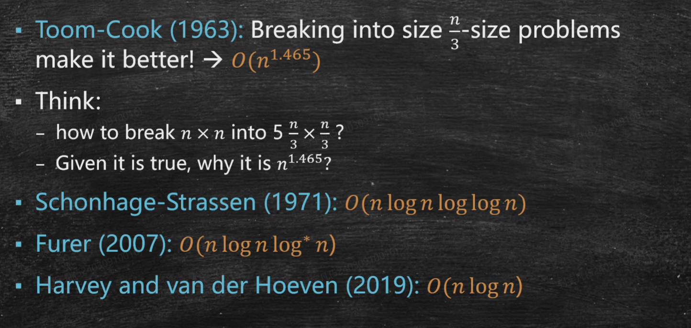
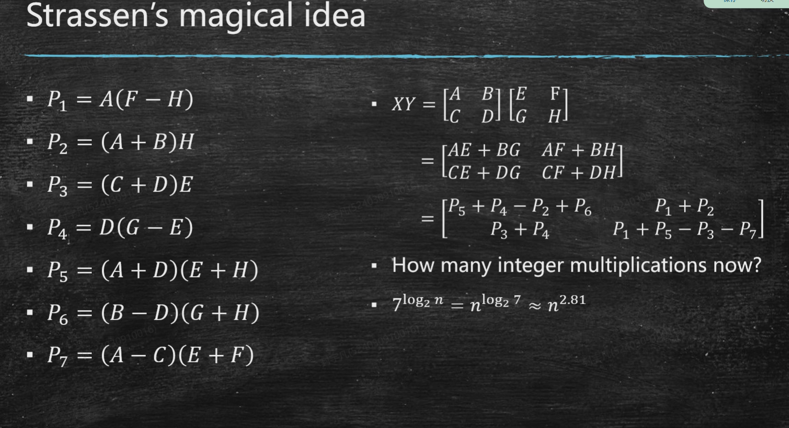

# Divide and Conquer and Running Time analysis
## Karatsuba Integer Multiplication
对于两个 $n$ 位整数 $x$ 和 $y$，若做最朴素的乘法，则需要进行O($n^2$)次elemwise的乘法运算。
对齐进行分治优化(Divide and Conquer)，第一步我们可以将它们写成：
$$x = x_1 \cdot 10^k + x_0$$
$$y = y_1 \cdot 10^k + y_0$$
其中 $k = \lceil n/2 \rceil$。那么它们的乘积为：
$$xy = (x_1 \cdot 10^k + x_0)(y_1 \cdot 10^k + y_0) = x_1y_1 \cdot 10^{2k} + (x_1y_0 + x_0y_1) \cdot 10^k + x_0y_0$$

注意到在分治之后的式子中，如果继续朴素地计算$x_1y_1, x_0y_1, x_1y_0, x_0y_0$，那么总的乘法次数为$4T(n/2) + O(n)$，根据主定理，其时间复杂度仍然是$O(n^2)$，并没有得到优化。

我们注意到在结果中，我们只需要$(x_0y_1 + x_1y_0)$的整体值，而**分别计算$x_0y_1$和$x_1y_0$是多余的，产生了多余的信息**。因此，我们可以通过计算$(x_1+x_0)(y_1+y_0) - x_1y_1 - x_0y_0$来得到$(x_0y_1 + x_1y_0)$的值。这样，我们只需要进行3次乘法运算，就可以得到$(x_0y_1 + x_1y_0)$的值。总的乘法次数为$3T(n/2) + O(n)$，根据主定理，其时间复杂度为 $O(n^{\log_2 3})$。

## Divide it !
There are some better algorithms

The last three algorithms are based on FFT

## Matrix Multiplication Optimization

该算法在信息论上可被证明是时间复杂度最低的分治算法
## Time Complexity Analysis
what are the **unit-time** operation for the computer?

Word RAM model: 能放在RAM中的数据，都可以视为unit-time word
- Read/write a word
- Arithmetic operations on words
- Comparison of words

#### Big O Notation
if $T(n) = O(n^2)$， 就是说$T(n) <= Cn^2$ for some constant $C$ and all $n >= n_0$

#### Big $\Omega$ Notation
if $T(n) = \Omega(n^2)$， 就是说$T(n) >= Cn^2$ for some constant $C$ and all $n >= n_0$

#### Big $\Theta$ Notation
if $T(n) = \Theta(n^2)$， 就是说$T(n) = O(n^2)$ and $T(n) = \Omega(n^2)$

> [!TIHINKING]
> 是否存在两个关于n的函数f和g使得 $f(n) \neq O(g(n))$，且 $f(n) \neq \Omega(g(n))$？
> 只要f交错震荡穿过g即可

#### little o notation
$T(n) = o(n^2)$ means that , for all C, there exists n >n_0 such that $T(n) < Cn^2$

#### little $\omega$ notation
$T(n) = \omega(n^2)$ means that , for all C, there exists n >n_0 such that $T(n) > Cn^2$

## Divide and Conquer
**Merge sort** as an example
$T(n) = 2T(n/2) + O(n)$