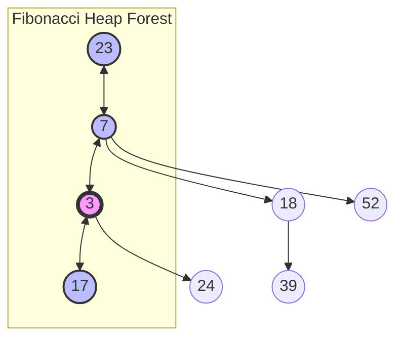
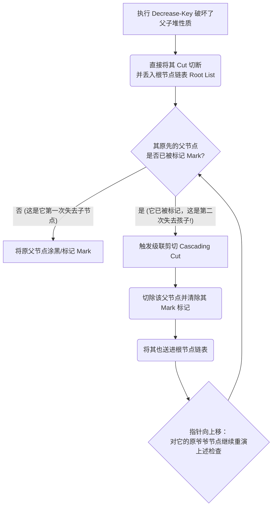

# Shortest Path & Fibonacci Heap

## 一、 最短路径核心定义与广度优先搜索 (BFS)

在有向图的连通性分析基础上，我们需要进一步探讨顶点之间的度量关系，即最短路径问题。

### 1.1 核心数学定义
*   **路径 (Path)**：在有向图 $G(V, E)$ 中，从起点到终点经过的顶点序列。
*   **无权图的路径长度 (Length)**：路径中包含的弧 (Arcs) 的数量。
*   **距离 (Distance, $d(u, v)$)**：从顶点 $u$ 到顶点 $v$ 的**最短路径的长度**。
*   **单源最短路径问题 (Single-Source Shortest Path, SSSP)**：
    *   **输入**：一个由邻接表表示的有向图 $G(V,E)$，以及一个源顶点 (Source Vertex) $s$。
    *   **输出**：对于图中所有的顶点 $v \in V$，求出距离 $d(s, v)$。

### 1.2 广度优先搜索 (Breadth-First Search, BFS)
在无权图中，寻找单源最短路径的直观算法是广度优先搜索。
*   **核心思想 (Water frontier)**：从源点 $s$ 开始，像水波一样层层向外扩散。
    *   走 1 步：到达距离为 1 的顶点集合 $V_1$。
    *   走 2 步：到达距离为 2 的顶点集合 $V_2$。
    *   递推关系：如果已知 $V_1, V_2, \dots, V_k$，则 $v \in V_{k+1}$ 当且仅当存在 $u \in V_k$ 使得弧 $(u, v)$ 存在，且 $v$ 不属于任何更早的层（$v \notin V_l, \forall l \le k$）。

#### BFS 伪代码与路径重构
为了输出具体的最短路径，我们需要额外维护一个 `pre[v]` 数组，用于记录是哪个顶点将 $v$ 首次拉入探索波前的。

```text
// 算法：广度优先搜索 (BFS)
// 输入：图 G(V, E), 源顶点 s
Function bfs(G, s):
    // 初始化
    for each v in V:
        marked[v] = false
    i = 0                   // 层级计数器 (layer counter)
    V_0 = {s}
    marked[s] = true
    pre[s] = s
    
    // 逐层遍历
    while V_i is not empty:
        for each u in V_i:
            for each (u, v) in E: // 遍历 u 的所有出边
                if marked[v] == false:
                    marked[v] = true
                    Add v into V_{i+1}
                    pre[v] = u    // 记录路径前驱
        i = i + 1
```

### 1.3 复杂度分析与 DFS/BFS 特性对比
*   **时间复杂度**：$$O(|V| + |E|)$$。
    **证明**：在 BFS 的执行过程中，每个顶点最多被标记（入队）一次，开销分摊到所有未标记顶点上计为 $O(|V|)$；每一层中，算法只对属于 $V_i$ 的顶点的出边进行检查，因此全图所有的边最多被检查一次，计为 $O(|E|)$。
*   **DFS vs BFS 能力对比**：
    *   检测环 (Detecting Cycles)：DFS (**Yes**) / BFS (**No**)
    *   拓扑排序 (Topological Ordering)：DFS (**Yes**) / BFS (**No**)
    *   连通分量 (Finding CCs)：DFS (**Yes**) / BFS (**Yes**)
    *   强连通分量 (Finding SCCs)：DFS (**Yes**) / BFS (**No**)
    *   无权图最短路径 (Shortest Path)：DFS (**No**) / BFS (**Yes**)

---

## 二、 带权图与 Dijkstra 算法

### 2.1 带权最短路径问题 (Weighted SSSP)
*   **输入变更**：每条边 $(u, v)$ 增加了一个**非负权重/距离** $w(u, v) \ge 0$。
*   **新路径长度定义**：不再是边的数量，而是路径上所有边的**权重之和**。
由于 BFS 只能按边的数量推进，无法感知权重的差异，因此 BFS 在带权图中将失效。我们需要引入最短路径树的概念。

### 2.2 最短路径树 (Shortest Path Tree, SPT) 与贪心构造证明
*   **观察与定义**：所有从 $s$ 出发的最短路径的并集构成了一棵树，即最短路径树 (SPT)。在这棵树中，从 $s$ 到任意节点 $v$ 的树上路径，即为原图 $G$ 中的最短路径。
*   **归纳构造法 (Inductive Construction)**：
    *   **初始状态**：仅包含源点 $\{s\}$ 的集合本身是一棵 SPT。
    *   **拓展任务**：给定一个局部的 SPT（尚未包含所有顶点），我们如何安全地将一个新的顶点 $v$ 加入 $T$？
*   **核心探路规则 (Vertex Exploring)**：
    由于我们只能通过当前的 $T$ 向外探索，我们定义“树上距离” $dist_T(v) = \min_{u \in T} \{dist_T(u) + d(u, v)\}$。
    我们必须挑出具有**最小** $dist_T(v)$ 的顶点 $v$ 加入 $T$。

**正确性证明 (反证法)：证明新加入的 $v$ 满足 $dist_T(v) = dist(v)$**
假设贪心选择的最小 $dist_T(v)$ 并不是真实的全局最短距离，即存在一条更短的路径 $s \to x \dots \to v$，使得这条真实的最短路径长度 $< dist_T(v)$，且其中节点 $x \notin T$ 是该路径上第一个离开 $T$ 的节点。
1. 由于 $x$ 是通过 $T$ 中的节点直接可达的，其此时必然已经拥有了一个候选距离 $dist_T(x)$。
2. 因为这条假定的更短路径必须先经过 $x$，且边权均 $\ge 0$，因此必须满足 $dist_T(x) \le \text{真实路径长度} < dist_T(v)$。
3. 推导出 $dist_T(x) < dist_T(v)$。
4. **得出矛盾**！因为我们的算法规则是选择拥有**最小** $dist_T$ 值的顶点加入 $T$。如果 $dist_T(x) < dist_T(v)$，算法本应该先选择 $x$，而不是 $v$。
因此，我们每次挑选具有最小树上距离的节点加入 SPT 是绝对正确且安全的。

### 2.3 Dijkstra 算法伪代码重构

```text
// 算法：Dijkstra 算法
// 输入：带非负权重的有向图 G(V, E), 源顶点 s
Function Dijkstra(G, s):
    // 1. 初始化
    T = {s}
    tdist[s] = 0
    for each v != s in V:
        tdist[v] = infinity
    for each (s, v) in E:
        tdist[v] = w(s, v)
        pre[v] = s
        
    // 2. 持续探索，直到覆盖所有可达顶点
    while T does not contain all reachable vertices:
        // 查找不在 T 中且 tdist[v] 最小的顶点 v
        v = argmin_{u not in T} (tdist[u])
        T = T U {v}
        
        // 3. 更新新加入顶点 v 的邻居的距离 (松弛操作 Relaxation)
        for each (v, u) in E where u not in T:
            if tdist[v] + w(v, u) < tdist[u]:
                tdist[u] = tdist[v] + w(v, u)
                pre[u] = v
```

### 2.4 复杂度分析：数据结构的抉择
Dijkstra 算法的开销主要由两部分构成：
1.  **Find Min (寻找最小距离节点)**：共发生 $|V|$ 轮。
2.  **Update (更新/松弛邻居节点)**：对所有被纳入的节点的出边进行更新，共计 $|E|$ 轮。

如果使用**普通数组 (Simple Array)** 实现：
*   第 $k$ 轮 Find Min 需要遍历 $|V|-k$ 个元素，总耗时 $O(|V|^2)$。
*   每次 Update 耗时 $O(1)$，总耗时 $O(|E|)$。
*   **总时间复杂度**：$$O(|V|^2 + |E|)$$。

---

## 三、 基于优先队列 (Heap) 的 Dijkstra 优化

为了打破 $O(|V|^2)$ 的寻找最小值瓶颈，必须引入堆（Heap）数据结构来维护 $tdist$ 集合。

### 3.1 各类堆结构理论时间界限
不同的堆对 `POPMIN` ( 对应 Find Min) 和 `UPDATE` (对应 Decrease Key) 有不同的时间成本：

| 堆实现 (Heap Type) | `POPMIN` 时间 | `UPDATE` 时间 | Dijkstra 总时间复杂度 |
| :--- | :--- | :--- | :--- |
| **二叉堆 (Binary Heap)** | $O(\log \|V\|)$ | $O(\log \|V\|)$ | $$O((\|V\| + \|E\|)\log \|V\|)$$ |
| **d-叉堆 (d-nary Heap)** | $O(d \log_d \|V\|)$ | $O(\log_d \|V\|)$ | $$O(\|E\| \log_{\|E\|/\|V\|} \|V\|)$$ (令 $d=\|E\|/\|V\|$) |
| **斐波那契堆 (Fibonacci Heap)**| $O(\log \|V\|)$ | $O(1)$ | $$O(\|E\| + \|V\|\log \|V\|)$$ |

#### 堆操作的时间复杂度详细解释：
*   **二叉堆 (Binary Heap)**：
    *   **POPMIN $O(\log |V|)$**：弹出根节点（全局最小值）后，将堆末尾节点提至根部，随后逐层向下比较并同较小的子节点交换（Sift-down）。二叉树的高度受限于 $\log_2 |V|$，每次只与 $2$ 个子节点比较，耗时 $O(\log |V|)$。
    *   **UPDATE $O(\log |V|)$**：Decrease Key 减小节点值后，仅需将其不断与父节点比较并向上冒泡交换（Sift-up），沿着对数高度的树径最多耗时 $O(\log |V|)$。
*   **d-叉堆 (d-nary Heap)**：
    *   **POPMIN $O(d \log_d |V|)$**：通过增多子节点数量使得树的层数变浅，高度降低为 $\log_d |V|$。但在向下调整（Sift-down）时，在每一层必须遍历比较其全套的 $d$ 个子节点以决出最小值，因此单层开销为 $O(d)$，总代价 $O(d \log_d |V|)$。
    *   **UPDATE $O(\log_d |V|)$**：向上调整（Sift-up）时依然只有单线联系，只需要与其唯一的直接父节点比对，单层操作开销为 $O(1)$。乘上经过压缩的树高，总体 UPDATE 时间被成功优化到 $O(\log_d |V|)$。
*   **斐波那契堆 (Fibonacci Heap)**：
    *   **POPMIN $O(\log |V|)$** (均摊)：平时不理会任何堆混乱，将所有的节点堆积推延（延迟策略）。只有在必须搜出新的最小值弹出时，借此机查阅根节点链表，清理、并合并相同度数的连串树根作为一次总结算。经过均摊分析后相当于每次分摊支付 $O(\log |V|)$。
    *   **UPDATE $O(1)$** (均摊)：极致追求“少管闲事”，采用快刀斩乱麻般的“直接切断 (Cut)”策略。在值被无情减小甚至导致父子倒置时，拒绝逐级对比较验证，霸道地将它直接割开（剥离它现在的父结构），将它光杆一条直接放逐扔进首层根节点大通铺中，从而在均摊分析视角下时间达到难以匹敌的 $O(1)$。

**结论**：在稠密图中，Update 操作（$|E|$ 次）远多于 PopMin 操作（$|V|$ 次）。斐波那契堆将 Update 优化到了神奇的常数级别 $O(1)$，从而达成了理论上最优的最短路径算法复杂度。

---

## 四、 斐波那契堆 (Fibonacci Heap) 与均摊分析

斐波那契堆是一种具有惰性合并 (Lazy Merge) 特性的极其精妙的数据结构。为了更好地去中心化和实现 $O(1)$ 的插入与剪切，其结构并非一棵规整的树，而是一个“多树构成的森林”，且所有的树根都串联在一条**双向循环根链表 (Root List)** 中，有一个全局唯一的 `min` 指针永远指向最小元素。


*图解说明：包含多棵有根树的堆森林，其中粉色 `(3)` 是当前维护全局最小值的起始主锚点。*

### 4.1 核心操作与灾难预防
在斐波那契堆中，为了保证 `UPDATE` 达到 $O(1)$ 的时间：
*   **UPDATE 逻辑**：直接将节点切断 (Cut) 并提升为根节点 (Root)。这个操作仅需 $O(1)$。
*   **合并逻辑 (Merge)**：在 `POPMIN` 时顺便执行，将度数 (Degree) 相同的根节点合并以减少根的数量。

**核心困境**：如果疯狂进行 `UPDATE` (Cut)，根节点数量 $t$ 会暴增，此时执行 `POPMIN` 时扫描所有根的代价为 $O(t^- + D)$（$t^-$为合并前的根数，$D$ 为最大度数），最坏情况下退化为 $\Omega(n)$，导致性能崩溃。
因此，算法必须保持树的“良性状态 (Good Tree)”：**限制树的高度 $D$ 最大为 $O(\log n)$**。

### 4.2 级联剪切 (Cascading Cut) 与节点标记 (Marking)



为了防止树由于过度的随意 Cut 而变得过度瘦长（一旦失去过多的子树支撑，便不再满足二项树的指数增长属性，退化为细长链表会导致后期 POPMIN 处理成本崩溃性膨胀），斐波那契堆引入了**级联剪切原则**与**追踪标记**:
*   **规则 1**：每个非根节点**最多只允许失去 1 个子节点**。
*   **标记机制 (Mark)**：当某个非根节点失去第一个子节点时，将其标记 (Marked)。
*   **级联触发**：如果一个已被标记的节点再次失去一个子节点（即即将失去第 2 个子节点），不仅将其切断并变为根节点，同时**解除其标记**，并对其父节点递归执行检查与切断（即 Cascading Cut）。

**最大度数上界证明**：
在此严苛的规则下，即使发生切断，度数为 $k$ 的根节点至少包含一棵度为 $k-2$ 的树、度为 $k-3$ 的树... 依此类推。其包含的总节点数满足斐波那契数列级增长：
$$F(k) = \sum_{i=1}^{k} fib[i] = O(C^k)$$
因为树的容量随度数指数级增长，所以全堆的最大度数被严格限制在 $$D \le \log n$$。

### 4.3 均摊分析 (Amortized Analysis)
为了证明具有连续雪崩效应的级联剪切并不会拉垮整体性能，我们需要进行严密的均摊分析。

*   **均摊思想**：定义势能函数 $\Phi$ 来量化系统的潜在混乱程度。均摊成本公式为：$$\hat{C} = C + \delta \cdot \Delta\Phi$$（真实成本 $C$ + 势能变化），只要 $\Phi \ge 0$，总均摊成本必然大于等于总真实成本。
*   **势能函数定义**：$$ \Phi = t + 2m $$ （其中 $t$ 为根节点的数量，$m$ 为被标记节点的数量）。
    *(注：权重 2 是为了支付未来可能引发的一次级联剪切和一次合并的开销)*

**操作 1：Update (Decrease Key) 的均摊分析**
假设触发了 $c$ 次级联剪切 ($c = \#CC$)：
*   真实开销：$C = O(c + 1)$（$c$ 次切断，1次常规提根）。
*   势能变化：新增了 $c+1$ 个根节点（$\Delta t = c + 1$）；有 $c$ 个标记被解除，但可能新增了 1 个标记（$\Delta m = -c + 1$）。
*   均摊成本：
    $$\hat{C} = O(c + 1) + \delta \cdot (\Delta t + 2\Delta m) = O(c + 1) + \delta \cdot ((c + 1) + 2(-c + 1)) = O(c+1) + \delta \cdot (3 - c)$$
    只要选择合适的常数 $\delta$，均摊开销严格收敛于 $$O(1)$$。

**操作 2：PopMin 的均摊分析**
*   真实开销：$C = O(t^- + D)$（$t^-$ 是操作前的根数，$D$ 是最大度数）。
*   势能变化：在合并根节点的过程中，合并完成后最多剩下 $D$ 个根，因此 $\Delta t \le D - t^-$；标记数量 $m$ 变化不大或不增。
*   均摊成本：
    $$\hat{C} = O(t^- + D) + \delta \cdot \Delta t \le O(t^- + D) + \delta(D - t^-)$$
    由于 $t^-$ 被互相抵消，最终均摊成本受限于 $O(D)$。由于前面已经证明了 $D \le \log n$，故最终均摊时间为：$$O(\log n)$$。

**全局结论**：通过均摊分析证明，结合斐波那契堆的 Dijkstra 算法在理论上的全局时间复杂度完美达到：
$$O(|V|\log |V| + |E|)$$。


## Dijkstra 算法的时间复杂度总结

- 不使用任何数据结构优化：$O(|V|^2)$

- 使用二叉堆：$O((|V| + |E|) \log |V|)$

- 使用 d-叉堆：$O(|E| \log_d |V|)$

- 使用斐波那契堆：$O(|E| + |V| \log |V|)$