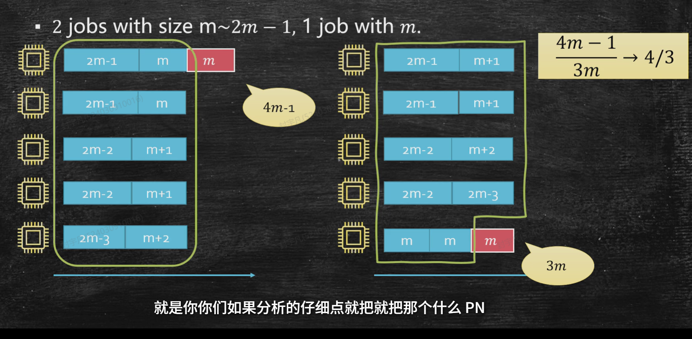
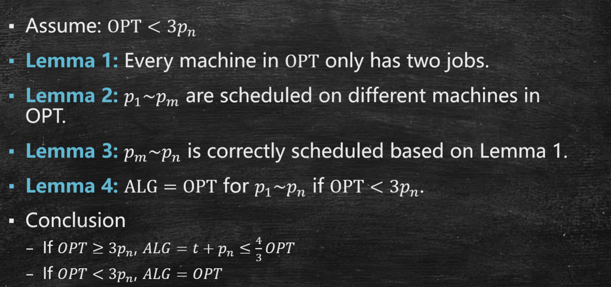

 # More Greedy Algorithms

## 一、如何选择正确的 Greedy Strategy

上一讲已经看到：Greedy 的难点不在于“每一步选一个看起来最好的东西”，而在于证明这个局部选择不会破坏全局最优解。

一个常用证明框架是：

> The local greedy choice does not ruin OPT.

也可以理解为：每做一步贪心选择之后，当前部分解仍然处在某个最优解里面。

### 1.1 Greedy 和 Divide and Conquer 的区别

**Divide and Conquer**:

- 把一个大问题拆成多个小问题。
- 分别递归求解。
- 最后合并答案。

**Greedy**:

- 不是把问题拆成多个独立子问题。
- 而是每次做一个局部选择，缩小剩余问题。
- 关键是证明这个选择仍然可以被某个最优解包含。

所以 Greedy 的证明经常长这样：

1. **Base**: 空集 $\varnothing$ 在某个 OPT 中。
2. **Hypothesis**: 当前已经选出的 $k-1$ 个元素在某个 OPT 中。
3. **Induction**: 证明加入第 $k$ 个 greedy choice 后，仍然存在一个 OPT 包含当前部分解。
4. **Conclusion**: 当算法停止时，当前解就是 OPT。

---

## 二、Activity Selection

### 2.1 Problem

- **Input**: $n$ 个活动，每个活动 $i$ 有固定开始时间 $s_i$ 和结束时间 $f_i$。
- **Output**: 选择尽可能多的互不冲突活动。

两个活动 $i,j$ 不冲突，当且仅当：

$$
f_i \le s_j \quad \text{or} \quad f_j \le s_i
$$

### 2.2 Three Greedy Ideas

可能的贪心策略：

1. **Start Time First**: 先选择开始最早的活动。
2. **Shortest Length First**: 先选择持续时间最短的活动。
3. **Finish Time First**: 先选择结束最早的活动。

前两个策略都可能失败：

- 开始早的活动可能占据很长时间，挡住很多短活动。
- 持续时间短的活动可能位于中间，把左右两边都切断。

正确策略是：

> Always choose the compatible activity with earliest finish time.

直觉是：结束越早，留给未来的空间越大。

### 2.3 Algorithm

```text
ActivitySelection(A):
    sort activities by finish time
    S = empty set
    current_end = -infinity

    for each activity i in sorted order:
        if s_i >= current_end:
            add i to S
            current_end = f_i

    return S
```

### 2.4 Correctness

设 greedy 第一步选择活动 $g$，它是所有活动中结束时间最早的活动。

取任意一个最优解 $OPT$。设 $o$ 是 $OPT$ 中第一个结束的活动。因为 $g$ 是全局结束最早的活动，所以：

$$
f_g \le f_o
$$

如果 $g=o$，则 greedy choice 已经在这个 OPT 中。

如果 $g\ne o$，用 $g$ 替换 $o$：

$$
OPT' = OPT - \{o\} + \{g\}
$$

由于 $g$ 结束不晚于 $o$，原来在 $o$ 后面可以做的活动，在 $g$ 后面仍然可以做。因此 $OPT'$ 仍然是可行解，并且活动数量不变，所以 $OPT'$ 也是一个最优解。

这说明：

> 存在一个 OPT 包含 greedy 第一步选择。

接下来只需要在所有开始时间 $\ge f_g$ 的剩余活动上递归应用同样的论证。由归纳法，Finish Time First 得到最优解。

### 2.5 Complexity

排序花费：

$$
O(n\log n)
$$

扫描一遍活动：

$$
O(n)
$$

总时间复杂度：

$$
O(n\log n)
$$

---

## 三、Prefix-Free Code

### 3.1 Encoding Problem

我们希望用二进制串编码一本书中的字符。

如果每个字符都用固定长度编码，那么解码简单，但可能浪费空间。例如有 $12$ 个字符时，每个字符需要 $4$ bits。

自然想法是：

- 高频字符用短编码。
- 低频字符用长编码。

但是任意变长编码会带来解码冲突。

例如：

| Character | Code |
| --- | --- |
| d | 1 |
| g | 10 |

当看到 `10` 时，不知道应该解码成 `g`，还是先解码 `d` 再继续读。

### 3.2 Prefix-Free Code

为了解决歧义，需要 **prefix-free code**：

> No symbol's code is the prefix of another symbol's code.

也就是说，任何字符的编码都不能是另一个字符编码的前缀。

这样就可以 bit-by-bit 解码：每当读到某个叶子节点，就确定一个字符。

### 3.3 Prefix-Free Code as a Binary Tree

任何二进制 prefix-free code 都可以看成一棵二叉树：

- 左边代表 `0`。
- 右边代表 `1`。
- 每个字符放在叶子节点。
- 根到叶子的路径就是该字符的编码。

如果字符 $a$ 的频率是 $f(a)$，深度是 $\operatorname{lev}(a)$，那么编码总成本是：

$$
\operatorname{Cost}(T)=\sum_{a\in A} f(a)\cdot \operatorname{lev}(a)
$$

所以问题变成：

- **Input**: 字符集合 $A$，频率函数 $f:A\to \mathbb{N}$。
- **Output**: 一棵最小化 $\sum f(a)\operatorname{lev}(a)$ 的 prefix-free binary tree。

---

## 四、Huffman Encoding

### 4.1 Failed Greedy Attempts

一个自然但错误的想法是：

- 把最小频率字符接到当前树里。

这类似 Prim 的 growing idea，但它不适合 Huffman。因为加入一个节点，本质上会增加已有节点或子树的高度，局部选择会影响未来的高度成本。

另一个想法是：

- 每次取两个最小字符合并。

这方向更接近正确，但关键是：合并之后不能把它们当作完成的子树后丢开，而应该把合并出的新子树看成一个 **super node**，继续参与之后的合并。

### 4.2 Huffman Algorithm

Huffman 的贪心规则：

> Repeatedly merge two nodes with minimum frequency.

合并两个节点 $x,y$ 后，产生一个新节点 $z$：

$$
f(z)=f(x)+f(y)
$$

然后把 $z$ 放回候选集合中。

```text
Huffman(A, f):
    create a leaf node for each character a in A
    put all nodes into a min-priority queue by frequency

    while there is more than one node:
        x = ExtractMin()
        y = ExtractMin()
        z = new internal node with children x and y
        f(z) = f(x) + f(y)
        Insert(z)

    return the only remaining node as the root
```

### 4.3 Augmentation View

为什么合并两个节点等价于增加成本？

当两个节点 $x,y$ 被合并成一个父节点时，$x,y$ 所在子树中所有叶子的深度都会增加 $1$。因此本轮增加的成本是：

$$
f(x)+f(y)
$$

之后如果这个 super node 再被合并，它的整体深度还会继续增加，对应继续支付：

$$
\operatorname{lev}(z)\cdot f(z)
$$

所以 Huffman 的每一步是在尽量让“当前要被加深的两个对象”的频率最小。

### 4.4 Correctness

核心引理：

> 在某个最优 prefix-free binary tree 中，频率最小的两个节点可以作为 siblings，且位于最大深度。

设 $x,y$ 是频率最小的两个节点。取一棵最优树 $T^*$。

在 $T^*$ 中，找两个最深的 sibling leaves，记为 $u,v$。因为它们最深，所以如果把更小频率的字符放到这里，成本不会更差。

如果 $x,y$ 不是这对最深 siblings，可以交换位置：

- 将 $x,y$ 放到最深 sibling 位置。
- 将原来的 $u,v$ 放到 $x,y$ 原来的位置。

由于 $f(x),f(y)$ 是最小频率，而最深位置的 depth 最大，交换后总成本不会增加。

因此存在一棵最优树，其中 $x,y$ 是最深的一对 siblings。

接下来把 $x,y$ 合并成 super node $z$，其中：

$$
f(z)=f(x)+f(y)
$$

原问题变成一个更小的问题：

$$
A' = A-\{x,y\}+\{z\}
$$

如果能为 $A'$ 构造最优 prefix-free tree，再把 $z$ 展开成 $x,y$，就得到原问题的最优解。

所以 Huffman 每次合并两个最小频率节点不会破坏 OPT，可以用归纳法证明最终结果最优。

### 4.5 Time Complexity

使用 min-heap：

- 初始化 heap: $O(n)$ 或排序后 $O(n)$。
- 每轮两次 `ExtractMin` 和一次 `Insert`。
- 共 $n-1$ 轮。

所以：

$$
O(n\log n)
$$

如果频率一开始已经排序，可以用两个队列：

1. 原始叶子节点队列。
2. 新生成 super node 队列。

因为 super node 的频率按生成顺序非递减，所以每次只需从两个队列头部取最小值。建树部分可以做到：

$$
O(n)
$$

若还需要先排序，总时间仍是：

$$
O(n\log n)
$$

---

## 五、Huffman 与信息论

Huffman 证明的是：

> 它在 binary prefix-free code 中最优。

但如果允许非二进制编码，例如 3-ary code，有些分布下可能更优。

从信息论角度看，设字符随机变量为 $X$，字符概率为 $p(a)$，熵为：

$$
H(X)=\sum_{a\in A}p(a)\log\frac{1}{p(a)}
$$

熵给出了平均编码长度的理论下界。

当每个字符概率刚好匹配二进制长度时：

$$
\operatorname{length}(a)=\log\frac{1}{p(a)}
$$

Huffman 可以达到熵下界。例如：

- 有 $2^k$ 个字符，且频率相同，则每个字符编码长度都是 $k$。
- 如果频率是 $1/2,1/4,1/8,\dots$ 这类二进制幂分布，编码长度也能完全匹配概率。

一般情况下，Huffman 是最优 binary prefix-free code，但平均长度未必等于熵。

---

## 六、Makespan Minimization

### 6.1 Problem

- **Input**: $m$ 台相同机器，$n$ 个 job，每个 job 的处理时间为 $p_i$。
- **Output**: 将所有 job 分配到机器上，使最大完成时间最小。

最大完成时间称为 **makespan**：

$$
C_{\max}=\max_{k=1}^{m}\text{load}(k)
$$

目标是最小化 $C_{\max}$。

这个问题是 NP-hard 的，所以不能指望一个简单 greedy 总是给出最优解。

### 6.2 List Scheduling

最简单的 greedy：

> Put each job onto the earliest finished machine.

也就是每次把当前 job 分配给当前负载最小的机器。

这个算法不一定最优，因为输入 job 的顺序会影响结果。

但是它有理论保证。

### 6.3 2-Approximation

设 greedy 得到的 makespan 为 $ALG$。考虑最后完成的 job，设它的处理时间是 $p_j$，开始时间是 $t$。

那么：

$$
ALG=t+p_j
$$

因为 greedy 总是把 job 放到最早空闲的机器上，所以在时间 $t$ 之前，所有机器都处于 busy 状态。于是总工作量 $W$ 满足：

$$
W \ge mt
$$

因此：

$$
t \le \frac{W}{m} \le OPT
$$

同时任意 job 都必须被某台机器执行，所以：

$$
p_j \le OPT
$$

于是：

$$
ALG=t+p_j \le OPT+OPT = 2OPT
$$

所以 List Scheduling 是一个 2-approximation algorithm。

这个界在某些输入上可以接近 $2$，因此不能只靠同一个证明得到更好常数。

---

## 七、LPT Algorithm

### 7.1 Algorithm

LPT = **Longest Processing Time First**。

算法：

1. 将 job 按处理时间从大到小排序。
2. 按这个顺序执行 List Scheduling：每次把 job 放到当前最早完成的机器上。

```text
LPT(jobs, machines):
    sort jobs by nonincreasing p_i
    for each job j:
        assign j to the machine with minimum current load
```

LPT 仍然不一定最优，但比任意顺序的 List Scheduling 更稳定。

### 7.2 First Bound: Using the Last Job

仍然考虑 LPT 结果中最后完成的 job，设它是 $p_j$，开始时间为 $t$：

$$
ALG=t+p_j
$$

同样有：

$$
t\le OPT
$$

如果可以证明：

$$
p_j \le \frac{1}{3}OPT
$$

那么立刻得到：

$$
ALG=t+p_j \le OPT+\frac{1}{3}OPT=\frac{4}{3}OPT
$$

所以关键是分析最后一个 job 的大小。

### 7.3 Why $p_j$ Is Small or LPT Is Optimal

因为 LPT 按从大到小排序，最后完成的 job 通常是比较短的 job。

如果：

$$
OPT \ge 3p_j
$$

那么：

$$
p_j \le \frac{1}{3}OPT
$$

直接得到 $4/3$ 近似。

如果：

$$
OPT < 3p_j
$$



由于所有未必更短的 job 都至少不小于 $p_j$，在最优解中任意一台机器不能放三个 job，否则负载会超过 $3p_j>OPT$。

因此每台机器在 OPT 中最多只有两个 job。

课件中的证明思路是：

- 当 OPT 中每台机器最多两个 job 时，前 $m$ 个大 job 必须分别放在不同机器上。
- 剩余 job 的配对顺序由大到小结构决定。
- LPT 在这种情况下会得到最优安排。

所以：

> 若 $OPT<3p_j$，则 LPT 实际上已经是 optimal。

综合两种情况：

$$
ALG \le \frac{4}{3}OPT
$$

更强的经典结论是：

$$
ALG \le \left(\frac{4}{3}-\frac{1}{3m}\right)OPT
$$

课件中主要展示的是 $4/3$ 的分析框架。

### 7.4 Counterexample

LPT 的近似比不能简单改成 $1$。

课件给出一类输入，使得：

$$
\frac{ALG}{OPT}\to \frac{4}{3}
$$



这说明 LPT 虽然比简单 List Scheduling 更好，但仍然只是近似算法。

---

## 八、本讲重点

1. Greedy proof 的核心是证明局部选择不会破坏某个 OPT。
2. Activity Selection 中，Finish Time First 是正确策略。
3. Prefix-free code 可以表示成二叉树，编码成本是 weighted external path length。
4. Huffman 每次合并两个最小频率节点，并把新子树当作 super node 继续参与合并。
5. Huffman 的正确性来自 sibling/exchange argument。
6. Huffman 在 binary prefix-free code 中最优，但不一定达到信息论熵下界。
7. Makespan Minimization 是 NP-hard，Greedy 不一定最优。
8. List Scheduling 是 $2$-approximation。
9. LPT 通过先安排长 job，把近似比改进到约 $4/3$。
