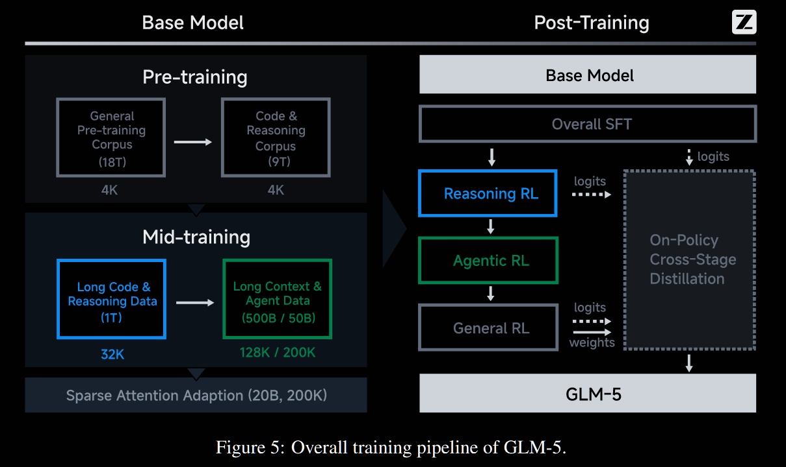
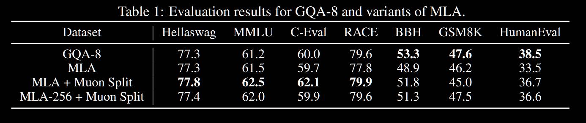
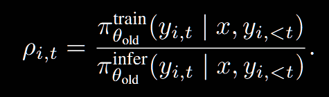
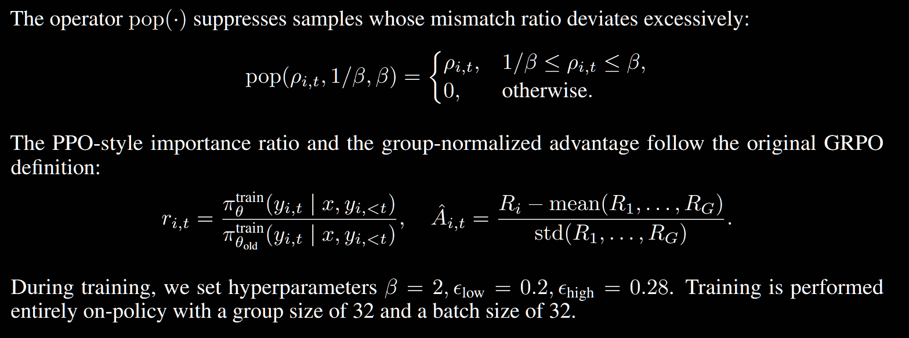

# GLM-5 Notes

## Model Innovation

1. Apply **DSA(DeepSeek Sparse Attention)** -> accelerate trining and inference;
2. New **asynchronous RL infrastructure**, decouples generation from training;
3. **novel asynchronous Agent RL algorithms**, which is designed to enhance the quality of autonomous decision-making

## Model Architecture

### Pretraining

1. **MoE: 256 experts**
2. **MLA:**
    
    **Difficulties**: MLA with a 576-dimension latent KV-cache cannot match the performance of GQA with 8 query groups”
    
    **Fixs**:
    
    1. **Muon Split** :  传统方法是应用Muon在上投影矩阵$W^{UQ}$, $W^{UK}$, $W^{UV}$,（通常形状是D \* H \* $d_h$ )上应用Newton-Schulz正交化，但这样就意味着，不同的注意力头共享一个更新尺度约束，但不同的注意力头应该是被射艺用来捕捉不同特征的。    Muon Split的想法很简单，即先按注意力头维度 H 将上投影注意力矩阵分块，再分别应用正交化。
        
        **Bonus：**
        
               **解耦更新尺度（Decoupled Scales）**：允许不同注意力头的投影权重以独立的尺度进行更新。
        
               **弥补 MLA 的性能损失**：MLA 的核心优势在于将 KV Cache 极度压缩到一个低维的 Latent 向量中以突破推理时的显存墙限制，但这要求 $W^{UK}$ 和   $W^{UV}$  能够精准地将特征映射回高维的多头空间。标准的全局 Muon 限制了解压过程的自由度，导致表现不佳。采用 Muon Split 后，各头恢复了独立更新能力。
        
               **Logit 稳定性**：由于各头在正交化时不再互相牵制和平均化，注意力分数（$Q \cdot K^T$ ） 的尺度在无 Logit Clipping得情况下载整个预训练期间保持了自然稳定。
        
    2. **减少MLA的头数，增加头维度：**
        
        由$Attention(Q, K, V)=softmax(\dfrac{QK^T}{\sqrt{d_k}})V$ , $Q$ 的形状是：$1 \times d_h$ $K$  的形状是：$L \times d_h$ ，相乘发现$d_h$ 消失了，即softmax与头维度无关，只与头数 H 有关，因此增加头维度，减少头数，有利于训练推理时的softmax这一步的加速。具体改动：$d_h$ : 192 -> 256, H 减少了 1/3 

        
        
3. **Multi-token Prediction(MTP) with Parameter sharing**
    
    **Bugs:** DeepSeek-V3 在训练时只加了 **1 层** MTP（只训练它预测下 1 个 Token）。但在实际推理时，却强行让这 1 层连续运行两次，去预测未来 **2 个** Token。为了打破“多层占显存”和“单层不准”的僵局，GLM5 设计了 1 套参数 3 个 MTP 层共同用上一步输出的 token输入到下一层MTP层里面继续预测下一个，梯度累计更新。
    
4. **DSA**
    
    这是Deepseek V3.2中提出的方法， 本质是一种动态稀疏注意力方法，但是最令人感兴趣的是Deepseek团队是怎么在 dense 基座模型上 运用DSA的 ，因为从头开始训练新的Attention模式的模型往往cost非常高。
    

## Mid-Training Infrastructure

Based on GLM-4.5

1. **Flexible MTP placement**
    
    - **Bugs**: MTP 模块跨越了 embedding, transformer 和 output 组件。在交错式流水线并行（interleaved pipeline parallelism）中，如果作为一个整体放在同一个 stage，会导致极高的显存占用，引发 stage 级别的显存不平衡。
    - **Fixs**: 拆分部署。将 MTP 的 output layer 放到整个流水线的最后一个 stage，与主模型的 output layer 放在一起以实现参数共享（parameter sharing）。同时，将 MTP 的 embedding 和 transformer 组件放在前一个 stage。
    - **Bonus**: 减轻了最后一个 stage 的显存压力，改善了整个流水线 ranks 的负载均衡。
2. **Pipeline ZeRO2 gradient sharding**
    
    - **Bugs**: 传统的 pipeline 中，每个 rank 维护多个 stages，单纯的梯度累加和优化器更新需要极大的完整梯度 buffer，显存开销大。
    - **Fixs**: 借鉴 ZeRO2 思想，在数据并行（data-parallel）的 ranks 之间切分梯度。每个 stage 只存储 `1/dp` 的完整梯度。此外引入双缓冲（double buffering），同时只保留两个 stage 的完整累加 buffer。
    - **Bonus**: 当一个 buffer 在连续的 microbatches 上累加梯度时，前一个 buffer 的梯度同步可以并行进行（重叠隐藏开销）。把持久化的梯度显存降低到了切分后的水平，且实际操作中零额外同步开销。
3. **Zero-redundant communication for the Muon distributed optimizer**
    
    - **Bugs**: 原生的 Muon 优化器会在每个数据并行的 rank 上执行全收集（all-gather）以获取完整的模型参数，这会导致瞬时的显存尖峰（transient memory spikes）和严重的冗余通信。
    - **Fixs**: 限制 all-gather 的范围。只收集每个 rank 自己拥有的参数分片（parameter shards），并将局部的计算与分片的通信进行时间上的重叠。
    - **Bonus**: 彻底消除了冗余通信，显著压低了优化器带来的峰值显存开销。
4. **Pipeline activation offloading**
    
    - **Bugs**: 在流水线预热（pipeline warmup）阶段，前向传播的进度远远超前于反向传播，导致中间激活值（intermediate activations）要在显存里存活很久，吃掉大量 GPU 内存。
    - **Fixs**: 引入层级（layer granularity）的卸载机制。前向计算完后，立刻把激活值卸载（offload）到 CPU 主机内存里；等反向传播要用到了，再提前加载（reload）回 GPU。
    - **Bonus**: 结合细粒度重计算（fine-grained recomputation），基本不需要激活值常驻 GPU 显存。通过精妙的调度，让 offload/reload 与计算重叠，并且避开了与 P2P 通信和 MoE token 路由的冲突，实现了“几乎零开销”的大幅显存瘦身。
5. **Sequence-chunked output projection for peak memory reduction**
    
    - **Bugs**: 模型的输出投影层（Output projection）和算交叉熵损失（cross-entropy loss）时，不仅要存激活值给反向传播用，还要在算 loss 时把精度提升，这会带来巨大的瞬时显存压力。
    - **Fixs**: 对输入序列进行分块（Sequence-chunked）。把长序列切成小块（smaller chunks），在每个 chunk 上独立走完投影和 loss 的前向与反向计算。算完一个 chunk 立刻释放它的激活值，再去算下一个。
    - **Bonus**: 切块越多，峰值显存占用就越小。在保持性能不掉的前提下，完美化解了输出层的显存危机。

## Post-Training

### 一、SFT with interleaved thinking modes

模型支持三种不同的思维风格

1. Interleaved thinking   在每个回答和工具调用之前都思考
2. Preserved thinking 保留之前的所有thinking模块，重复利用之前的thinking结果
3. Turn-level Thinking 在简单的人物时关闭thinking，在复杂的任务时开启thinking

### 二、Reasoning and Agentic RL

#### Reasoning RL

**Backbone Formula     adapted from IcePop, removed KL regularization term**([“Small Leak Can Sink a Great Ship—Boost RL Training on MoE with 𝑰𝒄𝒆𝑷𝒐𝒑!”](zotero://select/library/items/X85LXTW8))

$$L(θ) = −E{x∼D,\{y_i\}^G_{ i=1 }∼π^{infer}{θ{old}} (·|x) } ( \dfrac{1}{G} \sum_{ i=1}^G \dfrac{1}{ |y_i|} \sum^{|y_i|}_{t=1} pop(ρ_{i,t}, 1/β, β) · min (r_{i,t}Aˆ{i,t}, clip(r_{i,t}, 1 − ε{low}, 1 + ε{high}) Aˆ{i,t}） )$$

Training-inference mismatch riao定义为：

    

([GLM-5-Team 等, 2026](zotero://select/library/items/9HDFL968); [“Small Leak Can Sink a Great Ship—Boost RL Training on MoE with 𝑰𝒄𝒆𝑷𝒐𝒑!”](zotero://select/library/items/DW4VN3DA))

这里GLM团队的做法是用一个参数$\beta$ 来控制masmatch的上下界。

基于IcePop的强化学习loss公式，GLM-5在DSA架构上进行了大规模的Reasoning RL训练。**提到DSA相比于MLA的优势是引入了额外的indexer用来检索top-k重要的KV键值对，这对RL的稳定性十分重要。**

#### Replay

由于这里是on-policy的micro-batch更新，这就会遇到一个问题：如何保证上一步更新后，微调过的模型权重，选用的MoE，或者Spars attn，与更新前的一样，从而保证梯度能被正确地回传？

**在MoE中**，每次routing选择的专家通常只有1-2个，因此top-k中的k通常较小，我们可以在microbatch开始时采样rollouts时记录这些k，在更新时按照保存的top-k更新。这就被称为**Routing Replay。**

**在DSA中**，我们选择attention的indexer k值通常较大（这里选k=2048），因此将所有k的indices存下来并不现实。因此GLM-5的作者们使用了一种**“以计算换存储”**的方法（题外话：在之前使用Triton重写Flashattn2的实践中，是使用重计算以换速度，因为对于一个Tile的调用会产生atomic操作降低速度）。如何进行重计算以保证top-k的选择和更新前一样？

1. 对于ateention分数的计算，保持indexer打分器的参数不变

2. 在选择Top-k的时候，不使用CUDA, TileLang等实现（由于一些Tile级别的并行操作，有的时候Top-k并不是确定的），用pytorch等deterministic的operator

#### Mixed Domain reasoning RL

综合了Math， science， code， tool-integrated reasoning四个领域，每个领域有各自的判断模型和打分，四个领域进行了权重平均

### 三、Agentic RL

为什么要使用asynchronous的agentic RL？原来的synchrnous的模型在等待agent的长rollouts时会让GPU产生大量空闲。由于推理和训练被解耦，用来生成数据的模型权重往往落后于正在训练更新的模型权重（即 Off-policy 条件）。为了在这种异步环境下维持训练稳定性，GLM-5 引入了两个关键机制：

1. **TITO(Token-in-Token-out)：** inference engine在另一设备推理出了一个rollouts，正常来说是直接将纯文本的形式传给训练模型，但是由于两端模型tokenization的潜在差异或者边界截断、特殊字符的处理差异，在training这一端做出来的token可能与rollout生成的不同，直接造成token错位，reward爆炸。因此GLM-5直接将输入和输出都统一为Token的形式；

2. **Direct Double-sided Importance Sampling**： 不需要在训练卡上保存历史的 $\pi_{infer}$ 记录，在inference端生成的时候直接传输就行

### 四、General RL -- human style alignment

主要关注三个方面：**fundamental correctness, emotional intelligence, task-specific quality.**

**运用了三个打分模型： rule-based reward functions, outcome reward models (ORMs), and generative reward models (GRMs).**

值得注意的是，在该过程alignment中，还有高质量的人类生成的回答。这一策略是基于如果仅用模型生成的回答，会让模型的输出变得冗长且公式化的观察得出的。（“This is motivated by the observation that purely model-generated optimization tends to converge toward recognizably “model-like” patterns—often verbose, formulaic, or lacking the nuance of skilled human writing“）

### 五、On-policy Cross-stage Distillation

在后训练的阶段为了不让模型忘记前面的训练的内容，选择cross-stage distillation，对于前面的额部分，比如早期的SFT和Reasoning RL，会从之前的训练数据集中收集data作为老师模型的评判依据。

## RL Infrastructure —— SLIME

在slime框架上做的几点优化：

### PD（Prefill-decode）分离

prefill是计算密集型的任务，decode是访存密集型，如果将prefill和decode放在同一张卡上，导致GPU一会Tensor core负载大，一会显存带宽负载大，就是之前提到过的inference和training分离。

#### ! Notice

- PD-disaggregation 和 之前的inference-training 分离并不相同，前者是统一模型，同一权重在不同卡上跑以平衡compute bound 和 memory bound， 后者是在不同卡上跑有可能不同的模型，不同的架构跑inference以加快RL流程。
- PD-disaggregation isn’t always a silver bullut！！当workload很小，系统没有经过微调，通信开销很大的时候会gg。
- **Independent tuning**: You can implement different optimization techniques (like tensor or pipeline parallelism) for prefill and decode to better meet your goals for TTFT and ITL.
- 尾部表现（Tail-Behavior）长prefill可能会导致tail latency变差，就是说在大部分计算可以很快完成的情况下，小部分完成请求的时间tail巨长，这里影响了decode；
- （Several open-source frameworks and projects are actively exploring PD disaggregation, including [SGLang](https://github.com/sgl-project/sglang/issues/4655), [vLLM](https://docs.vllm.ai/en/latest/features/disagg_prefill.html), [Dynamo](https://docs.nvidia.com/dynamo/latest/architecture/disagg_serving.html), and [llm-d](https://docs.google.com/document/d/1FNN5snmipaTxEA1FGEeSH7Z_kEqskouKD1XYhVyTHr8/edit?pli=1&tab=t.0).）
### MTP

### Rollout robustness：Heartbeat-Driven Fault Tolerance

主要解决的问题：在大规模训练时可能有的server会crash，掉线，性能下降等故障。自动heartbeat检测，不行了换server

## Agentic Engineering

\-- from vibe coding to agentic engineering
