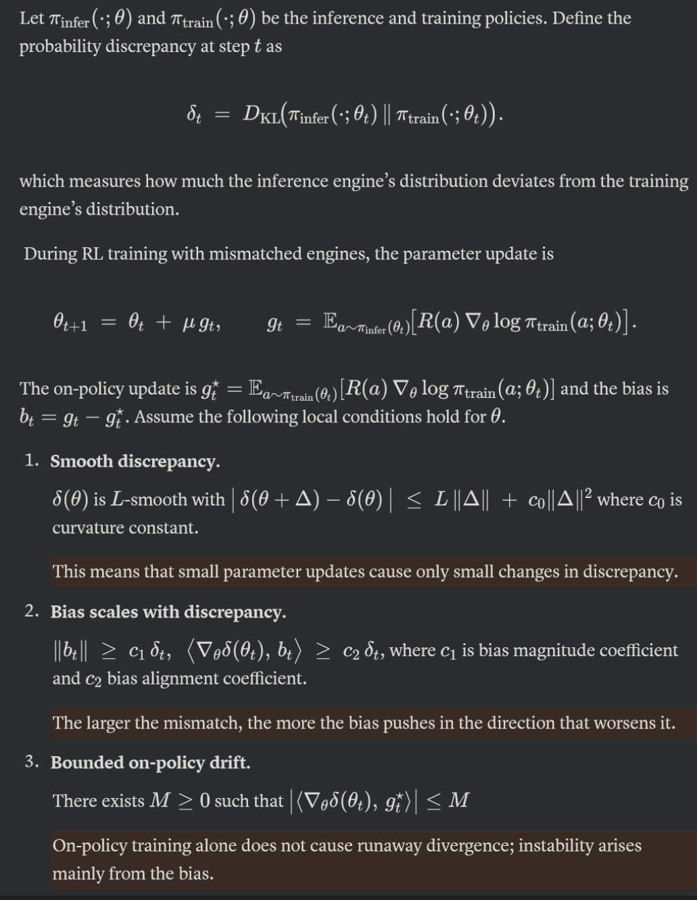

# Training and Inference Mismatch: IcePop

IcePop starts from a very practical problem in large-scale RL training: the model that generates rollouts is not always exactly the same model, numerically or operationally, as the model used to compute gradients.

In many RL systems, rollout generation is served by an inference engine such as vLLM, while parameter updates are executed by a training stack based on FSDP, tensor parallelism, mixed precision kernels, and optimizer-side sharding. These two paths are optimized for different goals. The inference path maximizes serving throughput, while the training path maximizes gradient efficiency and memory scalability. As a result, even when they share the same nominal checkpoint, they may not assign exactly the same probability to the next token.

Let the inference-side policy be $\pi_{\text{infer}}$ and the training-side policy be $\pi_{\text{train}}$. The mismatch can be written as:

$$
\pi_{\text{infer}}(a \mid s; \theta) \ne \pi_{\text{train}}(a \mid s; \theta).
$$

This looks like a small implementation detail, but it changes the meaning of the RL update. The rollout is sampled from $\pi_{\text{infer}}$, while the gradient is computed under $\pi_{\text{train}}$. In other words, an apparently on-policy algorithm quietly becomes an off-policy algorithm.

## Why MoE Makes It Worse

For dense models, train-inference mismatch may come mainly from numerical precision, kernel implementation, communication order, or stale weights. For MoE models, the router adds another source of instability.

There are two reasons this becomes serious:

1. The selected experts may differ between inference and training.
2. The discrepancy compounds when many routing layers are stacked.

MoE routing is a discrete decision layered inside a continuous model. A tiny numerical difference in router logits can flip a top-k expert choice. Once the activated expert changes, the hidden state distribution changes, then the next layer's router sees a different input, and the difference can cascade through the network.

This is why MoE RL is more fragile than the dense-model intuition suggests. The problem is not merely that $\pi_{\text{infer}}$ and $\pi_{\text{train}}$ are slightly different. The problem is that the model contains many internal branching points, and each branch can amplify the previous difference.

## Probability Discrepancy Compounds

The IcePop discussion defines a probability discrepancy between the two engines, for example through a KL-style distance:

$$
\delta_t =
D_{\text{KL}}(
\pi_{\text{infer}}(\cdot; \theta_t)
\Vert
\pi_{\text{train}}(\cdot; \theta_t)
).
$$

The intuition of the compounding argument is simple: if the gradient direction is biased by the mismatch, then every update can push the model into a region where the mismatch becomes larger. The training signal is no longer only optimizing the reward. It is also carrying systematic bias from the difference between the rollout distribution and the gradient distribution.

This is a useful lens for understanding RL collapse. The collapse is not necessarily caused by a single bad rollout or a single large gradient. It can be caused by a persistent small leak: a repeated mismatch that keeps injecting biased updates into a long-horizon optimization process.

## IcePop's Core Idea

IcePop introduces a token-level filter for this mismatch. For each sampled token, it computes a train-inference probability ratio:

$$
\rho_{i,t}
=
\frac{
\pi^{\text{train}}_{\theta_{\text{old}}}
(y_{i,t} \mid x, y_{i,<t})
}{
\pi^{\text{infer}}_{\theta_{\text{old}}}
(y_{i,t} \mid x, y_{i,<t})
}.
$$

If $\rho_{i,t}$ stays inside an acceptable interval, the token is treated as reliable enough for gradient computation. If the ratio is too large or too small, the token is considered too mismatched and its gradient contribution is masked out:

$$
\operatorname{pop}(\rho_{i,t}, 1/\beta, \beta)
=
\begin{cases}
\rho_{i,t}, & 1/\beta \le \rho_{i,t} \le \beta, \\
0, & \text{otherwise}.
\end{cases}
$$

This is the main difference from a softer importance-sampling correction. Instead of merely reweighting all tokens, IcePop refuses to learn from tokens where the inference engine and the training engine disagree too much.

## Relation to TIS

TIS also recognizes that the rollout policy and training policy may differ. It uses an importance ratio between the inference policy and the training policy, then applies a constant weight to control the mismatch.

IcePop makes a more aggressive choice. When the ratio is outside the trusted range, it sets the token's contribution to zero. This is not just clipping for numerical convenience. It is a statement about credit assignment: if the two engines disagree too much on a token, the training stack should not pretend that this token is a clean on-policy sample.

My view is that this is the right bias for large MoE RL. A noisy token-level update is worse than a missing update when the noise is systematic and compounding. In supervised learning, dropping data often feels wasteful. In RL, especially long-horizon RL, dropping contaminated credit assignment can be the more conservative choice.

## A Small Viewpoint: IcePop Is a Systems Contract

IcePop is easy to describe as an algorithmic trick, but I think its deeper meaning is a systems contract between the inference engine and the training engine.

Modern RL pipelines are no longer a single model running in a single execution mode. They are distributed systems with separate serving engines, training engines, precision formats, routing behavior, and weight synchronization schedules. If these components disagree, the loss function has to know about that disagreement.

From this angle, IcePop is not only stabilizing MoE routing. It is exposing a general principle:

> RL objectives for large models should be aware of the system that produced the trajectories.

This matters for future agentic RL as well. The longer the trajectory, the more opportunities there are for hidden mismatch: stale policy weights, tool-call side effects, non-deterministic kernels, router flips, and different decoding implementations. A clean mathematical objective is not enough if the execution system quietly changes the distribution.

## Hyperparameter Thoughts

The key hyperparameter is the trusted interval, usually controlled by $\beta$. A larger $\beta$ keeps more tokens but allows more mismatch. A smaller $\beta$ filters more aggressively but may discard useful learning signal.

I would not treat $\beta$ as a universal constant. It should depend on at least four factors:

1. Model scale: larger MoE models may have more routing-sensitive layers.
2. Rollout length: longer trajectories accumulate more mismatch.
3. Engine gap: a larger implementation gap between inference and training should imply stricter monitoring.
4. Batch and group size: larger groups can tolerate more filtering because there are more alternative samples.

A practical setting procedure should probably start from measurement rather than guesswork. Before choosing $\beta$, log the empirical distribution of $\rho_{i,t}$ across positions, layers, domains, and rollout lengths. Then choose bounds that remove the heavy tails without deleting the majority of ordinary tokens.

The useful metric is not only the average ratio. The tail behavior is more important. RL crashes are often driven by rare extreme updates rather than by the mean token.

## Remaining Questions

IcePop makes MoE RL more stable, but it also raises a few questions.

First, masking removes bad gradients, but it may also remove rare but valuable exploration signals. The tradeoff between stability and exploration is still task-dependent.

Second, token-level masking may be too local for some reasoning tasks. If one early token is mismatched but the whole trajectory succeeds, should the algorithm discard only that token, downweight the suffix, or reason at the sequence level?

Third, IcePop handles train-inference probability mismatch, but not all RL instability comes from probability mismatch. Reward hacking, verifier noise, stale rollouts, and tool-use non-determinism may need similar filtering ideas at other levels.

My takeaway is that IcePop is important because it treats RL training as an interaction between objective design and system design. For large MoE reasoning models, the boundary between "algorithm problem" and "infrastructure problem" is no longer clean.

Related context: [Every Step Evolves: Scaling Reinforcement Learning for Trillion-Scale Thinking Model](https://arxiv.org/abs/2510.18855).
