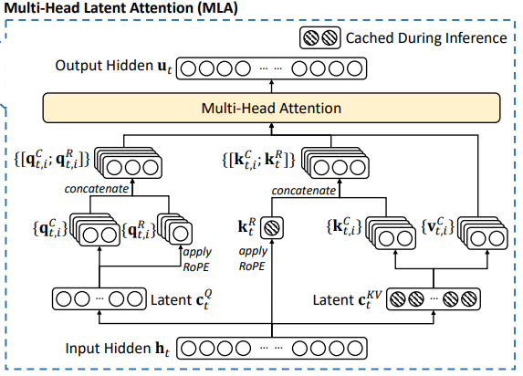
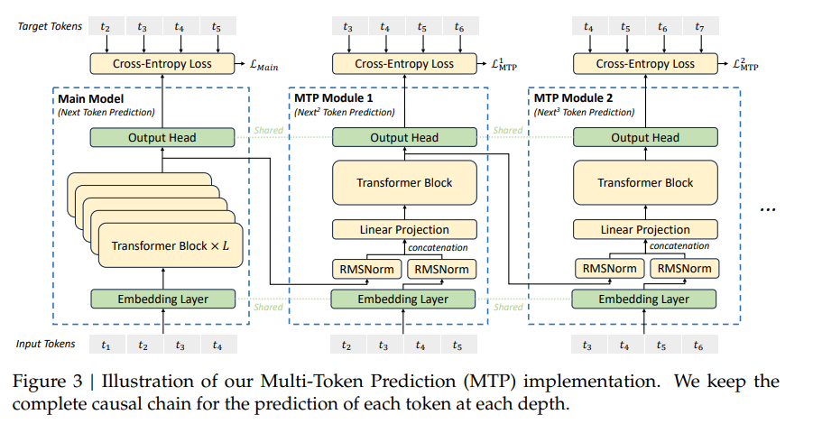

# MLA, dim by dim

## Opening

This note uses one lens throughout: write attention as tensor contractions, while keeping every dimension explicit. From this view, several seemingly separate MLA phenomena can be understood more deeply and more uniformly. Specifically, we get a few interesting conclusions:

- In prefill, MLA uses the KV latent bottleneck to reduce projection FLOPs, but it cannot absorb too early: the quadratic attention term should still live in $d_k,d_v$, not $d_c$.
- In decode, the best order changes because the cache already exists. After absorbing key/value projections, the length-$t$ cache computation can go through the latent state instead of reconstructed per-head $K,V$.
- RoPE gets in the way exactly because it makes the latent-to-key map position-dependent, which breaks full key absorption.
- Q compression delays head expansion on the query side, reducing activation scale and usually projection FLOPs as well.
- MTP-style speculative decoding behaves differently on MLA because MLA decode no longer repeatedly reads the full KV cache; it reads a smaller latent cache and does extra computation on top.

## Tensor View

Before the derivations, we first fix the tensor view used throughout the note. Every $\mathrm{matmul}$ below is treated as a PyTorch-style batched tensor contraction, and every attention activation follows the `(h, T, D)` order whenever it has a head axis: head first, sequence second, feature last. Per-head weights start with `h`; shared activations such as $X$, $C^{KV}$, and $C^Q$ do not have an `h` axis. When a shared activation multiplies a per-head weight, the missing head axis is broadcast.

**Einsum is all you need.** In practice every one of the multiplications below can be written as a single `einsum` expression, and we find it much easier to keep track of what is being contracted vs. broadcast that way. For example:

$$
Q \;=\; X W_Q \;\;\Longleftrightarrow\;\; Q_{h,T,d_k}
\;=\;
\mathrm{einsum}(\texttt{"Td, hdk -> hTk"},\; X,\; W_Q).
$$

The two indices that appear on both sides (like the `d` in this example) are contracted; the ones that appear only on one side (like `h` on $W_Q$, or `T` on $X$) are preserved. Every "broadcast" I use later is just this: an activation without an `h` axis multiplies against a weight with an `h` axis, and the result inherits `h`.

**Broadcast is legal only when dims line up.** Broadcasting between batch dims follows the standard PyTorch rule: when we align the batch dimensions of $A$ and $B$ from the right (the last two axes are reserved for the matmul), each pair must either match or have a `1` on one side — the side with the `1` is the one being replicated. A leading axis missing entirely (as when $X$ is only 2D above) counts as an implicit `1`. If a pair is neither equal nor has a `1`, the multiplication is undefined and the framework raises an error. Every matmul in this note satisfies the rule; whenever an activation without an `h` axis meets a weight with `h`, it is the activation's implicit `1` on the head axis being expanded to `h`.

> **Transpose convention.** Throughout, $A^\top$ denotes swapping only the last two axes — the *math-style* matrix transpose that leaves batch dims untouched. In PyTorch this is `A.transpose(-1, -2)` (or the equivalent `A.mT`), *not* `A.T`, which reverses all axes. So $K$ with shape $(h, T, d_k)$ has $K^\top$ of shape $(h, d_k, T)$, and $Q K^\top$ contracts on the last two axes cleanly.

**Output projection is an einsum contraction, not a batched matmul.** The final output projection $Y = O W_o$ with $O:(h, T, d_v)$ and $W_o:(h, d_v, d)$ is the one place where we write the result as $(T, d)$ rather than the "batched" $(h, T, d)$. Under the einsum convention this reads $Y = \mathrm{einsum}(\texttt{"hTv, hvd -> Td"}, O, W_o)$: the `h` axis is a contracted index because it appears on both operands but not on the output, so the sum over heads is implicit. Equivalently, $O$ can be reshaped to $(T, h d_v)$ and $W_o$ to $(h d_v, d)$, giving the standard "Concat + $W_O$" form of multi-head attention; the two views are byte-identical and both use $\mathrm{FLOPs} = 2 T h d_v d$.

**Tensor FLOPs formula.** For a 3D batched matmul the FLOPs count is simple. If we write the two operands as $A$ with shape $(a_1,\ldots,a_p,\; m,\; k)$ and $B$ with shape $(b_1,\ldots,b_q,\; k,\; n)$, and let $B_1,\ldots,B_r$ be the broadcast batch dims of the output, then

$$
\mathrm{FLOPs}
\;=\;
2 \cdot B_1 \cdots B_r \cdot m \cdot n \cdot k .
$$

The mental shortcut: multiply every output dimension by the contracted dimension $k$, then by the $2$ that comes from counting one multiply-add as two FLOPs. Every FLOPs count in this note is one application of this formula.

Two examples for concreteness:

- $Q = X W_Q$ where $X:(T,d)$ and $W_Q:(h,d,d_k)$ produces $Q:(h,T,d_k)$. The contracted dim is $d$; the output dims are $h, T, d_k$; so $\mathrm{FLOPs} = 2 h T d\, d_k$.
- $S = Q K^\top$ where $Q:(h,T,d_k)$ and $K^\top:(h,d_k,T)$ produces $S:(h,T,T)$. The contracted dim is $d_k$; the output dims are $h, T, T$; so $\mathrm{FLOPs} = 2 h T^2 d_k$.

With this tensor view in hand, the rest of the note is mostly shape accounting: write the candidate contraction order, identify the output dimensions and contracted dimension, and read off the FLOPs.

> **Takeaway.** Once every operation is written as a tensor contraction, FLOPs become explicit shape accounting.

## Notation and Preliminaries

For broader background on the cache tradeoffs from MHA/MQA/GQA to MLA, see [Su Jianlin's note](https://spaces.ac.cn/archives/10091). Here I do not try to survey those variants. I use MHA as the clean algebraic reference, and MLA as the object of the derivation.

For the derivations below, I count one multiply-add as $2$ FLOPs, and I only count matrix multiplication FLOPs. I temporarily ignore softmax, masks, normalization, RoPE elementwise rotation, and bias terms. Unless stated otherwise, prefill formulas use the full $T^2$ attention matrix; causal attention replaces the full square by the lower-triangular visible pairs, but does not change the comparisons below.

The main dimensions are:

| Symbol | Meaning | Shape / role |
| --- | --- | --- |
| $T$ | prefill sequence length | number of tokens in prefill or training |
| $t$ | decode KV-cache length | number of cached historical tokens |
| $d$ | hidden size | $x_i \in \mathbb{R}^{d}$ |
| $h$ | number of attention heads | head index $s = 1,\ldots,h$ |
| $d_k$ | per-head query/key dimension | $q_i^s,k_i^s \in \mathbb{R}^{d_k}$ |
| $d_v$ | per-head value dimension | $v_i^s,o_i^s \in \mathbb{R}^{d_v}$ |
| $d_c$ | MLA KV latent dimension | $c_i^{KV} \in \mathbb{R}^{d_c}$ |
| $d_{qc}$ | MLA query latent dimension | $c_i^Q \in \mathbb{R}^{d_{qc}}$ |

The MHA reference form is:

$$
Q=XW_Q,\qquad K=XW_K,\qquad V=XW_V.
$$

The shapes are:

$$
X:(T,d),\quad
W_Q,W_K:(h,d,d_k),\quad
W_V:(h,d,d_v),
$$

so

$$
Q,K:(h,T,d_k),\qquad V:(h,T,d_v).
$$

Then attention is:

$$
S=QK^\top,\qquad P=\operatorname{softmax}(S),\qquad O=PV,\qquad Y=OW_o.
$$

Here $S,P:(h,T,T)$, $O:(h,T,d_v)$, and the output projection $Y=OW_o$ uses the head-contraction convention from the previous section.

The MLA KV path replaces per-head $K,V$ projections with a shared latent:

$$
C^{KV}=XW_{DKV},\qquad
K=C^{KV}W_{UK},\qquad
V=C^{KV}W_{UV}.
$$

The shapes are:

$$
W_{DKV}:(d,d_c),\quad
C^{KV}:(T,d_c),\quad
W_{UK}:(h,d_c,d_k),\quad
W_{UV}:(h,d_c,d_v).
$$

Without query compression, the query path is still $Q=XW_Q$. With query compression, it is:

$$
C^Q=XW_{DQ},\qquad Q=C^QW_{UQ},
$$

with

$$
W_{DQ}:(d,d_{qc}),\quad
C^Q:(T,d_{qc}),\quad
W_{UQ}:(h,d_{qc},d_k).
$$

These are the only structural definitions needed later. The remaining sections ask what FLOPs we get when the same objects are multiplied in different orders.

## Baseline FLOPs

I start from baseline multi-head attention (MHA), derive each matrix multiplication and its FLOPs, and then compare it with MLA to see where the optimization actually comes from.

### Prefill Comparison

Prefill FLOPs consist of three parts: the input projections, the quadratic attention computation, and the final output projection. The table below gives the result before the detailed derivation.

| Method | Input-projection FLOPs | Attention FLOPs | Output-projection FLOPs |
| --- | --- | --- | --- |
| MHA | $2Tdh(2d_k+d_v)$ | $2hT^2(d_k+d_v)$ | $2Thd_vd$ |
| MLA without query compression | $2Tdd_c+2Thdd_k+2Thd_c(d_k+d_v)$ | $2hT^2(d_k+d_v)$ | $2Thd_vd$ |
| MLA with query compression | $2Tdd_c+2Tdd_{qc}+2Thd_{qc}d_k+2Thd_c(d_k+d_v)$ | $2hT^2(d_k+d_v)$ | $2Thd_vd$ |

Plugging in the DeepSeek-V2 attention configuration $d=5120,\ h=128,\ d_k=d_v=128,\ d_c=512,\ d_{qc}=1536$ gives:

| Method | Input-projection FLOPs | Relative to MHA |
| --- | ---: | ---: |
| MHA | $503.3\text{M}T$ | $100\%$ |
| MLA without query compression | $206.6\text{M}T$ | $41.0\%$ |
| MLA with query compression | $104.9\text{M}T$ | $20.8\%$ |

**MLA prefill does not mainly reduce the quadratic attention FLOPs. It significantly reduces the linear projection FLOPs, and this reduction is especially clear with query compression.**

### MHA Prefill

For MHA prefill, the complete score expression is

$$
S
=
QK^\top
=
\underset{(T,d)}{X}
\underset{(h,d,d_k)}{W_Q}
\underset{(h,d_k,d)}{W_K^\top}
\underset{(d,T)}{X^\top}.
$$

From a FLOPs perspective, the important point is to minimize the coefficient of the dominating $T^2$ term. Since $d_k<d$, the computation order is to first construct $Q=XW_Q$ and $K=XW_K$, and then compute $S=QK^\top$:

$$
\begin{aligned}
\underset{(T,d)}{X}
\underset{(h,d,d_k)}{W_Q}
&\rightarrow
\underset{(h,T,d_k)}{Q},
&\qquad \mathrm{FLOPs}&=2Thdd_k,
\\
\underset{(T,d)}{X}
\underset{(h,d,d_k)}{W_K}
&\rightarrow
\underset{(h,T,d_k)}{K},
&\qquad \mathrm{FLOPs}&=2Thdd_k,
\\
\underset{(h,T,d_k)}{Q}
\underset{(h,d_k,T)}{K^\top}
&\rightarrow
\underset{(h,T,T)}{S},
&\qquad \mathrm{FLOPs}&=2hT^2d_k.
\end{aligned}
$$

The complete value and output chain is

$$
\underset{(h,T,T)}{P}
\underset{(T,d)}{X}
\underset{(h,d,d_v)}{W_V}
\underset{(h,d_v,d)}{W_o}
\rightarrow
\underset{(T,d)}{Y}.
$$

**Value/output order: use $(P(XW_V))W_o$, not $((PX)W_V)W_o$ or $P(X(W_VW_o))$.**

The standard order is $XW_V\rightarrow V,\quad PV\rightarrow O,\quad OW_o\rightarrow Y,$ with total cost $F_{PVW_o}=2Thdd_v+2hT^2d_v+2Thd_vd.$

Computing $PX$ first costs $2hT^2d+2Thdd_v+2Thd_vd$. Precomposing $W_VW_o$ also gives the quadratic term coefficient $d$. Since $d_v\ll d$, **the standard order is cheaper: $2hT^2d_v$ instead of $2hT^2d$.**

Combining these terms, the dense MHA prefill FLOPs are

$$
F_{\mathrm{MHA,prefill}}=2Tdh(2d_k+d_v)
+2hT^2(d_k+d_v)
+2Thd_vd.
$$

> For causal prefill or training, the number of visible query-key pairs is $T(T+1)/2$. An implementation that exploits the lower triangle replaces $2hT^2(d_k+d_v)$ with $hT(T+1)(d_k+d_v)$.

### MLA Prefill

For MLA prefill, first compute the shared KV latent $C^{KV}=XW_{DKV}$. Without query compression, the complete score expression is

$$
S
=
\underset{(T,d)}{X}
\underset{(h,d,d_k)}{W_Q}
\underset{(h,d_k,d_c)}{W_{UK}^\top}
\underset{(d_c,d)}{W_{DKV}^\top}
\underset{(d,T)}{X^\top}.
$$

With query compression, it becomes

$$
S
=
\underset{(T,d)}{X}
\underset{(d,d_{qc})}{W_{DQ}}
\underset{(h,d_{qc},d_k)}{W_{UQ}}
\underset{(h,d_k,d_c)}{W_{UK}^\top}
\underset{(d_c,d)}{W_{DKV}^\top}
\underset{(d,T)}{X^\top}.
$$

**Key-projection order: use $(XW_{DKV})W_{UK}$, not $X(W_{DKV}W_{UK})$.**

The relevant key-projection chain is:

$$
\underset{(T,d)}{X}
\underset{(d,d_c)}{W_{DKV}}
\underset{(h,d_c,d_k)}{W_{UK}}
\rightarrow
\underset{(h,T,d_k)}{K}.
$$

Computing the shared latent first gives

$$
XW_{DKV}\rightarrow C^{KV},\quad
C^{KV}W_{UK}\rightarrow K, \qquad

F_{(XW_{DKV})W_{UK}}
=
2Tdd_c+2Thd_cd_k.
$$

If we first form the effective per-head key projection $W_{DKV}W_{UK}$ and then multiply it by $X$, the activation-side cost is

$$
F_{X(W_{DKV}W_{UK})}
=
2Thdd_k,
$$

not counting the additional one-time weight-precomposition cost $2hdd_cd_k$.

With $d=5120,\ d_c=512,\ d_k=128,\ h=128$, the shared-latent order costs $22.0\text{M}T$, versus $167.8\text{M}T$ for the effective-$W_K$ order. So compute $XW_{DKV}$ first and expand to heads afterward.

**Prefill score order: use $Q(C^{KV}W_{UK})^\top$, not $(QW_{UK}^\top)(C^{KV})^\top$.**

Because $d_k<d_c$, applying $W_{UK}^\top$ to $Q$ first moves the dominant score contraction from $d_k$ to $d_c$.

The preferred order is therefore

$$
\begin{aligned}
\underset{(T,d_c)}{C^{KV}}
\underset{(h,d_c,d_k)}{W_{UK}}
&\rightarrow
\underset{(h,T,d_k)}{K},
&\qquad \mathrm{FLOPs}&=2Thd_cd_k,
\\
\underset{(h,T,d_k)}{Q}
\underset{(h,d_k,T)}{K^\top}
&\rightarrow
\underset{(h,T,T)}{S},
&\qquad \mathrm{FLOPs}&=2hT^2d_k.
\end{aligned}
$$

The shared latent projection $C^{KV}=XW_{DKV}$ costs $2Tdd_c$. The query projection costs $2Thdd_k$ without query compression, or $2Tdd_{qc}+2Thd_{qc}d_k$ with query compression.

Once $V=C^{KV}W_{UV}$ has been reconstructed, the $V$ projection costs $2Thd_cd_v$, and the common $PV$ contraction costs $2hT^2d_v$. The final output projection, which is the same as in MHA, costs $2Thd_vd$.

This computation order is implementable at the kernel level. The most direct implementation materializes $K,V$ first and then calls a standard FlashAttention kernel. A more memory-efficient implementation computes $K,V$ from $C^{KV}$ inside each attention tile.

Without query compression, the dense MLA prefill FLOPs are

$$
F_{\mathrm{MLA,prefill,noQ}}
=
2Tdd_c
+2Thdd_k
+2Thd_c(d_k+d_v)
+2hT^2(d_k+d_v)
+2Thd_vd.
$$

With query compression, they are

$$
F_{\mathrm{MLA,prefill,Qcomp}}
=
2Tdd_c
+2Tdd_{qc}
+2Thd_{qc}d_k
+2Thd_c(d_k+d_v)
+2hT^2(d_k+d_v)
+2Thd_vd.
$$

For causal prefill or training, replace the common attention term $2hT^2(d_k+d_v)$ with $hT(T+1)(d_k+d_v)$.

### Decode Comparison

Cached decode FLOPs consist of the current-token projections, the attention computation that scales with cache length $t$, the MLA-specific local transformations, and the final output projection.

| Method | Current-token projection | Length-$t$ attention term | Remaining local terms |
| --- | --- | --- | --- |
| MHA | $2dh(2d_k+d_v)$ | $2ht(d_k+d_v)$ | $2hd_vd$ |
| MLA without query compression | $2dd_c+2hdd_k$ | $4htd_c$ | $2hd_kd_c+2hd_cd_v+2hd_vd$ |
| MLA with query compression | $2dd_c+2dd_{qc}+2hd_{qc}d_k$ | $4htd_c$ | $2hd_kd_c+2hd_cd_v+2hd_vd$ |

If we only look at FLOPs, MLA decode is not necessarily smaller than MHA. The MHA decode-length term is $2ht(d_k+d_v)$, while the MLA latent path uses $4htd_c$. Under the DeepSeek-V2 dimensions $d_k=d_v=128$ and $d_c=512$, the arithmetic work of the latter is not small.

However, decode is usually memory-bound. MHA stores and reads the full per-head cache

$$
K_{\le t}:(h,t,d_k),
\qquad
V_{\le t}:(h,t,d_v),
$$

while MLA stores the shared latent $C^{KV}_{\le t}:(t,d_c),$

plus a smaller decoupled RoPE cache.

With $h=128,\ d_k=d_v=128,\ d_c=512$, the MHA KV cache contains $32768$ dimensions per token, while the MLA latent cache contains $512$ dimensions per token.

Therefore, MLA decode acceleration mainly comes from **the cache change**: it replaces the full per-head KV reads and writes in long-context decode with shared-latent cache reads and writes. The additional FLOPs are moved into smaller computations that can be executed inside fused kernels.

### MHA Decode

With KV cache, historical $K_{\le t},V_{\le t}$ have already been computed in previous decode steps. The current step only computes and appends the new $q,k,v$. Across all heads, the current-token projection cost is $2dh(2d_k+d_v)$.

The computation order is determined by the cache: first generate $q,k,v$ from the current token $x$, append $k,v$ to the cache, and then use only the current $q$ to read historical $K_{\le t}$.

The score and value contractions are

$$
\underset{(h,1,d_k)}{q}
\underset{(h,d_k,t)}{K_{\le t}^\top}
\rightarrow
\underset{(h,1,t)}{\mathrm{score}},
\qquad
\mathrm{FLOPs}=2htd_k,
$$

$$
\underset{(h,1,t)}{p}
\underset{(h,t,d_v)}{V_{\le t}}
\rightarrow
\underset{(h,1,d_v)}{o},
\qquad
\mathrm{FLOPs}=2htd_v.
$$

The common output projection costs $2hd_vd$. Therefore, the cached MHA decode FLOPs are

$$
F_{\mathrm{MHA,decode,cached}}
=
2dh(2d_k+d_v)
+2ht(d_k+d_v)
+2hd_vd.
$$

### MLA Decode

For MLA decode, the cache stores the shared latent instead of full per-head $K,V$. At the current step,

$$
\underset{(1,d)}{x}
\underset{(d,d_c)}{W_{DKV}}
\rightarrow
\underset{(1,d_c)}{c^{KV}},
\qquad
\mathrm{FLOPs}=2dd_c.
$$

The new $c^{KV}$ is appended to $C^{KV}_{\le t}:(t,d_c)$. Without query compression, the current-token projection cost is $2dd_c+2hdd_k$. With query compression, it is $2dd_c+2dd_{qc}+2hd_{qc}d_k$.

The complete score expressions are

$$
\mathrm{score}_{\mathrm{noQ}}
=
\underset{(1,d)}{x}
\underset{(h,d,d_k)}{W_Q}
\underset{(h,d_k,d_c)}{W_{UK}^\top}
\underset{(d_c,t)}{(C^{KV}_{\le t})^\top},
$$

$$
\mathrm{score}_{\mathrm{Qcomp}}
=
\underset{(1,d)}{x}
\underset{(d,d_{qc})}{W_{DQ}}
\underset{(h,d_{qc},d_k)}{W_{UQ}}
\underset{(h,d_k,d_c)}{W_{UK}^\top}
\underset{(d_c,t)}{(C^{KV}_{\le t})^\top}.
$$

**Decode score order: use $(qW_{UK}^\top)(C^{KV}_{\le t})^\top$, not $q(C^{KV}_{\le t}W_{UK})^\top$.**

Both variants first absorb $W_{UK}^\top$ into the current query, then multiply by the latent cache:

$$
\begin{aligned}
\underset{(h,1,d_k)}{q}
\underset{(h,d_k,d_c)}{W_{UK}^\top}
&\rightarrow
\underset{(h,1,d_c)}{q_{\mathrm{abs}}},
&\qquad \mathrm{FLOPs}&=2hd_kd_c,
\\
\underset{(h,1,d_c)}{q_{\mathrm{abs}}}
\underset{(d_c,t)}{(C^{KV}_{\le t})^\top}
&\rightarrow
\underset{(h,1,t)}{\mathrm{score}},
&\qquad \mathrm{FLOPs}&=2htd_c.
\end{aligned}
$$

This applies $W_{UK}$ only to the current query, not all $t$ cached latents.

**Decode value order: use $(pC^{KV}_{\le t})W_{UV}$, not $p(C^{KV}_{\le t}W_{UV})$.**

First form the latent weighted sum, then apply $W_{UV}$:

$$
\underset{(h,1,t)}{p}
\underset{(t,d_c)}{C^{KV}_{\le t}}
\underset{(h,d_c,d_v)}{W_{UV}}
\rightarrow
\underset{(h,1,d_v)}{o},
$$

This costs $2htd_c+2hd_cd_v$ and avoids reconstructing $V$ for all cached tokens.

The common output projection costs $2hd_vd$. Therefore, the cached all-head MLA attention FLOPs are

$$
F_{\mathrm{MLA,decode,attn}}
=
2hd_kd_c+4htd_c+2hd_cd_v.
$$

For the whole MLA decode layer,

$$
\begin{aligned}
F_{\mathrm{MLA,decode,cached,noQ}}
&=
2dd_c
+2hdd_k
+2hd_kd_c
+4htd_c
+2hd_cd_v
+2hd_vd,
\\
F_{\mathrm{MLA,decode,cached,Qcomp}}
&=
2dd_c
+2dd_{qc}
+2hd_{qc}d_k
+2hd_kd_c
+4htd_c
+2hd_cd_v
+2hd_vd.
\end{aligned}
$$

Here $4htd_c$ is the decode-length part: one $2htd_c$ term computes the scores from the latent cache, and the other computes the weighted latent value.

This order is implementable at the kernel level. A fused MLA decode kernel can compute $q_{\mathrm{abs}}$, stream the cache blocks of $C^{KV}_{\le t}$, run online softmax, accumulate $pC^{KV}_{\le t}$, and finally multiply by $W_{UV}$.
## Why RoPE Gets in the Way

MLA's absorption trick has an implicit prerequisite: the map from latent cache to key is fixed across positions. Without RoPE, for cached token $i$:

$$
\begin{aligned}
k_i^s
&=
c_i^{KV}W_{UK}^s,
\\
score_i^s
&=
q^s(k_i^s)^\top
=
(q^s(W_{UK}^s)^\top)(c_i^{KV})^\top .
\end{aligned}
$$

Then we can first compute a current-token vector $q_{\mathrm{abs}}^s=q^s(W_{UK}^s)^\top$, and reuse it for all cached positions. This is the clean algebraic structure behind latent-cache decode.

The problem is that RoPE inserts a position-dependent rotation into the key path. Let $R_t$ denote the query rotation at the current position, and $R_i$ denote the key rotation at cached position $i$:

$$
\begin{aligned}
score_i^s
&=
(R_tq^s)(R_ik_i^s)^\top
\\
&=
q^sR_t^\top R_i(W_{UK}^s)^\top(c_i^{KV})^\top .
\end{aligned}
$$

Now the matrix $R_t^\top R_i(W_{UK}^s)^\top$ depends on $i$. This means we cannot form one $q_{\mathrm{abs}}^s$ and reuse it for all cached tokens. Reconstructing and caching all rotated per-head keys is of course possible, but that basically moves us back toward a normal KV cache.

The practical solution is to decouple the content channel and the positional channel:

$$
score_i^s
=
q_{\mathrm{content,abs}}^s(c_i^{KV})^\top
+
(R_tq_{\mathrm{rope}}^s)(R_ik_{i,\mathrm{rope}}^s)^\top .
$$

The content channel still uses the MLA latent-cache path; the RoPE channel is stored separately and kept small. Therefore RoPE does not make MLA impossible. It only blocks the cleanest version where the whole key is hidden behind one shared latent cache.

## Why Compress Q Too

KV compression and Q compression solve different system problems. KV compression changes what we store and read during decode; Q compression factorizes query projection:

$$
C^Q=XW_{DQ},\qquad Q^s=C^QW_{UQ}^s.
$$

- **Activation memory.** Without query compression, the query activation scale is $T h d_k$; with query compression, the compressed query state scale is $T d_{qc}$. The key condition is simple:

  $$
  d_{qc}<hd_k .
  $$

  For DeepSeek-V2, $h=128$, $d_k=128$, and $d_{qc}=1536$, so $hd_k=16384$. This significantly reduces the query activations that need to be saved, which is especially important in long-context prefill/training.

- **Prefill/training FLOPs.** Q compression can also bring a compute win. The query projection changes from:

  $$
  F_Q=2Tdh d_k
  \qquad\Longrightarrow\qquad
  F_{Q,\mathrm{comp}}=2Tdd_{qc}+2Thd_{qc}d_k .
  $$

  When $d_{qc}(d+hd_k)<hdd_k$, Q compression reduces query-projection FLOPs. Under DeepSeek-V2 dimensions, $F_Q=167.8\text{M}T$, while $F_{Q,\mathrm{comp}}=66.1\text{M}T$. This also explains why the previous prefill comparison shows a clear gap between MLA no-Q and MLA Q-compression.

  - **Decode.** Q compression only affects the current-token query path; it does not reduce the latent cache-length term by itself.

    **Query-side order: use $(c^QW_{UQ})W_{UK}^\top$, not $c^Q(W_{UQ}W_{UK}^\top)$.**

    The score path is:

  $$
  \underset{(1,d)}{x}
  \underset{(d,d_{qc})}{W_{DQ}}
  \underset{(h,d_{qc},d_k)}{W_{UQ}}
  \underset{(h,d_k,d_c)}{W_{UK}^\top}
  \underset{(d_c,t)}{(C_{\le t}^{KV})^\top}.
  $$

  Implementations usually keep the smaller per-head bottleneck $d_k$. Excluding the shared $x \to c^Q$ step, the all-head score cost is:

  $$
  2h(d_{qc}d_k+d_kd_c+td_c)
  \quad
  \text{instead of}
  \quad
  2h(d_{qc}d_c+td_c) .
  $$

  Since $d_k$ is much smaller than $d_c$ and $d_{qc}$, the two-step path is usually cheaper.

**Q compression saves activation memory and may also save prefill projection FLOPs, but it changes decode compute only modestly; KV compression is still the main decode-cache bandwidth win.**

## Why MLA Weakens MTP's Speculative-Decoding Gain: A Roofline View

The [DeepSeek-V3 Technical Report](https://arxiv.org/abs/2412.19437) uses MTP as an additional training objective. For prediction depth $k$, the MTP module concatenates the previous-depth representation and a shifted token embedding:

$$
h_i^{\prime k}
=
M_k[
\operatorname{RMSNorm}(h_i^{k-1});
\operatorname{RMSNorm}(\operatorname{Emb}(t_{i+k}))
],
\qquad
h_{1:T-k}^{k}
=
\operatorname{TRM}_k(h_{1:T-k}^{\prime k}).
$$

Then the shared output head predicts the $k$-th additional future token:

$$
P_{i+k+1}^{k}=\operatorname{OutHead}(h_i^k).
$$

During normal inference, DeepSeek-V3 can directly discard these MTP modules, so the MLA decode path is not affected by MTP. The interesting question appears when we repurpose MTP for speculative decoding: MTP drafts $D$ future tokens, and the main model verifies them in one pass. The naive expectation is that MLA (memory savings) and speculative decoding (compute batching) simply stack. They do not. The correct comparison is not "MTP on MLA vs plain MLA", but "MTP on MHA vs MTP on MLA" — and once we look at it through a roofline lens, we see why MLA changes the game.

### Why Speculative Decoding Works on MHA

MHA decode is deeply memory-bound. Per generated token, the model reads a full $h(d_k+d_v)$-dimensional KV cache from HBM once, then does a relatively small amount of arithmetic on it. With DeepSeek-V2/V3-style dimensions, $h(d_k+d_v)=128(128+128)=32768$ per token. On any modern GPU this sits well below the roofline ridge (typically $\sim 281$ FLOP/byte in bf16), so the compute units spend most of each decode step waiting for the cache to arrive.

Speculative decoding exploits this imbalance. When you verify $D$ drafted tokens in one forward pass, you do NOT pay for $D\times$ the KV bandwidth: the KV cache has already been read for the current-token verification, and each additional token just does another matmul against the same weights that are already on-chip. The marginal cost per speculation token is small — you are using compute that would otherwise sit idle. This is the real reason speculative decoding accelerates MHA decode: not by reducing the amount of work, but by moving previously idle compute into useful work.

### Why This No Longer Works on MLA

MLA compresses the KV cache per token from $h(d_k+d_v)=32768$ down to $d_c=512$ — a $\sim 64\times$ reduction in bytes moved per decode step. But queries stay per-head: each of the $h$ heads must load its own copy of the shared latent to compute its own dot product. The ratio $m_q / m_c$ climbs to $h=128$ (see Fergus Finn's ["Economics of Speculative Decoding"](https://fergusfinn.com/blog/economics-of-speculative-decoding/)). Arithmetic intensity — FLOPs per byte moved — rises together.

The consequence is sharp: even a modest number of speculation tokens (e.g., $D=2$) is enough to push MLA decode past the roofline ridge into the compute-bound regime on typical GPUs. Once decode is compute-bound, verifying an extra speculation token is no longer close to free — the compute cost grows nearly proportionally with $D$. The same cache compression that makes MLA efficient is what removes the memory-bound headroom speculative decoding needs. On MLA, MTP and the main decode are contending for the same compute resource.

Concretely, the average per-accepted-token cost of MTP on top of MLA is:

$$
\bar F_{\mathrm{MTP}}
\approx
\frac{
F_{\mathrm{draft}}(1{:}D)+F_{\mathrm{verify}}(D)
}{A}.
$$

For MTP to further accelerate decode on top of MLA, we would need:

$$
F_{\mathrm{draft}}(1{:}D)+F_{\mathrm{verify}}(D)
<
A\cdot F_{\mathrm{MLA,decode}}.
$$

MLA has shrunk the right-hand side (main decode is cheap now), but it has NOT shrunk the left. The MTP draft path costs the same:

$$
F_{\mathrm{draft}}(k)
\approx
4d^2
+F_{\operatorname{TRM}_k,\mathrm{decode}}^{\mathrm{MLA}}
+2dV.
$$

Here $4d^2$ comes from projecting $[h^{k-1};\operatorname{Emb}]$ from $2d$ back to $d$, $F_{\operatorname{TRM}_k,\mathrm{decode}}^{\mathrm{MLA}}$ is the extra decode cost of the MTP Transformer block, and $2dV$ is the shared output-head cost for full logits. And the verify pass now sits in the compute-bound regime, so its cost grows almost linearly in $D$ rather than being amortized by cache reuse.

There is a second, subtler cost. $\operatorname{TRM}_k$ runs on a shifted hidden stream $h^k$, whose token alignment differs from the main model — so it cannot directly reuse the main $C^{KV}$ cache. If the MTP block also uses MLA internally, it maintains its own latent cache for this stream. MLA's savings on the main path do not automatically extend to the draft path either.

### Summary

Speculative decoding accelerates MHA decode because MHA decode is memory-bound: verification cycles that would otherwise sit idle can be filled by drafted tokens at almost no additional cost. MLA changes the operating point. By compressing the KV cache by $\sim 64\times$ and raising arithmetic intensity by a factor of $h$, MLA pushes decode close to (or past) the roofline ridge, into the compute-bound regime. There, every speculation token has to pay its full compute cost. **MLA and MTP are not independent accelerations — they draw from the same pool of compute, and MLA has already consumed most of it.**

This is not an argument against combining them; DeepSeek-V3 clearly still benefits from MTP as a training objective. It is an argument for calibrating expectations: on top of MLA, MTP-based speculative decoding delivers a much smaller speedup than it does on top of MHA.
