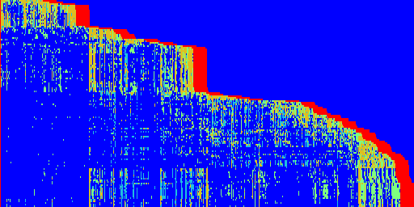
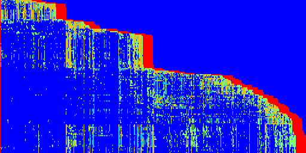
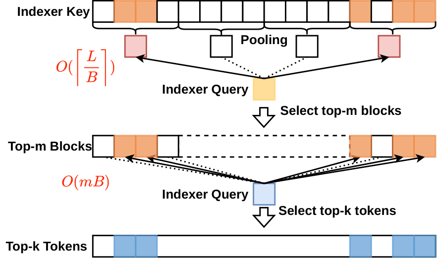
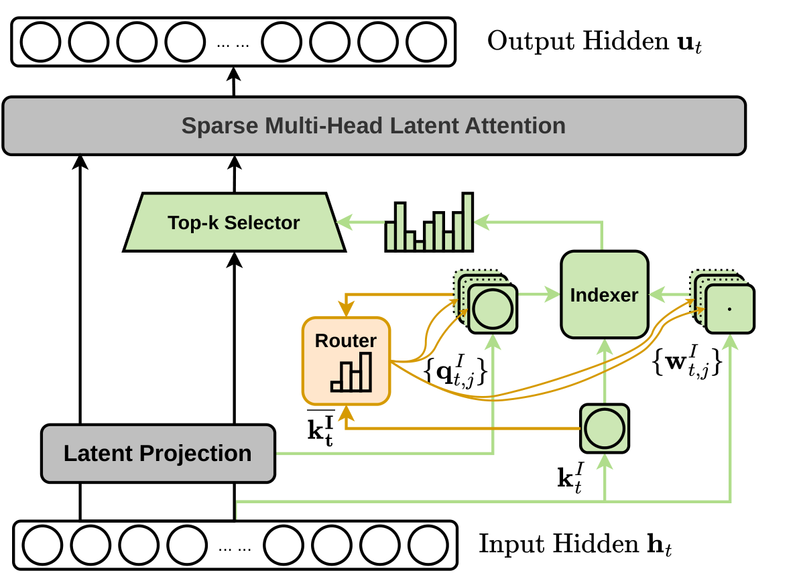
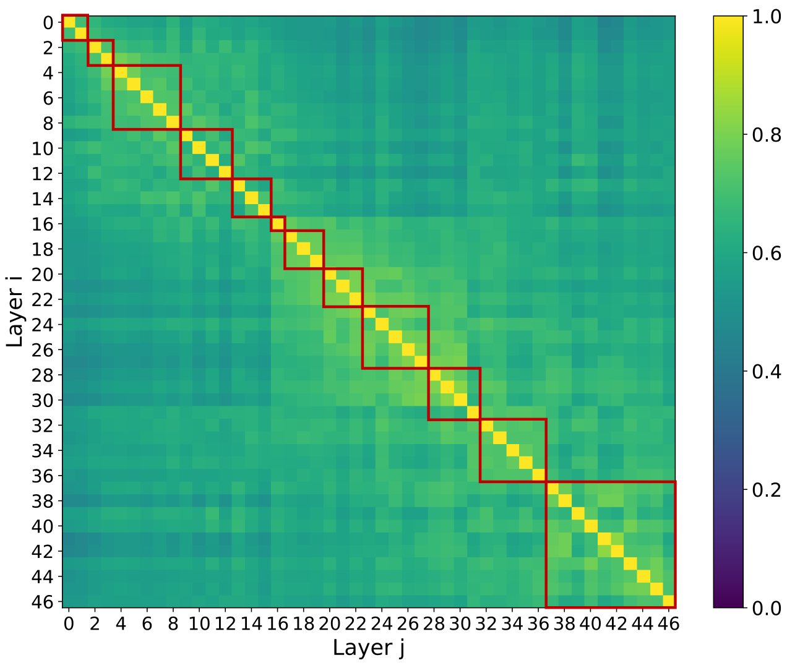
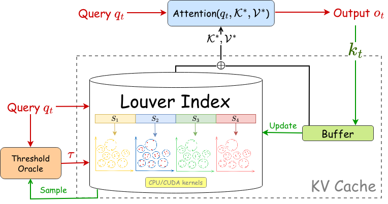
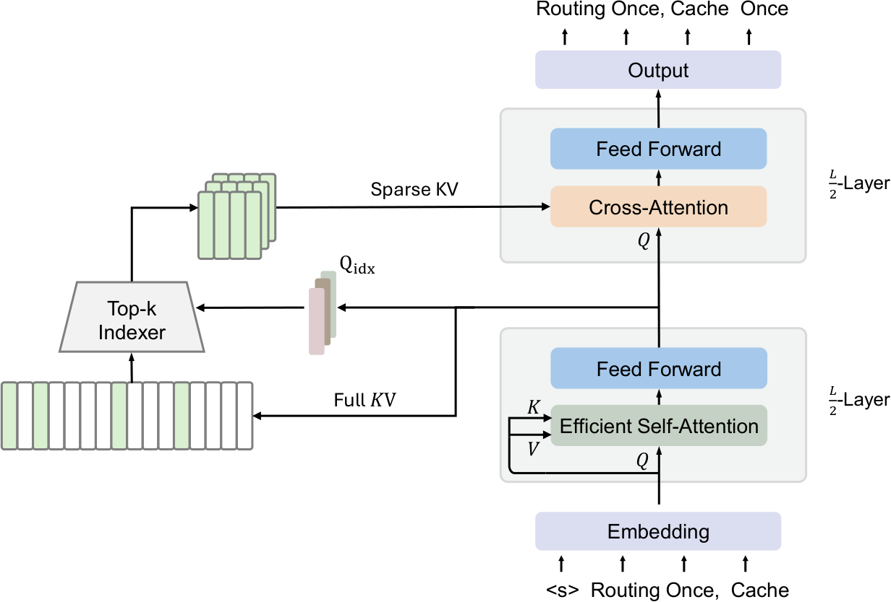
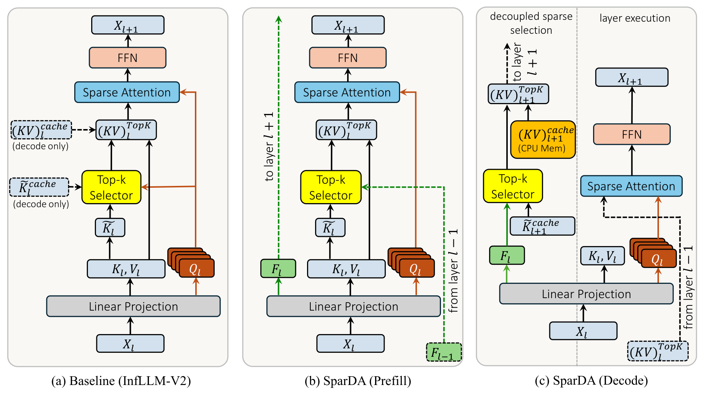

# After DSA: Two Routes to a Better Indexer

[中文版](./dsa-indexer-optimization.md)

## Where Does the Bottleneck Go After Sparsification?

Suppose a model has a 128K-token context but lets each query attend to only 2K tokens. The main attention operation skips most of the history, but the model must first answer a separate question: which 2K tokens should it read? Finding those addresses also costs computation.

DeepSeek Sparse Attention (DSA) adds a lightweight indexer before the main attention operation. The indexer scores the current query against historical indexing keys, selects the top-$k$ positions, and passes them to Sparse MLA. Its score can be summarized as

$$
I_{t,s}=\sum_{j=1}^{H_I}w^I_{t,j}\operatorname{ReLU}\!\left(q^I_{t,j}\cdot k^I_s\right).
$$

Here $t$ is the current query position, $s$ is a historical position, and $H_I$ is the number of indexer heads. $q^I_{t,j}$ and $k^I_s$ are low-dimensional indexing queries and keys; $w^I_{t,j}$ controls the contribution of head $j$. Each head scores every historical position, ReLU removes negative correlations, the weighted head scores are aggregated, and the indexer selects the top-$k$.

The common misconception is that **sparse main attention makes the complete retrieval pipeline linear**. For sequence length $L$, main attention can fall from $O(L^2)$ to $O(Lk)$. If every query's indexer still scans the entire prefix, however, it continues to produce $O(L^2)$ query–key scores. As Sparse MLA becomes faster, this supposedly small component can become the dominant cost.

The subsequent work can be organized along two routes:

1. **Exploit index-score patterns.** Keep the DSA scoring mechanism but remove repeated work along the token, head, layer, or query axis.
2. **Redesign the indexer architecture.** Change the candidate representation, search interface, supervision, or execution schedule.

These are explanatory categories rather than mutually exclusive labels. Many systems use both data regularities and architectural changes; the distinction is whether they first compress an existing score tensor or first change how candidates are generated.

## Route I: Compress Four Redundant Axes

A rough map of indexer work is

$$
W_{\mathrm{index}}\propto U_L\times H_I\times Q_I\times N_I,
$$

where $U_L$ is the number of layers that independently generate indices, $H_I$ is the number of heads performing exact scoring, $Q_I$ is the number of independently retrieved queries, and $N_I$ is the number of historical keys scanned per retrieval. This is not an exact FLOP count. It is an optimization map: each family below primarily reduces one factor.

<figure style="margin: 1.75rem auto 2rem; width: 100%;">
  

    

      
      
(a) Layer 23

    

    

      
      
(b) Layer 18

    

  

</figure>

### Tokens: HISA Recalls Coarsely and Reranks Precisely

[HISA](https://arxiv.org/abs/2603.28458) exploits local structure along the token axis. Important tokens are not always scattered independently across the entire history; nearby positions often have correlated relevance. HISA partitions indexing keys into blocks of size $B$, pools each block, selects the top-$m$ block representatives, and runs the original DSA score only over the expanded token candidates.

A flat search changes from

$$
\text{exactly scoring }N\text{ tokens}
$$

to

$$
\text{coarsely scoring }\frac{N}{B}\text{ blocks}
+\text{ precisely scoring }C\text{ candidate tokens},\qquad C\ll N.
$$

This is like searching a library by checking shelf summaries before inspecting pages on a few shelves. The important detail is that the block mean is used **only for recall**. Final ranking returns to the token-level DSA score, so the Sparse MLA interface remains unchanged.

The gain is a smaller $N_I$. The cost is an irreversible first stage: if a block contains one isolated strong signal, averaging may hide it, and exact reranking can never recover it. Every saved exact score therefore depends on block-level recall.

### Heads: MISA Activates Only Useful Heads

[MISA](https://arxiv.org/abs/2605.07363) asks whether owning many indexer heads means every query must invoke all of them. Each head first interacts cheaply with pooled historical keys to estimate its usefulness:

$$
E_{t,j}=\frac{1}{M}\sum_b\left|w^I_{t,j}\operatorname{ReLU}\!\left(q^I_{t,j}\cdot\widetilde k^I_b\right)\right|.
$$

$\widetilde k^I_b$ summarizes historical block $b$, and $M$ is the number of summaries. A gate or query norm alone says only how loud a head is; $E_{t,j}$ also checks whether the current history contains content that head can match. After selecting the top-$h$, only those heads scan the complete token sequence.

HISA reduces the tokens precisely scored by every head; MISA reduces the heads that perform precise scoring. A representative configuration in the paper activates 8 of 64 indexer heads, but those 8 still read the full prefix. The evidence therefore suggests that a bandwidth-bound system may not convert the FLOP reduction proportionally into end-to-end speedup.

### Layers: IndexCache Reuses Addresses, Not Weights

[IndexCache](https://arxiv.org/abs/2603.12201) exploits high top-$k$ overlap between nearby layers. A small set of Full layers generates indices normally; Shared layers skip their indexers and reuse token positions from the nearest preceding Full layer. Each Shared layer still computes attention with its own query, key, and value. It reuses **where to read**, not the weights assigned after reading.

The hard problem is selecting which layers may share. The paper ultimately uses greedy loss search:

$$
\ell^*=\arg\min_{\ell\in\mathcal R}\operatorname{EvalLoss}\!\left(M,\mathcal D,\mathbf c\vert_{c_\ell\rightarrow S}\right).
$$

$M$ is the frozen model, $\mathcal D$ is a calibration set, $\mathcal R$ contains removable indexers, and $\mathbf c$ is the current sharing configuration. At each step, the method temporarily turns each candidate into a Shared layer, evaluates the complete model, and commits the change with the smallest loss increase. It then evaluates the remaining candidates again because deletions interact.

The authors note that cosine similarity measures direction but can miss a few important swaps near the top-$k$ boundary. Nor can a local similarity score predict whether the remaining network will amplify or cancel the error. Loss search is more expensive, but it measures the final model distribution directly.

### Queries: PIVOT Shares the Scan Without Necessarily Sharing the Answer

[PIVOT](https://arxiv.org/abs/2607.24593) observes that neighboring queries often have highly overlapping top-$k$ sets. It aggregates a group of $g$ queries into a proxy:

$$
\bar q_j=\operatorname{Mean}_{t\in G}q^I_{t,j}.
$$

The proxy performs one full-prefix scan. PIVOT-Reuse shares its top-$k$ across the group. PIVOT-Refine instead recalls top-$c$ candidates and lets each original query rerank them with the DSA score. Group complexity changes from $O(gL)$ to $O(L)$ for Reuse or $O(L+gc)$ for Refine.

For a small example, suppose four queries need $\{1,4\}$, $\{1,5\}$, $\{1,4\}$, and $\{1,6\}$. Eight requested selections have a union of only four tokens. A proxy can recall those four once, after which Refine recovers each query's two results without scanning the full prefix four times.

The key distinction is that **sharing candidate retrieval does not require sharing the final selection**. Refine spends a larger candidate budget on recall and restores query-specific ranking afterward. It follows the same coarse-to-fine principle as HISA on a different axis.

## Route II: Redesign Candidate Generation

The first route asks which existing scores need not be computed. The second asks why candidates must come from a low-dimensional query scanning every key before a top-$k$. Once the indexer is treated as a retrieval system, its search problem, supervision, and schedule all become design choices.

### Louver: Replace Top-$k$ with a Range Query

[Louver](https://arxiv.org/abs/2605.06763) returns all keys satisfying

$$
\langle q,k\rangle\ge\tau
$$

instead of directly finding the $k$ largest scores. It clusters keys and stores a center $c$ and radius $\rho$ for each cluster. Cauchy–Schwarz gives the bound

$$
\langle q,k\rangle\le \langle q,c\rangle+\rho\|q\|_2.
$$

If even this upper bound is below $\tau$, the whole cluster is safely pruned. A Threshold Algorithm advances synchronously over several subspaces. If the next cluster bound in subspace $s$ is $f_{s,\sigma_s(d)}$, every unseen key has full-dimensional score at most

$$
U(d)=\sum_s f_{s,\sigma_s(d)}.
$$

The search stops once $U(d)<\tau$ and verifies candidates with exact dot products to remove false positives. What the authors guarantee is filtering correctness for a given threshold; that guarantee does not establish that the chosen threshold preserves enough attention mass. Louver also handles a growing autoregressive KV cache through a dense buffer and asynchronous index updates, making it more than an offline nearest-neighbor method.

### MiniMax Sparse Attention: Train the Selector as a Native Branch

[MiniMax Sparse Attention](https://arxiv.org/abs/2606.13392) assigns one low-dimensional index query head to each GQA group and shares the index key across groups. Its Index Branch computes token scores, max-pools every 128-token block, and selects 16 blocks. The Main Branch applies exact softmax attention to the corresponding 2,048 tokens.

The design preserves per-group routing differences, contiguous block access, and a low-dimensional shared index key. Its hardest problem is supervision: top-$k$ is not differentiable, so LM loss cannot tell the selector which unselected block should have been included. The authors first use a full-attention warmup, then train index projections against the average attention distribution of the Main heads in the same GQA group. Stop-gradient is applied to backbone hidden states and the teacher.

The ablation reports stalled LM loss and gradient spikes without detachment. MSA does not asymptotically remove the Index Branch's full scan. Instead, it jointly designs the selector, supervision, and block kernel during pretraining so that the scan has a small constant and regular memory access.

### CLSA: Make Shared Routing an Architectural Invariant

[You Only Index Once (CLSA)](https://arxiv.org/abs/2606.06467) builds on YOCO's shared-KV architecture. Multiple cross-decoder layers already read the same KV cache, so one common token route can serve them all. Every layer still recomputes attention weights with its own query.

Rather than imitate one anchor layer, the shared indexer fits the mean dense-attention distribution across all cross layers and heads:

$$
\bar A=\frac{1}{L_cH_a}\sum_{l=1}^{L_c}\sum_{h=1}^{H_a}
\operatorname{softmax}\!\left(Q^{(l,h)}K^{(h)\top}\right).
$$

If two layers concentrate on tokens 1 and 3 respectively, the average teacher asks the common route to cover both. Training freezes the backbone for an initial KL warmup and then optimizes jointly. Unlike IndexCache's post-hoc reuse, CLSA makes layer-axis sharing an architectural invariant. The tradeoff is that it is not a drop-in DSA patch: it requires a shared-KV backbone and training changes, while an average teacher may dilute tokens needed by only a few layers.

### SparDA: Move Selection Off the Critical Path

[SparDA](https://arxiv.org/abs/2606.04511) changes not the search space but the indexer's timing. A Forecast module $F_l$ at layer $l$ predicts the blocks required by layer $l+1$:

$$
\mathcal B_{l+1}=\mathcal B_{\mathrm{init}}\cup\mathcal B_{\mathrm{local}}\cup
\operatorname{TopK}\!\left(F_l\widetilde K_{l+1}^{\top},k\right).
$$

The actual attention at layer $l+1$ is still computed by $Q_{l+1}$. Forecast supplies addresses early, allowing selection and CPU-to-GPU KV prefetching to overlap with current-layer computation. Its training target adds an “all other blocks” bucket: teacher top-$k$ items remain separate, while the remaining probability mass is merged before KL. Otherwise a student might assign high probability to many wrong blocks without being penalized as long as the internal top-$k$ order is correct.

This is why FLOPs alone do not describe the gain. SparDA may not remove all work, but it shortens the serial selection–transfer–attention path. It requires a trained Forecast module and a specialized offload pipeline.

## Choosing Between the Two Routes

Mapping each method back to the workload clarifies the tradeoffs:

| Method | First object changed | Main gain | Main risk or cost |
|---|---|---|---|
| HISA | Scanned tokens | Reduces $N_I$ | Coarse recall may miss isolated signals |
| MISA | Active heads | Reduces $H_I$ | Gains may be limited by bandwidth |
| IndexCache | Routing layers | Reduces $U_L$ | Must search or train the sharing pattern |
| PIVOT | Independent queries | Reduces $Q_I$ | Diverse queries require larger candidates |
| Louver | Search interface | Certified cluster pruning | Threshold quality controls retained mass |
| MSA | Selector and supervision | Regular access and pretraining alignment | Retains a low-constant full scan |
| CLSA | Backbone sharing | Routes only once across layers | Requires architecture and training changes |
| SparDA | Execution timing | Hides selection and transfer latency | Requires prediction and offload machinery |

Theoretical complexity, kernel FLOPs, and end-to-end latency must remain separate. Fewer heads may not reduce the bandwidth needed to read the complete key sequence. Reusing a route is not reusing attention. Moving selection off the critical path may improve latency even without reducing total FLOPs.

## Conclusion

The central post-DSA problem is not to invent yet another sparse-attention formula. It is to make the retrieval process that creates sparsity itself sparse, shared, or hidden.

The first route treats indexer work as a four-dimensional tensor: HISA compresses tokens, MISA heads, IndexCache layers, and PIVOT queries. The second changes the retrieval system: Louver reformulates search, MSA redesigns selector supervision, CLSA builds route sharing into the backbone, and SparDA changes when selection runs.

The authors establish accuracy–efficiency tradeoffs under specific models, context lengths, and hardware configurations. The evidence supports a more limited inference: no optimization dominates under every bottleneck. A reliable engineering order is to identify whether the system is limited by arithmetic, bandwidth, index maintenance, or the serial critical path, and only then choose an axis to compress or an interface to redesign.

## References

- [DeepSeek-V3.2: Pushing the Frontier of Open Large Language Models](https://arxiv.org/abs/2512.02556)
- [HISA: Efficient Hierarchical Indexing for Fine-Grained Sparse Attention](https://arxiv.org/abs/2603.28458)
- [IndexCache: Accelerating Sparse Attention via Cross-Layer Index Reuse](https://arxiv.org/abs/2603.12201)
- [MISA: Mixture of Indexer Sparse Attention for Long-Context LLM Inference](https://arxiv.org/abs/2605.07363)
- [PIVOT: Efficient Query-Group Indexing for Token-Level Sparse Attention](https://arxiv.org/abs/2607.24593)
- [Sparse Attention as a Range Searching Problem](https://arxiv.org/abs/2605.06763)
- [MiniMax Sparse Attention](https://arxiv.org/abs/2606.13392)
- [You Only Index Once: Cross-Layer Sparse Attention with Shared Routing](https://arxiv.org/abs/2606.06467)
- [SparDA: Sparse Decoupled Attention for Efficient Long-Context LLM Inference](https://arxiv.org/abs/2606.04511)
