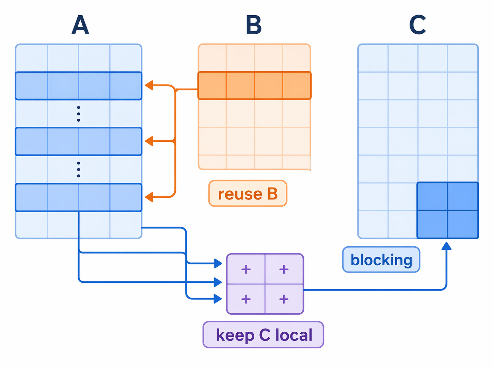
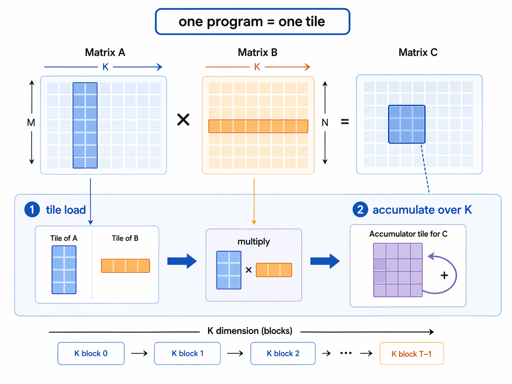
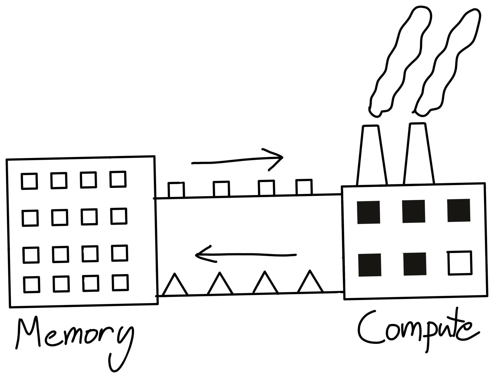
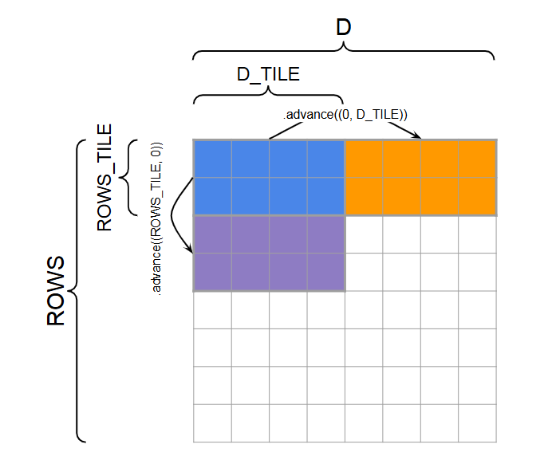

# GEMM: SIMD Implement on CPU and Triton Implemetn on GPU

## CPU GEMM

### The naive triple loop

For matrix $A(M, K)$ and $B(K, N)$, let $C = A \times B$, for this matrix multiplication, the naive idea is:
```cpp
for (int i = 0; i < M; ++i)
    for (int j = 0; j < N; ++j)
        for (int k = 0; k < K; ++k)
            C[i][j] += A[i][k] * B[k][j];
```

This is correct, but the loop reads `B[k][j]` column-wise. But we know that memory is stored row-wise. And the cache will *prefetch* memory row-wisely. Hence this kind of loop is bad for cache locality.

### Reorder the loops

```cpp
for (int i = 0; i < M; ++i)
    for (int k = 0; k < K; ++k) {
        double a_val = A[i][k];
        for (int j = 0; j < N; ++j)
            C[i][j] += a_val * B[k][j];
    }
```

We rearrange the last two loops. Now `B[k][j]` is read row-wise. Cache read its prefetched data happily :), this is the first real optimization that `B` becomes more contiguous and one scalar from `A` is reused across a whole row update.

### Cache Miss Rate
**Cache Miss** happens when data is not found in the cache and needs to be fetched from main memory. This process is very slow.

The next idea is: do not work on the full matrix at once(even with prefetch, cache cannot load full matrix at a time :( ). Work on small tiles that be prefetched totally into cache will decrease **Cache Miss Rate** .

```cpp
for (int j = 0; j < N; j += 32)
    for (int kk = 0; kk < K; kk += KC)
        for (int ii = 0; ii < M; ii += MC)
            ...
```
- the same panel of `B` can be reused many times before eviction

### Use packing + SIMD micro-kernel

Blocking to reduce Cache miss is not enough. The inner kernel must also be efficient. 
In CPU register, we can use SIMD commands to do the same operation for different data vectors.

The optimization is:

- pack a `K x 32` panel of `B` into contiguous memory
- compute a `6 x 32` output block at a time
- keep the `6 x 32` partial sums in AVX-512 registers

Packed `B`:

```cpp
static inline void pack_B_KCx32(int K, const double* B, int ldb, double* Bp) {
    for (int k = 0; k < K; ++k) {
        const double* src = B + (size_t)k * ldb;
        double* dst = Bp + (size_t)k * 32;

        _mm512_store_pd(dst + 0,  _mm512_loadu_pd(src + 0));
        _mm512_store_pd(dst + 8,  _mm512_loadu_pd(src + 8));
        _mm512_store_pd(dst + 16, _mm512_loadu_pd(src + 16));
        _mm512_store_pd(dst + 24, _mm512_loadu_pd(src + 24));
    }
}
```

Core micro-kernel:

```cpp
static inline void micro_kernel_6x32_packedB(
    int K,
    const double* A,
    int lda,
    const double* Bp,
    double* C,
    int ldc
) {
    __m512d c[6][4];
    for (int i = 0; i < 6; ++i)
        for (int j = 0; j < 4; ++j)
            c[i][j] = _mm512_setzero_pd();

    for (int k = 0; k < K; ++k) {
        const double* brow = Bp + (size_t)k * 32;
        __m512d b0 = _mm512_load_pd(brow + 0);
        __m512d b1 = _mm512_load_pd(brow + 8);
        __m512d b2 = _mm512_load_pd(brow + 16);
        __m512d b3 = _mm512_load_pd(brow + 24);

        for (int i = 0; i < 6; ++i) {
            __m512d a_val = _mm512_set1_pd(A[(size_t)i * lda + k]);
            c[i][0] = _mm512_fmadd_pd(a_val, b0, c[i][0]);
            c[i][1] = _mm512_fmadd_pd(a_val, b1, c[i][1]);
            c[i][2] = _mm512_fmadd_pd(a_val, b2, c[i][2]);
            c[i][3] = _mm512_fmadd_pd(a_val, b3, c[i][3]);
        }
    }
}
```
### Benchmark
CPU: AMD EPYC 9654 96-Core Processor

Cache size:
  - L1d: 512 KiB total
  - L2: 16 MiB total
  - L3: 512 MiB total

| M | N | K | Threads | KC | MC | Naive best ms | Naive GFLOP/s | Opt best ms | Opt GFLOP/s | Speedup | 
| --- | --- | --- | --- | --- | --- | --- | --- | --- | --- | --- | 
| 512 | 512 | 512 | 16 | 512 | 120 | 383.294 | 0.700 | 0.827 | 324.782 | 463x | 
| 1024 | 1024 | 1024 | 16 | 512 | 120 | 3221.803 | 0.667 | 3.448 | 622.862 | 934x | 
| 2048 | 2048 | 2048 | 16 | 512 | 120 | 47991.056 | 0.358 | 21.224 | 809.446 | 2261x | 

It's huge optimization in matrix mutiplication! But sooner we'll find it more surpring when on GPUs.

## GPU Triton GEMM
### Matrix multiplication and memory



Start from the naive CPU version. We know that reordering and blocking are free lunch, so we can apply them here too. 

But in GPU, there are no registers, instead SRAM and DRAM are two important concepts. **SRAM** are *shared memory*, less memory, stronger computational ability, **DRAM** are *global memory*, more memory, no computational ability. We need to transport data between SRAM and DRAM for computing and storing, which is time-consuming, and cause *memory wall*. (Cited from CS336)


Hence, efficiently reusing the data in SRAM is important for GPU computing. Different from register storing vectors, SRAM are divided and by **TILE**.


In Triton, a program instance is a block of threads all running the same program, and these thread blocks can be run in parallel on the GPU. Instead of taking tensors as arguments, we take pointers to *TILE* first elements, as well as strides for each tensor that tell us how to move along axes.

So the first optimization is to stop thinking in scalars and start thinking in tiles:

```python
for m in range(0, M, BLOCK_SIZE_M):
    for n in range(0, N, BLOCK_SIZE_N):
        acc = zeros((BLOCK_SIZE_M, BLOCK_SIZE_N), dtype=float32)
        for k in range(0, K, BLOCK_SIZE_K):
            a = A[m:m+BLOCK_SIZE_M, k:k+BLOCK_SIZE_K]
            b = B[k:k+BLOCK_SIZE_K, n:n+BLOCK_SIZE_N]
            acc += dot(a, b)
        C[m:m+BLOCK_SIZE_M, n:n+BLOCK_SIZE_N] = acc
```

The point is simple: load a tile, reuse it, then move on.

### Memory access in Triton

Instead of one program per output element, use one program per output tile.

```python
offs_m = pid_m * BLOCK_SIZE_M + tl.arange(0, BLOCK_SIZE_M)
offs_n = pid_n * BLOCK_SIZE_N + tl.arange(0, BLOCK_SIZE_N)
offs_k = tl.arange(0, BLOCK_SIZE_K)
```

Now the program handles a full block of `C`, not a single scalar.

The next step is the key Triton idea: turn tile coordinates into pointer grids.

```python
a_ptrs = a_ptr + offs_m[:, None] * stride_am + offs_k[None, :] * stride_ak
b_ptrs = b_ptr + offs_k[:, None] * stride_bk + offs_n[None, :] * stride_bn
```

These two formulas are the heart of the note:

- `offs_m[:, None]` means all rows of the `A` tile
- `offs_k[None, :]` means all columns inside the current K-block
- together they build a 2D address grid

The same logic applies to `B`, but with shape `(BLOCK_SIZE_K, BLOCK_SIZE_N)`.

Then the pointers move forward along `K`:

```python
a_ptrs += BLOCK_SIZE_K * stride_ak
b_ptrs += BLOCK_SIZE_K * stride_bk
```

So the output tile stays fixed, while the kernel walks through `K` block by block.

### L2 cache optimization

By this point, the kernel already has:

- tiling
- pointer-based tile access
- blocked accumulation along `K`

The next improvement is launch order.

If program ids are assigned in a plain row-major order, a useful tile of `B` may be loaded into L2, but the next program may not reuse it soon enough. So Triton remaps program ids to improve temporal locality.

```python
pid = tl.program_id(axis=0)
num_pid_m = tl.cdiv(M, BLOCK_SIZE_M)
num_pid_n = tl.cdiv(N, BLOCK_SIZE_N)
num_pid_in_group = GROUP_SIZE_M * num_pid_n
group_id = pid // num_pid_in_group
first_pid_m = group_id * GROUP_SIZE_M
group_size_m = min(num_pid_m - first_pid_m, GROUP_SIZE_M)
pid_m = first_pid_m + ((pid % num_pid_in_group) % group_size_m)
pid_n = (pid % num_pid_in_group) // group_size_m
```

This does not change correctness. It changes which tile is computed next.

The goal is to keep nearby row tiles close in time, thus increasing the chance that the same `B` tile is reused from L2


### Implementation example

The optimized kernel is:

```python
@triton.jit
def matmul_kernel(
    a_ptr, b_ptr, c_ptr,
    M, N, K,
    stride_am, stride_ak,
    stride_bk, stride_bn,
    stride_cm, stride_cn,
    BLOCK_SIZE_M: tl.constexpr,
    BLOCK_SIZE_N: tl.constexpr,
    BLOCK_SIZE_K: tl.constexpr,
    GROUP_SIZE_M: tl.constexpr,
):
    pid = tl.program_id(axis=0)
    num_pid_m = tl.cdiv(M, BLOCK_SIZE_M)
    num_pid_n = tl.cdiv(N, BLOCK_SIZE_N)
    num_pid_in_group = GROUP_SIZE_M * num_pid_n
    group_id = pid // num_pid_in_group
    first_pid_m = group_id * GROUP_SIZE_M
    group_size_m = min(num_pid_m - first_pid_m, GROUP_SIZE_M)
    pid_m = first_pid_m + ((pid % num_pid_in_group) % group_size_m)
    pid_n = (pid % num_pid_in_group) // group_size_m

    offs_m = pid_m * BLOCK_SIZE_M + tl.arange(0, BLOCK_SIZE_M)
    offs_n = pid_n * BLOCK_SIZE_N + tl.arange(0, BLOCK_SIZE_N)
    offs_k = tl.arange(0, BLOCK_SIZE_K)

    a_ptrs = a_ptr + offs_m[:, None] * stride_am + offs_k[None, :] * stride_ak
    b_ptrs = b_ptr + offs_k[:, None] * stride_bk + offs_n[None, :] * stride_bn

    acc = tl.zeros((BLOCK_SIZE_M, BLOCK_SIZE_N), dtype=tl.float32)

    for k in range(0, tl.cdiv(K, BLOCK_SIZE_K)):
        k_remaining = K - k * BLOCK_SIZE_K
        a = tl.load(
            a_ptrs,
            mask=(offs_m[:, None] < M) & (offs_k[None, :] < k_remaining),
            other=0.0,
        )
        b = tl.load(
            b_ptrs,
            mask=(offs_k[:, None] < k_remaining) & (offs_n[None, :] < N),
            other=0.0,
        )
        acc += tl.dot(a, b)
        a_ptrs += BLOCK_SIZE_K * stride_ak
        b_ptrs += BLOCK_SIZE_K * stride_bk

    c_ptrs = c_ptr + offs_m[:, None] * stride_cm + offs_n[None, :] * stride_cn
    c_mask = (offs_m[:, None] < M) & (offs_n[None, :] < N)
    tl.store(c_ptrs, acc, mask=c_mask)
```


### Benchmark

GPU: NVIDIA GeForce RTX 4060 series GPU
Driver version: 571.96
CUDA version: 12.8
Triton version: 3.5.1

| M | N | K | Naive best ms | Naive TFLOP/s | Triton best ms | Triton TFLOP/s | Speedup | torch best ms | torch TFLOP/s |
| --- | --- | --- | --- | --- | --- | --- | --- | --- | --- |
| 512 | 512 | 512 | 103.320 | 0.003 | 0.052 | 5.140 | 1978.392 | 0.051 | 5.243 |
| 1024 | 1024 | 1024 | 412.086 | 0.005 | 0.129 | 16.644 | 3193.873 | 0.119 | 18.079 |
| 2048 | 2048 | 2048 | 2477.370 | 0.007 | 0.697 | 24.636 | 3552.580 | 0.609 | 28.197 |

It's really a huge leap in FLOP/s from CPU to GPU and from naive to Triton!
