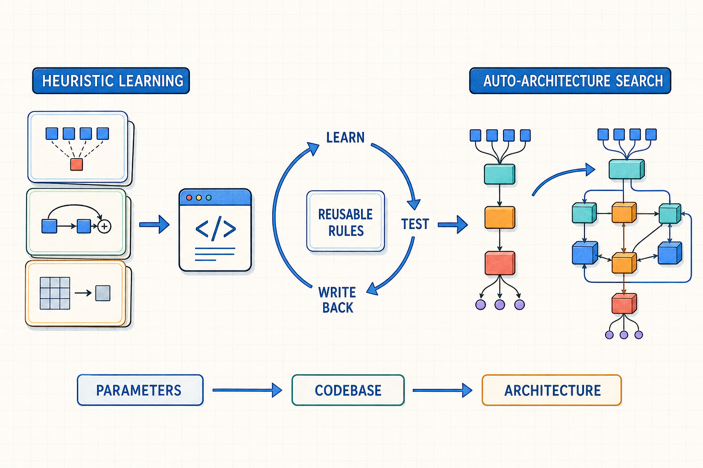

# 从 Heuristic Learning 到 Auto-Architecture Search

这几天读到 Jiayi Weng 的 Heuristic Learning, 其将 Karpathy 的 autoresearch 推向了更高一层：系统不再只完成一次实验，而是学习可复用的启发式规则，再把它们写回代码库。可以把它理解为一种发生在研究流程之外的元学习——被持续更新的不只是模型参数，还有指导下一轮研究的显式知识。

过去在传统软件工程时期，这种通过添加启发式规则来完成任务的方法也被设想过，但是这在当时的技术条件下，维护这样的代码库简直是不可能的。大模型及coding agent给了我们工具，让我们重新捡起这件事。

但再次之后，我们开始思考更长远的问题：外部代码系统最终能否拥有与神经网络相当的表达能力和灵活性？大规模语言模型已经展示了神经网络在表达复杂模式上的潜力。那么，我们能否把 Heuristic Learning 从外部代码库进一步移植到 LLM 的架构中，让持续优化的对象依次从“模型参数”扩展到“外部代码系统”，最终到达“模型架构”本身？

如果这条路线成立，Auto-Architecture Search 就不再只是从预先定义的候选集合中挑选架构，而是让模型参与提出、评估并积累架构层面的改进。不过，要实现这种自我演化，至少需要解决四个问题：

1. **反馈如何足够快且准确？** 架构变化通常需要训练才能验证，成本高、周期长，评估结果还可能受到数据与训练噪声的影响。这点与 heuristic learning不同的是，后者可以通过规范化的编译器，高效的CPU/GPU来快速获取反馈，coding agent利用了这些工具，于是可以快速迭代，那么在Auto-Arch-search的方向，与之相对应的工具是什么？
2. **应该迭代哪一部分？** 参数与结构的搜索空间近乎无穷。系统需要判断哪些模块值得修改，以及一次修改应该采用多大的粒度。
3. **如何收敛到一组有效架构？** 大量候选根本不值得完整尝试；如果缺少可靠的先验、筛选和归因机制，它们反而会遮蔽真正有潜力的方向。
4. **哪些知识应该保持显式，哪些应该进入神经参数？** 显式规则更容易检查、复用与修改，神经参数则更擅长吸收难以写成规则的模式。两者之间的边界会直接决定系统如何学习和演化。

如果 Auto-Architecture Search 能够真正运转起来，我们得到的将不只是一个会在固定架构内优化参数的模型，而是一个能够逐步改写自身学习机制的研究系统。这或许会让我们离真正的智能再近一点。最近 SSI 的工作和 jeaf dean 从 google 离职创立 *Discovery Loop*，都在 bet on自我迭代与持续学习方向，不过我认为在模型架构上的自我迭代总是令人着迷的。
