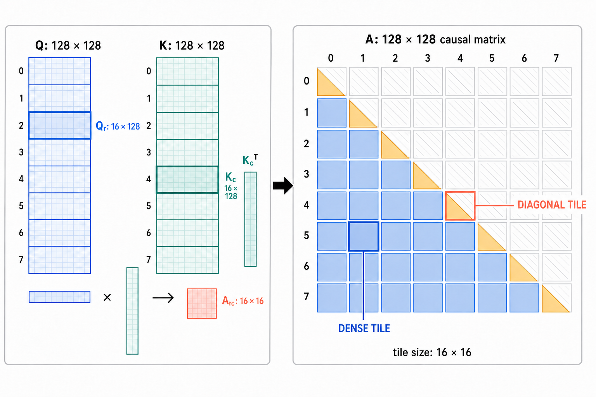

# K3 的 KDA 精度问题：为什么要有 lower-bound decay

在 Kimi K3 论文中，提到了在KDA的实现中，给衰减系数的对数 $g$ 添加 lower-bound，把原来可以趋向负无穷的 log-decay，限制到 $(-5, 0)$。作者在报告中提到是为了解决在矩阵相乘时对角tile上的精确度 问题，让原本必须逐位置计算的 diagonal tile，使其可以通过 Tensor Core 进行高效矩阵运算，但 lower-bound 究竟如何解决这个问题，lower-bound是否对其他部分的数值精确度也有贡献？

在这里我根据 K3 报告、[FlashKDA仓库](https://github.com/MoonshotAI/FlashKDA)以及一组 H200 机制实验得到了两个初步的结论，关于lower-bound 作用的机制：

1. 限制了 $|g_i - g_j|$的绝对值范围，防止对角线上 tile 矩阵中的 $\exp(G_i - G_j)$ 爆炸或消失，导致矩阵乘法的数值不稳定性；
2. 控制了下三角系统求逆时 $L^2$、$L^4$、$L^8\ldots$ 的中间值衰减速度，防止数值下溢。

**第一条决定 diagonal tile 能否使用 dense Tensor Core；第二条决定 FP16 Neumann 展开能否保持可控，以及为什么 chunk 大小最后选择了 16。**

## FlashKDA 中tile的计算方式

我们暂时忽略 decay，先从一个 chunk 内最基础的 query-key 乘法开始。这里我们不妨令 chunk 长度 $C=128$，head dimension $d=128$：

$$
Q,K\in\mathbb{R}^{128\times128}.
$$

这里第一维是 token 位置，第二维是每个 token 的 128 维特征。Tensor Core 不会把整个 causal matrix 当成一个不可分割的大矩阵处理，而是先沿 token 维把 $Q$ 和 $K$ 每 16 行切成一个 panel。第 $r$ 个 query panel 与第 $c$ 个 key panel 分别是

$$
Q^{(r)},K^{(c)}\in\mathbb{R}^{16\times128},
$$

二者相乘得到一个 score tile：

$$
B^{(r,c)}
=Q^{(r)}\left(K^{(c)}\right)^\top
\in\mathbb{R}^{16\times16}.
$$

因此，两个 16×128 panels 的乘法，最终只负责 128×128 score matrix 中的一个 16×16 方块。$C=128$ 时一共有 $8\times8$ 个这样的方块。



causal mask 会把这些 tiles 分成三类：

- 当 $c<r$ 时，query tile 中的 16 个位置都晚于 key tile 中的 16 个位置，整个 16×16 方块都有效。这是 **off-diagonal dense tile**。
- 当 $c>r$ 时，所有 key 都来自未来，整个方块都被 mask。
- 当 $c=r$ 时，query 与 key 来自同一组 16 个位置，方块内部仍然只有 $i\ge j$ 的下三角有效。这是 **diagonal tile**。

> 上面的 128-token chunk 用于展示“大 chunk 再切成 16-token secondary tiles”的计算结构。当前 FlashKDA v1 直接使用 16-token kernel chunk，因此一个 kernel chunk 恰好就是一个 16×16 数值 tile

#### 逐通道衰减因子 $exp(G)$ 在 tile 计算中的方式
KDA 不只计算普通的 $QK^\top$。它还需要让较早的 key 按每一步的 retention 衰减。设第 $t$ 步的 log-decay 为 $g_t<0$，从 chunk 开头累计到位置 $i$ 的 log-decay 为

$$
G_i=\sum_{t=1}^{i}g_t,
\qquad
\Gamma_i=\exp(G_i).
$$

把每个位置的 $\Gamma_i$ 组成缩放向量 $\Gamma$ 后，chunk 内的 causal score 与输出可以写成

$$
A=\operatorname{Tril}\!\left[
(\Gamma\odot Q)
\left(K\oslash\Gamma\right)^\top
\right],
$$

对一个具体位置对 $(i,j)$，缩放后的 query 与 key 相乘为

$$
(\Gamma_i q_i)\cdot\left(\frac{k_j}{\Gamma_j}\right)
=q_i\cdot k_j\,\exp(G_i-G_j).
$$

这里就解释了为什么 decay 可以进入 GEMM：先用 $\exp(G_i)$ 缩放 $Q$ 的第 $i$ 行，再用 $\exp(-G_j)$ 缩放 $K$ 的第 $j$ 行，普通矩阵乘法就会自动为每个位置对产生正确的相对衰减。

对第 $(r,c)$ 个 tile，同一个过程写成

$$
A^{(r,c)}
=
\left(\Gamma^{(r)}\odot Q^{(r)}\right)
\left(K^{(c)}\oslash\Gamma^{(c)}\right)^\top.
$$

当 $i\ge j$ 时，因为每个 $g_t<0$，所以 $G_i\le G_j$，进而

$$
0<\exp(G_i-G_j)\le1.
$$

也就是说，**结果矩阵中的相对衰减不会爆炸。** 数值风险不是最终的 $\exp(G_i-G_j)$，但是在计算过程中，为了执行 GEMM，kernel 把它拆成了两个独立操作数：

$$
\exp(G_i-G_j)=\exp(G_i)\exp(-G_j).
$$

如果 $G_i$ 非常负，左侧因子 $\exp(G_i)$ 可能下溢为 0，而右侧因子 $\exp(-G_j)$ 可能上溢为 $\infty$。这就是第一个核心矛盾：

> 直接形成 $\exp(G_i-G_j)$ 数值安全，却需要对每个位置对单独计算；拆成 $\exp(G_i)$ 与 $\exp(-G_j)$ 可以把位置对收缩进 GEMM，却要求两个因子各自在低精度范围内可表示。

## diagonal tile 为什么需要 lower-bound decay
上面提到，由于在矩阵运算时，目标 $exp(G_i - G_j)$ 会被拆成 $exp(G_i)$ 和 $exp(-G_j)$分配到 $Q$,$K$ tile中，因此都可能存在下溢或上溢的风险。在FlashKDA中，因为每一步 $g_t<0$，所以累计量 $G_t$ 是随位置单调递减的。对一个 off-diagonal tile，所有 key 位置 $j$ 都早于所有 query 位置 $i$。因此可以在两个 tiles 之间选取同一个边界 $b$，使

$$
G_i\le G_b\le G_j.
$$

相对衰减便可以按这个边界拆成

$$
\exp(G_i-G_j)
=\exp(G_i-G_b)\exp(G_b-G_j).
$$

两个指数都不大于 0，所以两个因子都位于 $(0,1]$。同一个 $G_b$ 可以服务整个 off-diagonal tile，因而能够直接组成 dense GEMM。

但是diagonal tile 不同：$i$ 与 $j$ 位于同一个 tile。虽然每个有效位置对都满足 $j\le i$，但不存在一个固定边界 $b$，能够同时落在所有 $(j,i)$ 之间。若把 $b$ 固定在 tile 起点，则 $G_b-G_j\ge0$；若固定在 tile 终点，则 $G_i-G_b\ge0$。总有一侧变成可能很大的正指数。要让两侧始终不超过 1，边界只能随位置对改变，这就退化成了 Kimi Linear 的 position-pair diagonal path，并不能在 Tensor Core 中高效计算。

这里就是 lower-bounded decay 发挥作用的地方。由于规定了：

$$
g\in(-5,0),
\quad
16\lvert g_{\min}\rvert=80.
$$

这样 16-token tile 内任意 $G$ 与固定 $G_b$ 的差都被限制在 $(-80,80)$，对应的指数不超过 $\exp(80)$，仍在 BF16 的动态范围内。于是 diagonal tile 不再需要为每个 $(i,j)$ 单独选择边界，可以和 off-diagonal tile 一样使用 dense Tensor Core GEMM，因此大幅提升了运行时性能。

## FlashKDA 中的逆矩阵求解

KDA chunk 内的 delta 更新会形成一个严格下三角矩阵 $L$，并需要计算：

$$
\mathrm{INV}=(I+L)^{-1}.
$$

对于一般的 $C\times C$ 稠密矩阵，直接求逆的复杂度为 $O(C^3)$。但 $I+L$ 具有特殊的下三角结构，因此可以将其利用 Neumann Series 展开。

Neumann series 可以理解为几何级数的矩阵版本。对标量 $x$，当 $\lvert x\rvert<1$ 时：

$$
\frac{1}{1-x}=1+x+x^2+x^3+\cdots.
$$

把标量 $x$ 换成矩阵 $L$，便得到：

$$
(I+L)^{-1}=I-L+L^2-L^3+\cdots.
$$

这个展开称为 Neumann series。一般情况下，它要求 $L$ 的谱半径小于 1，也就是所有特征值的绝对值都小于 1。在这里，$L$ 并不是一般矩阵：它是一个 $C\times C$ 严格下三角矩阵，因此谱半径严格等于0。更直接的原因是，严格下三角矩阵是[幂零矩阵](https://zh.wikipedia.org/wiki/%E5%B9%82%E9%9B%B6%E7%9F%A9%E9%98%B5)，矩阵每乘一次 $L$，非零元素至少向下移动一条对角线；经过 $C$ 次相乘后：

$$
L^C=0.
$$

因此在 $L$ 的 Neumann series 中，所有次数不低于 $C$ 的项都严格等于零，无穷级数变成一个必然终止、并且精确成立的有限展开：

$$
(I+L)^{-1}
=I-L+L^2-L^3+\cdots+(-L)^{C-1}.
$$

更进一步地，我们可以对该有限序列化简，FlashKDA 没有逐项相加，而是使用平方展开。对于 $C=16$：

$$
(I+L)^{-1}
=(I-L)(I+L^2)(I+L^4)(I+L^8).
$$

kernel 实际只需要计算 $L^2,L^4,L^8$，把逐项展开改写成三轮适合 Tensor Core 的 dense GEMM。它降低了求逆路径的串行深度并提高了硬件并行效率，但若按经典矩阵乘法统计总算术量，每轮 GEMM 仍是 $O(C^3)$；这里的收益主要来自固定 $C=16$ 后的并行映射，而不是渐进复杂度变成 $O(C^2)$。

## lower-bound decay 在逆矩阵求解中的作用

前一节说明了平方展开的深度由 chunk 长度 $C$ 决定。lower-bound decay 与逆矩阵求解的联系，也正是通过 $C$ 建立起来的。

K3 将单步 log-decay 限制为 $g\in(-5,0)$。若每一步都接近最强衰减，一个长度为 $C$ 的 chunk 最坏需要处理的累计尺度为：

$$
\exp(-5C)
\quad\text{和}\quad
\exp(5C).
$$

由 BF16/FP32 的指数范围可知，$C=17$ 时 $\exp(\pm85)$ 仍然有限，而 $C=18$ 时 $\exp(\pm90)$ 已经跨过上下溢边界。也就是说，从累计衰减的动态范围看，可用的 chunk 长度上界落在 17 附近。

另一方面，FlashKDA 的 inverse 使用连续平方构造 $L^2,L^4,L^8,\ldots$，因此二次幂长度会形成自然的实现边界。16 恰好是上述指数安全区内最大的二次幂：

$$
\begin{aligned}
C=16 &: \quad L^{16}=0,\quad \text{实际最高形成 }L^8,\\
C=17 &: \quad L^{16}\ne0\ \text{（一般情况下）},\quad \text{需要新增 }(I+L^{16}).
\end{aligned}
$$

因此，从 16 增加到 17 虽然尚未越过指数范围，却会第一次要求低精度 kernel 真正形成 $L^{16}$。这不意味着 $L^{16}$ 必然溢出，但它增加了一层中间值增长与舍入误差放大的路径；继续增大到 18，又会触及累计衰减的动态范围边界。

所以 lower-bound decay 在这里通过限定最坏累计衰减，与 Neumann 平方展开共同确定了 chunk 的合理边界：**16 是指数安全区内最大的二次幂，同时让 inverse 在 $L^8$ 后停止。** 

## 数值实验 （H200）

为了把 split exponent 的问题与 Neumann inverse 的问题分开，实验首先构造了 `floor_e-5` 输入：所有位置都取最强衰减 $g=-5$，然后把 FlashKDA K1 的关键算术路径推广到不同的 chunk 长度。

实验流程为：

1. $\exp(G)$ 和 $\exp(-G)$ 先转换为 BF16；
2. 使用 BF16 operands、FP32 accumulation 构造 $L$；
3. 将 $L$ 存为 FP16；
4. 使用 H200 上的 FP16 accumulation 模拟 Neumann inverse；
5. 用 FP64 构造和直接求逆作为 gold result。

每种设置运行 3 个 seed。下表中的误差为中位数，非有限 scale 数量取最坏值。

### 指数边界

| Chunk C | inverse finite | decay 为 0 | reciprocal 为 inf | INV total | INV power |
|---:|---:|---:|---:|---:|---:|
| 8 | 100% | 0 | 0 | $8.80\times10^{-7}$ | $5.16\times10^{-8}$ |
| 16 | 100% | 0 | 0 | $1.23\times10^{-6}$ | $8.51\times10^{-8}$ |
| 17 | 100% | 0 | 0 | $1.07\times10^{-6}$ | $6.69\times10^{-8}$ |
| 18 | 100% | 1 | 1 | $7.86\times10^{-6}$ | $6.62\times10^{-8}$ |
| 19 | 0% | 2 | 2 | $\infty$ | $6.60\times10^{-8}$ |
| 32 | 0% | 15 | 15 | $\infty$ | $6.51\times10^{-8}$ |

可以看到在 $g_{\min}=-5$ 的最坏衰减下，$C=16$ 仍处于安全范围；18--19 token 附近开始出现预期的上下溢，并最终传播到 $L$ 的有效区域。与此同时，INV power 始终维持在约 $10^{-8}$，说明这里观察到的失效来自 exponent range，而不是 Neumann 高次幂。

### 高次幂压力输入

为了排除指数上下溢，实验构造了 `weak_decay_correlated`：

- 所有 key 相同并归一化，制造高度相关的更新方向；
- $g=-0.01$，保证 $\exp(\pm G)$ 始终有限；
- $\beta=0.5$，避免多步传播迅速消失。

| Chunk C | 最高实际幂 | Max power magnitude | INV total | INV power | Finite |
|---:|---:|---:|---:|---:|---:|
| 8 | $L^4$ | $1.40$ | $1.51\times10^{-3}$ | $2.13\times10^{-4}$ | 100% |
| 16 | $L^8$ | $1.96\times10^1$ | $3.27\times10^{-3}$ | $3.93\times10^{-3}$ | 100% |
| 17 | $L^{16}$ | $2.43\times10^1$ | $6.75\times10^{-3}$ | $5.64\times10^{-3}$ | 100% |
| 24 | $L^{16}$ | $5.32\times10^2$ | $7.55\times10^{-2}$ | $5.94\times10^{-2}$ | 100% |
| 32 | $L^{16}$ | $5.87\times10^3$ | $1.33$ | $1.21$ | 100% |
| 48 | $L^{32}$ | $\infty$ | $\infty$ | $\infty$ | 0% |

可以看到误差随着幂次升高逐渐增大， $L^{16}$、$L^{32}$ 会成为中间值增长和 FP16 误差放大的新入口。但这里只是模拟实验，衰减系数 $g=-0.01$ 设置过于极端，实际结果仍取决于实际模型中 key 相关性、$\beta$、衰减强度和 $L$ 的结构。

### 普通随机输入

压力实验用于揭示机制边界，不能直接当作典型模型分布。`model_like` 随机输入给出了必要的反例：

| Chunk C | Finite | INV total | INV power | Max power magnitude |
|---:|---:|---:|---:|---:|
| 8 | 100% | $1.78\times10^{-5}$ | $1.46\times10^{-6}$ | $4.50\times10^{-2}$ |
| 16 | 100% | $3.01\times10^{-5}$ | $1.51\times10^{-6}$ | $2.82\times10^{-2}$ |
| 32 | 100% | $2.61\times10^{-5}$ | $1.34\times10^{-6}$ | $7.84\times10^{-2}$ |
| 48 | 0% | $\infty$ | $1.93\times10^{-6}$ | $7.46\times10^{-2}$ |

可以看到在实际情况下，不太会出现上面的极端情况，误差并不会随着 chunk 增大而必然、单调地恶化。

因此设置 chunk 为 16 是一个极限下界，覆盖极端衰减、高相关 key、低精度 inverse 与硬件布局的保守设计点。

#### 实验代码

下面保留三类输入、稳定参考、kernel 数值路径、FP16 accumulation 和单次实验指标。结果聚合、绘图、表格输出与文件写入代码均省略。

<details>
<summary>展开实验代码</summary>

```python
#!/usr/bin/env python3
"""Measure FlashKDA (I + L)^-1 accuracy as chunk size grows."""

import ctypes
import math
from pathlib import Path

import torch


LOG2E = math.log2(math.e)
_CUBLAS = None
_CUBLAS_HANDLE = ctypes.c_void_p()
_FP16_ONE = ctypes.c_ushort(0x3C00)
_FP16_ZERO = ctypes.c_ushort(0x0000)


def exp2_ftz_f32(x):
    y = torch.exp2(x.float())
    return torch.where(y < torch.finfo(torch.float32).tiny, 0.0, y)


def cublas_fp16_accum_mm(a, b):
    """CUDA FP16-accumulator GEMM, matching the kernel precision path."""
    global _CUBLAS
    if _CUBLAS is None:
        try:
            _CUBLAS = ctypes.CDLL("libcublas.so")
        except OSError:
            import nvidia.cublas

            lib_dir = Path(nvidia.cublas.__file__).parent / "lib"
            candidates = sorted(lib_dir.glob("libcublas.so.*"))
            if not candidates:
                raise
            _CUBLAS = ctypes.CDLL(str(candidates[0]))
        assert _CUBLAS.cublasCreate_v2(ctypes.byref(_CUBLAS_HANDLE)) == 0

    m, k = a.shape
    k2, n = b.shape
    assert k == k2 and a.is_contiguous() and b.is_contiguous()

    out = torch.zeros(m, n, dtype=torch.float16, device=a.device)
    torch.cuda.synchronize(a.device)
    status = _CUBLAS.cublasGemmEx(
        _CUBLAS_HANDLE,
        0,
        0,
        ctypes.c_int(n),
        ctypes.c_int(m),
        ctypes.c_int(k),
        ctypes.byref(_FP16_ONE),
        ctypes.c_void_p(b.data_ptr()),
        ctypes.c_int(2),
        ctypes.c_int(n),
        ctypes.c_void_p(a.data_ptr()),
        ctypes.c_int(2),
        ctypes.c_int(k),
        ctypes.byref(_FP16_ZERO),
        ctypes.c_void_p(out.data_ptr()),
        ctypes.c_int(2),
        ctypes.c_int(n),
        ctypes.c_int(64),  # CUBLAS_COMPUTE_16F
        ctypes.c_int(0),   # CUBLAS_GEMM_DEFAULT
    )
    assert status == 0, f"cublasGemmEx failed: {status}"
    torch.cuda.synchronize(a.device)
    return out


def fp16_accum_mm(a, b):
    """Use CUDA FP16 accumulation, with a deterministic CPU fallback."""
    if a.is_cuda:
        return cublas_fp16_accum_mm(a, b)

    out = torch.zeros(
        a.shape[0], b.shape[1], dtype=torch.float16, device=a.device
    )
    for k in range(a.shape[1]):
        product = a[:, k:k + 1].float() * b[k:k + 1].float()
        out = (out.float() + product).half()
    return out


def neumann_inverse_fp16(l):
    """Compute (I-L)(I+L^2)(I+L^4)... with FP16 accumulation."""
    n = l.shape[0]
    inv = (torch.eye(n, dtype=torch.float16, device=l.device) - l).half()
    power = l
    exponent = 1
    max_power = float(l.abs().max())

    while exponent * 2 < n:
        power = fp16_accum_mm(power, power)
        exponent *= 2
        max_power = max(max_power, float(power.abs().max()))
        inv = (inv + fp16_accum_mm(inv, power)).half()

    return inv, exponent, max_power


def make_inputs(case, chunk, dim, seed, device):
    generator = torch.Generator(device="cpu").manual_seed(seed)

    if case == "weak_decay_correlated":
        key = torch.randn(1, dim, dtype=torch.float64, generator=generator)
        key = key / key.norm(dim=-1, keepdim=True)
        keys = key.expand(chunk, -1)
        log_decay = torch.full((chunk,), -0.01, dtype=torch.float64)
        beta = torch.full((chunk,), 0.5, dtype=torch.float64)
    else:
        keys = torch.randn(
            chunk, dim, dtype=torch.float64, generator=generator
        )
        keys = keys / keys.norm(dim=-1, keepdim=True)
        if case == "floor_e-5":
            log_decay = torch.full((chunk,), -5.0, dtype=torch.float64)
        else:
            random_gate = torch.randn(
                chunk, dtype=torch.float64, generator=generator
            )
            log_decay = -5.0 * torch.sigmoid(random_gate)
        beta = torch.sigmoid(
            torch.randn(chunk, dtype=torch.float64, generator=generator)
        )

    return (
        keys.to(device=device, dtype=torch.bfloat16),
        log_decay.to(device),
        beta.to(device),
    )


def stable_l(keys, log_decay, beta):
    keys64 = keys.double()
    cumsum = log_decay.cumsum(0)
    dots = keys64 @ keys64.t()
    decay_ratio = torch.exp(
        (cumsum[:, None] - cumsum[None, :]).clamp(max=0.0)
    )
    return torch.tril(
        dots * decay_ratio * beta[:, None], diagonal=-1
    )


def kernel_l(keys, log_decay, beta):
    cumsum_log2 = log_decay.cumsum(0) * LOG2E
    decay = exp2_ftz_f32(cumsum_log2).bfloat16()
    inv_decay = exp2_ftz_f32(-cumsum_log2).bfloat16()

    k_decayed = keys * decay[:, None]
    k_inverse = keys * inv_decay[:, None]
    l = (k_decayed.float() @ k_inverse.float().t()).half()
    l = torch.tril(l, diagonal=-1)
    l = (l * beta.half()[:, None]).half()
    return l, decay, inv_decay


def rel_rmse(actual, expected):
    if not torch.isfinite(actual).all():
        return math.inf
    error = (actual.double() - expected.double()).square().mean().sqrt()
    scale = expected.double().square().mean().sqrt()
    return float(error / (scale + 1e-30))


def run_one(case, chunk, dim, seed, device):
    keys, log_decay, beta = make_inputs(
        case, chunk, dim, seed, device
    )
    l_ref = stable_l(keys, log_decay, beta)
    identity = torch.eye(chunk, dtype=torch.float64, device=device)
    inv_ref = torch.linalg.inv(identity + l_ref)
    l_kernel, decay, inv_decay = kernel_l(keys, log_decay, beta)

    stable_inv, stable_power, stable_power_max = (
        neumann_inverse_fp16(l_ref.half())
    )
    kernel_inv, kernel_power, kernel_power_max = (
        neumann_inverse_fp16(l_kernel)
    )
    residual = rel_rmse(
        (identity + l_ref) @ kernel_inv.double(), identity
    )

    if torch.isfinite(l_kernel).all():
        inv_of_kernel_l = torch.linalg.inv(identity + l_kernel.double())
        neumann_only = rel_rmse(kernel_inv, inv_of_kernel_l)
    else:
        neumann_only = math.inf

    return {
        "case": case,
        "chunk": chunk,
        "seed": seed,
        "decay_zeros": int((decay == 0).sum()),
        "inv_decay_nonfinite": int((~torch.isfinite(inv_decay)).sum()),
        "l_finite": int(torch.isfinite(l_kernel).all()),
        "inv_finite": int(torch.isfinite(kernel_inv).all()),
        "l_rel_rmse": rel_rmse(l_kernel, l_ref),
        "inv_total_rel_rmse": rel_rmse(kernel_inv, inv_ref),
        "inv_neumann_only_rel_rmse": neumann_only,
        "inv_stable_l_rel_rmse": rel_rmse(stable_inv, inv_ref),
        "inverse_residual": residual,
        "highest_power": kernel_power,
        "kernel_power_max": kernel_power_max,
        "stable_l_highest_power": stable_power,
        "stable_l_power_max": stable_power_max,
    }


if __name__ == "__main__":
    device = torch.device("cuda" if torch.cuda.is_available() else "cpu")
    result = run_one(
        case="floor_e-5",
        chunk=16,
        dim=128,
        seed=0,
        device=device,
    )
    print(result)
```

</details>

## 参考资料

- Kimi Team, [Kimi K3: Open Frontier Intelligence](https://arxiv.org/abs/2607.24653), 2026。重点参见第 2.1.1 节及 Figure 3。
- MoonshotAI, [FlashKDA](https://github.com/MoonshotAI/FlashKDA)。重点参见 chunk-size selection、`fwd_kernel1.cuh` 与 `utils.cuh`。
