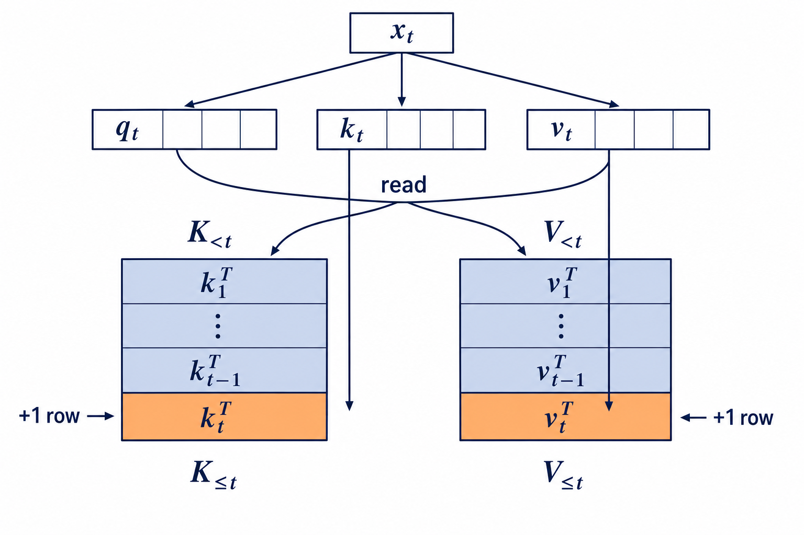
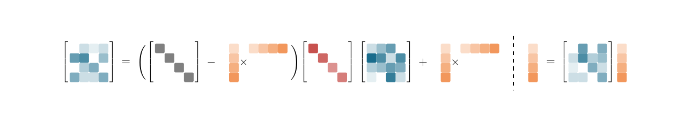

# Linear Attention: From DeltaNet to KDA

Why use linear attention? Start with how a standard decoder-only Transformer stores history during generation. For the hidden state $\mathbf x_t$ of token $t$, the attention layer uses three linear projections to produce $\mathbf q_t,\mathbf k_t$, and $\mathbf v_t$. The query is used only for the current read and is not written to the cache. The new key and value must remain available to every later token. The figure below uses the convention that each token occupies one matrix row: once the old cache has $t-1$ rows, $\mathbf k_t^\top$ and $\mathbf v_t^\top$ become row $t$ of $\mathbf K$ and $\mathbf V$, respectively. The KV cache therefore grows linearly with sequence length and creates substantial memory pressure.

*Figure 1: A new token produces the current query, key, and value. $\mathbf q_t$ only performs the read, while $\mathbf k_t^\top$ and $\mathbf v_t^\top$ each append one row to the existing cache. With a transposed implementation layout, the same operation appears as appending a column.*

Suppose the old cache contains $t-1$ rows. When a new token arrives, the complete update is

$$ \begin{aligned}
\mathbf q_t&=\mathbf x_t\mathbf W_Q,\qquad \mathbf k_t=\mathbf x_t\mathbf W_K,\qquad \mathbf v_t=\mathbf x_t\mathbf W_V,\\
\mathbf K_{\le t}&=\begin{bmatrix}\mathbf K_{<t}\\\mathbf k_t^\top\end{bmatrix},\qquad
\mathbf V_{\le t}=\begin{bmatrix}\mathbf V_{<t}\\\mathbf v_t^\top\end{bmatrix},\qquad
\mathbf o_t^\top=\operatorname{softmax}\!\left(\frac{\mathbf q_t^\top\mathbf K_{\le t}^\top}{\sqrt{d_k}}\right)\mathbf V_{\le t}.
\end{aligned} $$

The phrase "append one row" is the key to understanding the KV cache. At step $t$, the model computes only the new $\mathbf k_t$ and $\mathbf v_t$ instead of recomputing the first $t-1$ rows, but it must append both rows to the cache. When token $t+1$ arrives, its query reads all $t$ rows. Consequently, the cache of every layer and head grows as $O(L(d_k+d_v))$ with context length $L$, and the attention read for each new token also grows with $L$. During training or prefill, every query is paired with every key, giving leading compute $O(L^2d_k)$. FlashAttention reduces the memory traffic and materialization cost of the attention matrix, but it does not remove these token pairs or the growth of the KV cache.

Linear attention changes precisely this storage rule of "add one more K/V row for every token." A separable feature map $\phi$ allows the attention computation to be reassociated, so each new key-value pair can be merged immediately into the same fixed-size matrix state. The next image comes from the KDA paper. For now, ignore the detailed decay and erase gates; the important visual distinction is that the blue state matrix on the left is updated in place into the blue state on the right, rather than extended with another row along a time axis.

*Figure 2: cropped from [Section 3 of Kimi Linear](https://arxiv.org/abs/2510.26692v2). The blue matrix is the fixed-size state; orange vectors describe the current token's write and read operations.*

A new token no longer appends one row to K and another to V. Instead, the outer product $\phi(\mathbf k_t)\mathbf v_t^\top$ modifies the same $d_\phi\times d_v$ state. A query no longer scans all historical rows either; it multiplies the state directly. Normalized variants also maintain a fixed-size accumulation vector, but that vector likewise does not grow with $L$. For fixed channel dimensions, storage and single-step computation no longer depend on the number of previous tokens, so total computation is linear in $L$.

This change is also the source of the tradeoff. A Transformer retains the K/V row of every token and can access a particular historical position precisely. Linear attention makes all history share one finite state and is therefore **lossy fixed-state compression**. The DeltaNet family usually absorbs $\phi$ into $\mathbf q_t$ and $\mathbf k_t$. The rest of this post uses $\mathbf q_t,\mathbf k_t\in\mathbb R^{d_k}$, $\mathbf v_t,\mathbf o_t\in\mathbb R^{d_v}$, $\mathbf S_t\in\mathbb R^{d_k\times d_v}$, and the readout $\mathbf o_t=\mathbf S_t^\top\mathbf q_t$. For a chunk of length $C$, uppercase $\mathbf Q,\mathbf K\in\mathbb R^{C\times d_k}$ and $\mathbf V,\mathbf O\in\mathbb R^{C\times d_v}$ stack tokens by row.

Pure addition can only accumulate. If the state already records "key A maps to value 2" and later receives "key A now maps to value 8," it superposes the old and new answers instead of replacing the old one. The path from DeltaNet to Gated DeltaNet-2 answers three questions about a fixed state: how to overwrite an old association, how to execute many overwrites in parallel on a GPU, and how finely forgetting, erasing, and writing should be controlled.

## DeltaNet

Ordinary linear attention removes the growing KV cache, but exposes the first memory-management problem: its state can accumulate associations but cannot replace them. Suppose the state already stores “key A maps to 2,” and later the same key A maps to 8. An additive update superposes both writes. DeltaNet's central claim is: **do not write the new value unconditionally; first read the current answer, then write only the error between the new and old answers back to the same key address.**

Let $\mathbf S_{t-1}\in\mathbb R^{d_k\times d_v}$ be the state matrix. For the current key $\mathbf k_t\in\mathbb R^{d_k}$ and target value $\mathbf v_t\in\mathbb R^{d_v}$, the old state's prediction is

$$ \widehat{\mathbf v}_t=\mathbf S_{t-1}^\top\mathbf k_t. $$

The most direct local objective for making this prediction approach $\mathbf v_t$ is the squared error

$$ \mathcal L_t(\mathbf S)=\frac12\left\|\mathbf S^\top\mathbf k_t-\mathbf v_t\right\|_2^2. $$

This objective does not train the entire network; it explains how the current token edits the fast-weight state. Define $\mathbf e_t=\mathbf S^\top\mathbf k_t-\mathbf v_t$. A state element $S_{ab}$ affects the loss only through the term $S_{ab}k_{t,a}$ in output dimension $b$, so the matrix gradient is

$$ \nabla_{\mathbf S}\mathcal L_t=\mathbf k_t\left(\mathbf S^\top\mathbf k_t-\mathbf v_t\right)^\top=\mathbf k_t\mathbf e_t^\top. $$

Starting from $\mathbf S_{t-1}$, take one gradient step with the token-dependent write strength $\beta_t\in(0,1)$:

$$ \mathbf S_t=\mathbf S_{t-1}+\beta_t\mathbf k_t\left(\mathbf v_t-\mathbf S_{t-1}^\top\mathbf k_t\right)^\top. $$

This is the Delta Rule. The residual in parentheses answers “how wrong is the old answer?”, the left factor $\mathbf k_t$ answers “which address should change?”, and $\beta_t$ answers “how strong is this edit?” Here $\beta_t$ is not the optimizer's global learning rate. It is a per-token gate predicted by the slow network, commonly parameterized as $\beta_t=\sigma(\mathbf w_\beta^\top\mathbf x_t)$. Removing the old read $\mathbf S_{t-1}^\top\mathbf k_t$ reduces the rule to additive linear attention that writes without erasing.

Expanding the residual makes the erase-then-write structure explicit:

$$ \mathbf S_t=(\mathbf I-\beta_t\mathbf k_t\mathbf k_t^\top)\mathbf S_{t-1}+\beta_t\mathbf k_t\mathbf v_t^\top. $$

The first term erases the old read along the current key, and the second writes the new value along that same key. For any test direction $\mathbf x$,

$$ (\mathbf S_t-\mathbf S_{t-1})^\top\mathbf x=\beta_t\left(\mathbf v_t-\mathbf S_{t-1}^\top\mathbf k_t\right)(\mathbf k_t^\top\mathbf x). $$

If $\mathbf x\perp\mathbf k_t$, the right-hand side is zero, so this edit leaves that direction unchanged. If in addition $\|\mathbf k_t\|_2=1$, the new read at the current key is

$$ \mathbf S_t^\top\mathbf k_t=(1-\beta_t)\widehat{\mathbf v}_t+\beta_t\mathbf v_t. $$

Thus, with a normalized key, $\beta_t$ has an exact interpolation meaning. Without key normalization, the effective step becomes $\beta_t\|\mathbf k_t\|_2^2$, so an overly large key norm can cause excessive erasure.

A minimal calculation checks every quantity. Let $d_k=2,d_v=1$, $\mathbf S_{t-1}=[2,4]^\top$, $\mathbf k_t=[1,0]^\top$, $v_t=8$, and $\beta_t=0.25$. The old read is $2$, the residual is $8-2=6$, and the write-back is

$$ 0.25\begin{bmatrix}1\\0\end{bmatrix}6=\begin{bmatrix}1.5\\0\end{bmatrix},\qquad \mathbf S_t=\begin{bmatrix}3.5\\4\end{bmatrix}. $$

The current-key direction moves one quarter of the way from 2 toward 8, while the orthogonal direction remains 4. The 2021 paper directly tested this overwrite behavior with repeated-assignment tasks. On WikiText-103 small, the additive Linear Transformer obtained test PPL 38.3, the Delta Network 35.5, and the Transformer 34.1. The evidence supports “error-based writing improves over the corresponding additive update,” not “early DeltaNet already surpassed Transformers in general.”

DeltaNet still leaves two independent gaps. First, despite its appealing memory semantics, it must execute $\mathbf S_1\rightarrow\mathbf S_2\rightarrow\cdots$ sequentially and therefore underutilizes GPUs during training. Second, it edits only the direction hit by the current key; stale content unrelated to that key does not disappear proactively. The first gap leads to Parallel DeltaNet, and the second to Gated DeltaNet.

## Parallel DeltaNet

Parallel DeltaNet does not fix an inadequate memory rule; it fixes the inability to train that same rule efficiently. Computing every token's residual in parallel would be wrong, because residual $r$ must read the state after the first $r-1$ edits. If every position reads the chunk-entry state $\mathbf S_0$, the Delta Rule's model semantics change. The paper's central claim is therefore precise: **keep the token-by-token Delta update exactly unchanged, but rearrange the serial dependence inside a chunk into a few matrix multiplications and one unit-lower-triangular solve.**

Index local positions by $r=1,\ldots,C$ and define

$$ \mathbf A_r=\mathbf I-\beta_r\mathbf k_r\mathbf k_r^\top,\qquad \mathbf S_r=\mathbf A_r\mathbf S_{r-1}+\beta_r\mathbf k_r\mathbf v_r^\top. $$

Here $\mathbf A_r$ is the erase transition and the second term is the new write. The way to understand the later symbols is not to memorize the paper's final formula, but to ask what remains after composing $r$ affine maps. Expanding the first two steps gives

$$ \mathbf S_1=\mathbf A_1\mathbf S_0+\beta_1\mathbf k_1\mathbf v_1^\top, $$

$$ \mathbf S_2=\mathbf A_2\mathbf A_1\mathbf S_0+\mathbf A_2\beta_1\mathbf k_1\mathbf v_1^\top+\beta_2\mathbf k_2\mathbf v_2^\top. $$

The result naturally separates into “what remains of the entry state after consecutive erasures” and “what remains of the in-chunk writes after later erasures.” Define

$$ \mathbf S_r=\mathbf P^r\mathbf S_0+\mathbf H^r, $$

$$ \mathbf P^r=\mathbf A_r\mathbf A_{r-1}\cdots\mathbf A_1,\qquad \mathbf H^r=\sum_{i=1}^{r}\left(\mathbf A_r\cdots\mathbf A_{i+1}\right)\beta_i\mathbf k_i\mathbf v_i^\top. $$

For $i=r$, the empty product is the identity. $\mathbf P^r\in\mathbb R^{d_k\times d_k}$ transports the history entering the chunk, while $\mathbf H^r\in\mathbb R^{d_k\times d_v}$ accumulates in-chunk writes. They are not additional memories; they are the two unavoidable parts of the unrolled recurrence.

This alone is not enough. Explicitly constructing $\mathbf P^r$ and $\mathbf H^r$ for every $r$ still creates many small $d\times d$ matrices. Why look for a WY form? Every $\mathbf A_r$ is identity minus a rank-one term, and every write has $\mathbf k_r$ as its left factor. All changes therefore remain in the subspace spanned by the chunk's keys. The natural target is to store only the outer-product coefficients associated with those keys:

$$ \mathbf P^r=\mathbf I-\sum_{i=1}^{r}\mathbf k_i\mathbf w_i^\top,\qquad \mathbf H^r=\sum_{i=1}^{r}\mathbf k_i\mathbf u_i^\top. $$

The vectors $\mathbf w_r$ and $\mathbf u_r$ are not arbitrary auxiliaries. Coefficient matching forces their definitions so that the outer-product form remains valid after step $r$. Suppose $\mathbf P^{r-1}=\mathbf I-\sum_{i<r}\mathbf k_i\mathbf w_i^\top$. Then

$$ \begin{aligned}\mathbf P^r&=(\mathbf I-\beta_r\mathbf k_r\mathbf k_r^\top)\mathbf P^{r-1}\\&=\mathbf P^{r-1}-\mathbf k_r\left(\beta_r\mathbf k_r^\top\mathbf P^{r-1}\right).\end{aligned} $$

To keep the last term in the form $\mathbf k_r\mathbf w_r^\top$, its right factor must be

$$ \mathbf w_r^\top=\beta_r\mathbf k_r^\top\mathbf P^{r-1}, $$

or equivalently

$$ \mathbf w_r=\beta_r\left(\mathbf k_r-\sum_{i<r}\mathbf w_i(\mathbf k_i^\top\mathbf k_r)\right). $$

The write contribution obeys the analogous recurrence

$$ \mathbf H^r=\mathbf A_r\mathbf H^{r-1}+\beta_r\mathbf k_r\mathbf v_r^\top. $$

Substitute $\mathbf H^{r-1}=\sum_{i<r}\mathbf k_i\mathbf u_i^\top$ and collect the coefficient of the newly introduced $\mathbf k_r$:

$$ \begin{aligned}\mathbf H^r&=\mathbf H^{r-1}-\beta_r\mathbf k_r\mathbf k_r^\top\sum_{i<r}\mathbf k_i\mathbf u_i^\top+\beta_r\mathbf k_r\mathbf v_r^\top\\&=\mathbf H^{r-1}+\mathbf k_r\left[\beta_r\left(\mathbf v_r-\sum_{i<r}\mathbf u_i(\mathbf k_i^\top\mathbf k_r)\right)\right]^\top.\end{aligned} $$

Therefore

$$ \mathbf u_r=\beta_r\left(\mathbf v_r-\sum_{i<r}\mathbf u_i(\mathbf k_i^\top\mathbf k_r)\right). $$

$\mathbf u_r$ is called a pseudo-value because it is not the raw value. It has already subtracted the old read induced at the current key by earlier effective writes, so it carries both “write new content” and “cancel the old association.” $\mathbf w_r$ describes how the same edits erase the entry state. Both recurrences use $\mathbf k_i^\top\mathbf k_r$ because $\mathbf P$ and $\mathbf H$ are acted on by the same $\mathbf A_r$. If two keys are orthogonal, the inner product is zero and edit $r$ does not need to correct edit $i$.

A two-step example shows why a pseudo-value may contain negative components. Let $\mathbf k_1=\mathbf k_2=[1,0]^\top$, $\beta_1=1$, and $\mathbf v_1=[2,0]^\top$. Then let $\beta_2=0.5$ and $\mathbf v_2=[0,2]^\top$. The first step gives $\mathbf u_1=[2,0]^\top$. Because the two keys coincide,

$$ \mathbf u_2=0.5\left(\begin{bmatrix}0\\2\end{bmatrix}-\begin{bmatrix}2\\0\end{bmatrix}\right)=\begin{bmatrix}-1\\1\end{bmatrix}. $$

The effective value at that key becomes $\mathbf u_1+\mathbf u_2=[1,1]^\top$, exactly the 50% interpolation between the old and new values. The negative component is not “negative memory”; it is the cancellation required to overwrite the old answer.

At this point the $C$ vectors $\mathbf u_r$ and $\mathbf w_r$ are still recurrent in $r$. Why does a triangular system appear next? Quantity $r$ depends only on earlier positions $i<r$. Stacking these causal equations by row therefore produces a strictly lower-triangular coefficient matrix. Use the row-stacking convention

$$ \mathbf K[r,:]=\mathbf k_r^\top,\quad \mathbf V[r,:]=\mathbf v_r^\top,\quad \mathbf U[r,:]=\mathbf u_r^\top,\quad \mathbf W[r,:]=\mathbf w_r^\top, $$

where $\mathbf K,\mathbf W\in\mathbb R^{C\times d_k}$ and $\mathbf V,\mathbf U\in\mathbb R^{C\times d_v}$. Define

$$ \mathbf D=\operatorname{Diag}(\beta_1,\ldots,\beta_C),\qquad \mathbf G=\mathbf K\mathbf K^\top,\qquad \mathbf L=\operatorname{tril}(\mathbf D\mathbf G,-1). $$

Thus $L_{ri}=\beta_r\mathbf k_r^\top\mathbf k_i$ only when $i<r$. The matrix $\mathbf D$ must multiply the Gram matrix on the left because $\beta_r$ belongs to equation $r$ and scales row $r$; putting it on the right would incorrectly use $\beta_i$. Moving the recurrence for $\mathbf u_r$ to one side and transposing yields

$$ \mathbf u_r^\top+\sum_{i<r}\beta_r(\mathbf k_r^\top\mathbf k_i)\mathbf u_i^\top=\beta_r\mathbf v_r^\top. $$

This is exactly row $r$ of a matrix equation, so all recurrences become

$$ (\mathbf I+\mathbf L)\mathbf U=\mathbf D\mathbf V,\qquad (\mathbf I+\mathbf L)\mathbf W=\mathbf D\mathbf K. $$

For $C=3$, write $g_{ri}=\mathbf k_r^\top\mathbf k_i$:

$$ \mathbf I+\mathbf L=\begin{bmatrix}1&0&0\\\beta_2g_{21}&1&0\\\beta_3g_{31}&\beta_3g_{32}&1\end{bmatrix}. $$

The first row gives $\mathbf u_1^\top=\beta_1\mathbf v_1^\top$; the second subtracts position 1's influence from position 2; the third subtracts the influences of positions 1 and 2 from position 3. The triangular system introduces no new model computation. It only packages $C$ causal recurrences into an object that can be solved in batches. Let

$$ \mathbf T=(\mathbf I+\mathbf L)^{-1}\mathbf D. $$

Then

$$ \mathbf U=\mathbf T\mathbf V,\qquad \mathbf W=\mathbf T\mathbf K. $$

$\mathbf T\in\mathbb R^{C\times C}$ is neither a transpose symbol nor a learned parameter. $T_{ri}$ measures the contribution of raw key/value pair $i$ to effective coefficient $r$. The inverse is compact notation: implementations exploit the unit-lower-triangular structure of $\mathbf I+\mathbf L$ and use forward substitution rather than a general matrix inverse, leaving most work as matrix multiplication.

The compact factors can now be assembled into the chunk update. Since

$$ \mathbf P^C=\mathbf I-\mathbf K^\top\mathbf W,\qquad \mathbf H^C=\mathbf K^\top\mathbf U, $$

we obtain

$$ \begin{aligned}\mathbf S_C&=(\mathbf I-\mathbf K^\top\mathbf W)\mathbf S_0+\mathbf K^\top\mathbf U\\&=\mathbf S_0+\mathbf K^\top(\mathbf U-\mathbf W\mathbf S_0).\end{aligned} $$

Define the net update

$$ \mathbf R=\mathbf U-\mathbf W\mathbf S_0\in\mathbb R^{C\times d_v}. $$

Here $\mathbf U$ is the effective in-chunk write, while $\mathbf W\mathbf S_0$ is the old read that those edits must erase from this particular entry state. The exit state and all in-chunk outputs are

$$ \mathbf S_C=\mathbf S_0+\mathbf K^\top\mathbf R, $$

$$ \mathbf O=\mathbf Q\mathbf S_0+(\mathbf Q\mathbf K^\top\odot\mathbf M)\mathbf R. $$

$\mathbf Q\mathbf S_0$ reads history from before the chunk. $\mathbf Q\mathbf K^\top\odot\mathbf M$ computes causal in-chunk query-key correlations, and multiplying by $\mathbf R$ reads the net edits that have occurred so far. Tokens inside a chunk are therefore processed with large parallel matrix operations; only chunk exit states remain recurrent across chunks. Setting $C=1$ recovers token-by-token recurrence. An excessively large $C$ makes the $C\times C$ correlations and triangular solve expensive, so chunk size trades off parallelism, the local quadratic term, and hardware utilization.

The complexity follows directly from the shapes. Token-token correlations and the triangular path cost about $O(C^2d)$ per chunk, while interaction with the $d\times d$ state costs about $O(Cd^2)$. Across $L/C$ chunks,

$$ \frac LC\left[O(C^2d)+O(Cd^2)\right]=O(LCd+Ld^2). $$

“Parallel” does not imply fewer total FLOPs; the $Ld^2$ term remains. The main gain is replacing $L$ small serial state updates with about $L/C$ recurrent boundaries and mapping the in-chunk work to GPU-friendly GEMMs. The authors report roughly 4–36× speedups for their chunkwise kernel over their recurrent kernel, but this is not an end-to-end speedup over Transformers. Their 1.3B model is still about 19% slower than Transformer++ at 2K and about 28% faster at 16K. Chunkwise computation fits training and long-prompt prefill; during autoregressive decoding, where only one new token arrives, directly maintaining $\mathbf S_t$ is more natural.

Parallel DeltaNet has now solved “how to execute the Delta Rule efficiently” without changing its memory policy. Only the direction hit by the current key is overwritten; stale content unrelated to that key can still occupy the fixed state indefinitely. That is the problem addressed next.

## Gated DeltaNet

Parallel DeltaNet makes directional overwriting trainable at high throughput, but it does not answer when an old background should be cleared proactively. The Delta Rule is precise: it edits only the current-key direction. The cost is that when the topic changes, stale content in other directions remains in the limited state. A Mamba2-style scalar decay has the opposite bias: it can quickly shrink all history, but it cannot replace one association according to the old read at its key. Gated DeltaNet's core claim is: **let scalar decay perform global clearance and let the Delta Rule perform local correction; these are complementary memory operations, not competing ones.**

First decay the old state with a head-level retention rate $\alpha_t\in(0,1)$, then apply the same Delta correction to the decayed state:

$$ \widetilde{\mathbf S}_{t-1}=\alpha_t\mathbf S_{t-1},\qquad \widehat{\mathbf v}_t=\widetilde{\mathbf S}_{t-1}^\top\mathbf k_t, $$

$$ \mathbf S_t=\widetilde{\mathbf S}_{t-1}+\beta_t\mathbf k_t(\mathbf v_t-\widehat{\mathbf v}_t)^\top. $$

Combining the two gives

$$ \mathbf S_t=\alpha_t(\mathbf I-\beta_t\mathbf k_t\mathbf k_t^\top)\mathbf S_{t-1}+\beta_t\mathbf k_t\mathbf v_t^\top. $$

$\alpha_t$ answers “how much of this head's entire history should remain?”, while $\beta_t$ answers “how much should the current-key direction be rewritten?” If $\|\mathbf k_t\|_2=1$, every direction orthogonal to $\mathbf k_t$ is scaled by $\alpha_t$, while the current-key direction receives the extra factor $1-\beta_t$. This is the exact division of labor between global forgetting and directional erasure.

Why start with a scalar rather than a more expressive vector gate? The scalar is weaker expressively, but it commutes with every matrix:

$$ \prod_{r=1}^{C}\alpha_r(\mathbf I-\beta_r\mathbf k_r\mathbf k_r^\top)=\left(\prod_{r=1}^{C}\alpha_r\right)\prod_{r=1}^{C}(\mathbf I-\beta_r\mathbf k_r\mathbf k_r^\top). $$

The cumulative decay can be factored out of the WY/UT rank-one product, preserving almost all of Parallel DeltaNet's chunkwise structure. Replacing it immediately with an arbitrary diagonal matrix would generally make decay and the rank-one edit non-commutative and break that derivation. KDA's main algorithmic task is to handle exactly this difficulty.

The authors use three S-NIAH failure modes to show why the two operations are complementary:

| Method | Simple retention S1@8K | Heavy interference S2@4K | Complex value S3@2K |
|---|---:|---:|---:|
| DeltaNet | **98.8** | 18.6 | 47.0 |
| Mamba2 | 30.4 | 56.2 | 47.6 |
| Gated DeltaNet | 91.8 | **92.2** | **84.2** |

The authors point out that DeltaNet is best when a simple association should be retained for a long time without forgetting. Under heavy interference, it collides because it lacks global clearance. Complex values also require precise error-based writing, so decay alone is insufficient. GDN is stronger on average, but the drop on S1 from 98.8 to 91.8 also shows that an incorrect forgetting decision can damage useful memory. The 1.3B/100B-token experiments support that pure GDN is stronger overall than Mamba2 and DeltaNet while having similar training throughput to DeltaNet. Pure GDN still trails attention or hybrid models on real retrieval, so it improves fixed-state management without removing the capacity limit.

GDN's next bottleneck comes directly from its hardware-friendly scalar gate: every key channel within a head must decay at the same rate. It cannot keep some channels long-lived while refreshing others quickly. KDA turns this global forgetting decision into channel-wise forgetting.

## KDA

Gated DeltaNet can decide when an entire head should forget, but a single $\alpha_t$ forces all key channels in that head to have the same lifetime. One can picture a row of memory slots controlled by one master valve: closing it makes every slot forget quickly, while opening it makes every slot persistent. Kimi Delta Attention (KDA) makes the following claim: **give every key/state channel its own long-term retention rate, while constraining the transition to a diagonal-plus-rank-one form that remains efficiently parallelizable.**

Let $\boldsymbol\alpha_t\in(0,1]^{d_k}$ and define a diagonal decay on the key axis:

$$ \mathbf D_t=\operatorname{Diag}(\boldsymbol\alpha_t)\in\mathbb R^{d_k\times d_k}. $$

KDA first decays the old state channel by channel and then performs a Delta correction:

$$ \widetilde{\mathbf S}_{t-1}=\mathbf D_t\mathbf S_{t-1},\qquad \widehat{\mathbf v}_t=\widetilde{\mathbf S}_{t-1}^\top\mathbf k_t, $$

$$ \mathbf S_t=\widetilde{\mathbf S}_{t-1}+\beta_t\mathbf k_t(\mathbf v_t-\widehat{\mathbf v}_t)^\top. $$

Combining them yields

$$ \mathbf S_t=(\mathbf I-\beta_t\mathbf k_t\mathbf k_t^\top)\mathbf D_t\mathbf S_{t-1}+\beta_t\mathbf k_t\mathbf v_t^\top. $$

Two details are easy to misread. First, the quantity promoted to a vector is the long-term decay $\boldsymbol\alpha_t$; the active edit strength $\beta_t$ remains scalar. Second, $\mathbf D_t$ left-multiplies the state, so it controls key/state rows rather than gating individual value dimensions. Setting $\boldsymbol\alpha_t=\alpha_t\mathbf 1$ reduces KDA to Gated DeltaNet.

Why not simply replace GDN's scalar $\alpha_t$ with a vector and stop? In general,

$$ \mathbf D_t\mathbf k_t\mathbf k_t^\top\ne\mathbf k_t\mathbf k_t^\top\mathbf D_t. $$

Scalar decay factors out of a product of rank-one transitions, whereas diagonal decay becomes entangled with every erasure. KDA's key algorithmic contribution is not merely predicting a longer gate. It finds a change of variables that absorbs cumulative channel-wise decay into the two sides of the key, returning the recurrence to a generalized rank-one form that Parallel DeltaNet can handle.

Within a chunk, define cumulative retention

$$ \boldsymbol\gamma_r=\boldsymbol\alpha_r\odot\boldsymbol\alpha_{r-1}\odot\cdots\odot\boldsymbol\alpha_1, $$

and write

$$ \mathbf S_r=\operatorname{Diag}(\boldsymbol\gamma_r)\widehat{\mathbf S}_r. $$

Since $\operatorname{Diag}(\boldsymbol\gamma_r)=\mathbf D_r\operatorname{Diag}(\boldsymbol\gamma_{r-1})$, substitute this expression into the KDA recurrence and left-multiply by $\operatorname{Diag}(\boldsymbol\gamma_r)^{-1}$. Define

$$ \mathbf a_r=\mathbf k_r/\boldsymbol\gamma_r,\qquad \mathbf b_r=\boldsymbol\gamma_r\odot\mathbf k_r, $$

where multiplication and division are elementwise. The normalized recurrence becomes

$$ \widehat{\mathbf S}_r=(\mathbf I-\beta_r\mathbf a_r\mathbf b_r^\top)\widehat{\mathbf S}_{r-1}+\beta_r\mathbf a_r\mathbf v_r^\top. $$

What does this transformation accomplish? $\mathbf a_r$ is the write address with cumulative decay removed, while $\mathbf b_r$ is the erase/read direction carrying cumulative decay. They are no longer identical, but the transition is still identity minus rank one. Parallel DeltaNet's central machinery can therefore be reused: construct a strictly lower-triangular system from the causal inner products $\mathbf b_r^\top\mathbf a_i$, solve for pseudo-values and erase coefficients, and restore $\operatorname{Diag}(\boldsymbol\gamma_C)$ at the chunk boundary. This is an exact reparameterization of the same recurrence, not an approximation.

KDA can also be viewed as a constrained DPLR (Diagonal-Plus-Low-Rank) transition. $\mathbf D_t$ gives channels distinct lifetimes and the rank-one term edits the current key. KDA does not use two fully free low-rank factors because a general DPLR transition, although more flexible, needs more decay-adjusted correlation matrices, secondary chunking, and matrix multiplications. The authors report that their KDA kernel is about $1.98\times$ faster than their general-DPLR implementation at 64K. This is a kernel comparison, not the same multiplier for the full model.

Cumulative normalization has a clear cost. If some $\gamma_{r,j}$ becomes very small, $\mathbf k_r/\boldsymbol\gamma_r$ may overflow at low precision. The constrained DPLR structure reduces the number of paths that require stabilization but does not eliminate the division; practical implementations still need higher-precision accumulation or secondary chunking.

The complete Kimi Linear model is not pure KDA. It uses three KDA layers for every global MLA layer. The authors explicitly acknowledge that a fixed state still struggles with lossless arbitrary long-range retrieval, so KDA cheaply compresses most history while periodic MLA layers retain token-level global access. In the mixture-ratio ablation, pure MLA, 1:1, 3:1, 7:1, and 15:1 obtain validation PPL 5.77, 5.66, 5.65, 5.70, and 5.82. The 3:1 ratio is the best trade-off in that recipe, not a theoretical constant. Speed figures also need separate scopes: KDA-kernel speed, single-request decoding, and system throughput after spending saved KV-cache memory on larger batches are different measurements.

KDA answers “how quickly should different key channels forget?”, but one active Delta edit still has only one $\beta_t$: how much old association to erase and how much new value to write remain tied to the same scalar. Gated DeltaNet-2 separates these decisions.

## Gated DeltaNet-2

KDA's channel-wise gate controls long-term decay; it does not refine the current active edit. Using the same $\beta_t$ for both erase and write imposes two constraints. The model cannot erase an old association without writing the entire new value, and it cannot write only selected value channels without accepting the same erasure strength. Gated DeltaNet-2 (GDN2) claims that **long-term decay, reading and erasing an old association, and writing a new value are three distinct problems that should be controlled by gates on different axes.**

Keep KDA's per-key-channel decay

$$ \mathbf D_t=\operatorname{Diag}(\boldsymbol\alpha_t), $$

and define

$$ \mathbf e_t=\mathbf b_t\odot\mathbf k_t\in\mathbb R^{d_k},\qquad \mathbf z_t=\mathbf w_t\odot\mathbf v_t\in\mathbb R^{d_v}. $$

$\mathbf b_t\in[0,1]^{d_k}$ is the key/erase-side gate: it chooses which key channels participate when forming the old read to be erased. $\mathbf w_t\in[0,1]^{d_v}$ is the value/write-side gate: it chooses which new-value channels become the write target. The complete update has four steps:

$$ \overline{\mathbf S}_t=\mathbf D_t\mathbf S_{t-1},\qquad \mathbf r_t=\overline{\mathbf S}_t^\top\mathbf e_t, $$

$$ \boldsymbol\delta_t=\mathbf z_t-\mathbf r_t,\qquad \mathbf S_t=\overline{\mathbf S}_t+\mathbf k_t\boldsymbol\delta_t^\top. $$

In plain language: first decay the old state along the key channels; then use the gated erase key to read the old content that this edit intends to replace; subtract that read from the gated new value to obtain a residual; finally write the residual along the address specified by $\mathbf k_t$. Combining the four steps gives

$$ \mathbf S_t=(\mathbf I-\mathbf k_t\mathbf e_t^\top)\mathbf D_t\mathbf S_{t-1}+\mathbf k_t\mathbf z_t^\top. $$

The easiest point to misunderstand is the role of $\mathbf b_t$. It does not directly zero selected state rows. It changes how the old read $\mathbf r_t$ aggregates the key axis. The actual state change remains the rank-one outer product $\mathbf k_t(\mathbf z_t-\mathbf r_t)^\top$. The write address is still $\mathbf k_t$; GDN2 adds channel selection on the erase/read and value/write sides rather than replacing the rank-one edit with an arbitrary matrix update.

A two-dimensional example makes the axes explicit. Let the decayed state be $\overline{\mathbf S}_t=\begin{bmatrix}2&0\\0&1\end{bmatrix}$, with $\mathbf k_t=[1,0]^\top$, $\mathbf b_t=[0.5,1]^\top$, $\mathbf v_t=[4,6]^\top$, and $\mathbf w_t=[1,0.25]^\top$. Then

$$ \mathbf e_t=\begin{bmatrix}0.5\\0\end{bmatrix},\qquad \mathbf z_t=\begin{bmatrix}4\\1.5\end{bmatrix},\qquad \mathbf r_t=\overline{\mathbf S}_t^\top\mathbf e_t=\begin{bmatrix}1\\0\end{bmatrix}. $$

The residual is $\boldsymbol\delta_t=[3,1.5]^\top$, so

$$ \mathbf S_t=\begin{bmatrix}2&0\\0&1\end{bmatrix}+\begin{bmatrix}1\\0\end{bmatrix}\begin{bmatrix}3&1.5\end{bmatrix}=\begin{bmatrix}5&1.5\\0&1\end{bmatrix}. $$

$\mathbf b_t$ controls how much old content is read from the key axis, $\mathbf w_t$ determines which targets on the value axis enter the residual, and $\mathbf k_t$ selects the address receiving that residual. The three roles are not interchangeable.

The reduction relationships expose how the family is nested. If

$$ \mathbf b_t=\beta_t\mathbf 1_{d_k},\qquad \mathbf w_t=\beta_t\mathbf 1_{d_v}, $$

then $\mathbf e_t=\beta_t\mathbf k_t$ and $\mathbf z_t=\beta_t\mathbf v_t$, so GDN2 reduces to KDA. Further setting $\boldsymbol\alpha_t=\alpha_t\mathbf 1$ gives Gated DeltaNet, and setting $\alpha_t=1$ gives DeltaNet. This proves strict inclusion of the parameterizations; whether training can exploit the added freedom still requires empirical evidence.

Why can two vector gates remain parallelizable? Apply the same cumulative-decay normalization as KDA inside a chunk, defining $\overline{\mathbf k}_r=\mathbf k_r/\boldsymbol\gamma_r$ and $\overline{\mathbf e}_r=\boldsymbol\gamma_r\odot\mathbf e_r$. The recurrence becomes

$$ \widehat{\mathbf S}_r=(\mathbf I-\overline{\mathbf k}_r\overline{\mathbf e}_r^\top)\widehat{\mathbf S}_{r-1}+\overline{\mathbf k}_r\mathbf z_r^\top. $$

This is still a generalized rank-one recurrence, so Parallel DeltaNet's main chain—causal inner products, a unit-lower-triangular system, pseudo-values, and a chunk update—can be reused. The interference coefficient changes from $\mathbf k_r^\top\mathbf k_i$ to $\overline{\mathbf e}_r^\top\overline{\mathbf k}_i$, and the write and erase auxiliaries share the same triangular system. The full WY/UT derivation is not repeated here because its computational reason is the same as in Parallel DeltaNet.

The authors' ablation supports a role for both gates:

| Variant | Wiki PPL ↓ | S3@2K ↑ | Multi-key@4K ↑ | Real-retrieval avg. ↑ |
|---|---:|---:|---:|---:|
| Channel-wise $\mathbf w$, scalar $\mathbf b$ | 16.55 | 71.4 | 30.6 | 28.92 |
| Channel-wise $\mathbf b$, scalar $\mathbf w$ | 16.12 | 84.6 | 35.2 | 29.51 |
| **Channel-wise $\mathbf b$ and $\mathbf w$** | **15.90** | **89.8** | **37.8** | **29.88** |

The experiments suggest that key/erase-side selectivity provides the larger gain, with the value/write gate adding further improvement. The paper does not establish that any specific channel has a fixed semantic role. The extra expressivity is not free: on a single H100 with a 1.3B hybrid model, GDN2 is about 4.5% slower than KDA at 2K and 6.2% slower at 16K because vector gates live inside channel reductions and require a gate-aware backward pass and fused kernels. The current evidence is still limited to 1.3B/100B training and synthetic contexts up to 8K. It does not show that fixed states can preserve arbitrarily long histories without loss, nor does it establish final million-token serving latency.

## Conclusion

We can now answer the opening question directly. Linear attention replaces a KV cache that grows with the sequence by a fixed-size state, changing history from explicit per-token storage into lossy compression inside a finite matrix. The research line is therefore not merely a search for another linear formula. It asks how a finite state can be edited and forgotten, and how those operations can run efficiently on GPUs.

DeltaNet first fixes the inability of additive updates to replace an old answer: read the value at the current key and write only the residual. Parallel DeltaNet does not change this memory rule. It expands the affine recurrence, matches compact WY coefficients, and stacks causal dependencies into a unit-lower-triangular system so that the same semantics can be trained chunkwise. Gated DeltaNet adds a commuting scalar decay to combine global clearance with directional overwrite. KDA refines long-term decay to the key-channel level and uses cumulative-decay normalization to recover a generalized rank-one structure. GDN2 finally separates the erase/read and value/write sides of the active edit.

The main line can be compressed to

$$ \text{additive accumulation}\rightarrow\text{error-based overwrite}\rightarrow\text{chunkwise parallelism}\rightarrow\text{global forgetting}\rightarrow\text{channel-wise forgetting}\rightarrow\text{decoupled erase and write}. $$

What the authors establish most firmly is the algebraic relationship among the recurrences, Parallel DeltaNet's exact chunkwise equivalence, and kernel or training throughput under specific hardware configurations. Experiments support that finer control uses finite capacity more effectively under heavy interference and repeated overwrites, but they do not show that the capacity limit has disappeared. Kimi Linear still retains one global MLA layer for every three KDA layers, and strong GDN/GDN2 configurations often mix in sliding-window attention. The practical conclusion remains a division of labor: linear states provide cheap compression and most temporal mixing, while attention handles the parts that need precise token-level access.

## References

- [Linear Transformers Are Secretly Fast Weight Programmers (ICML 2021)](https://proceedings.mlr.press/v139/schlag21a.html)
- [Parallelizing Linear Transformers with the Delta Rule over Sequence Length (NeurIPS 2024)](https://proceedings.neurips.cc/paper_files/paper/2024/hash/d13a3eae72366e61dfdc7eea82eeb685-Abstract-Conference.html)
- [Gated Delta Networks: Improving Mamba2 with Delta Rule (ICLR 2025)](https://openreview.net/forum?id=r8H7xhYPwz)
- [Kimi Linear: An Expressive, Efficient Attention Architecture](https://arxiv.org/abs/2510.26692v2)
- [Gated DeltaNet-2: Decoupling Erase and Write in Linear Attention](https://arxiv.org/abs/2605.22791v1)
