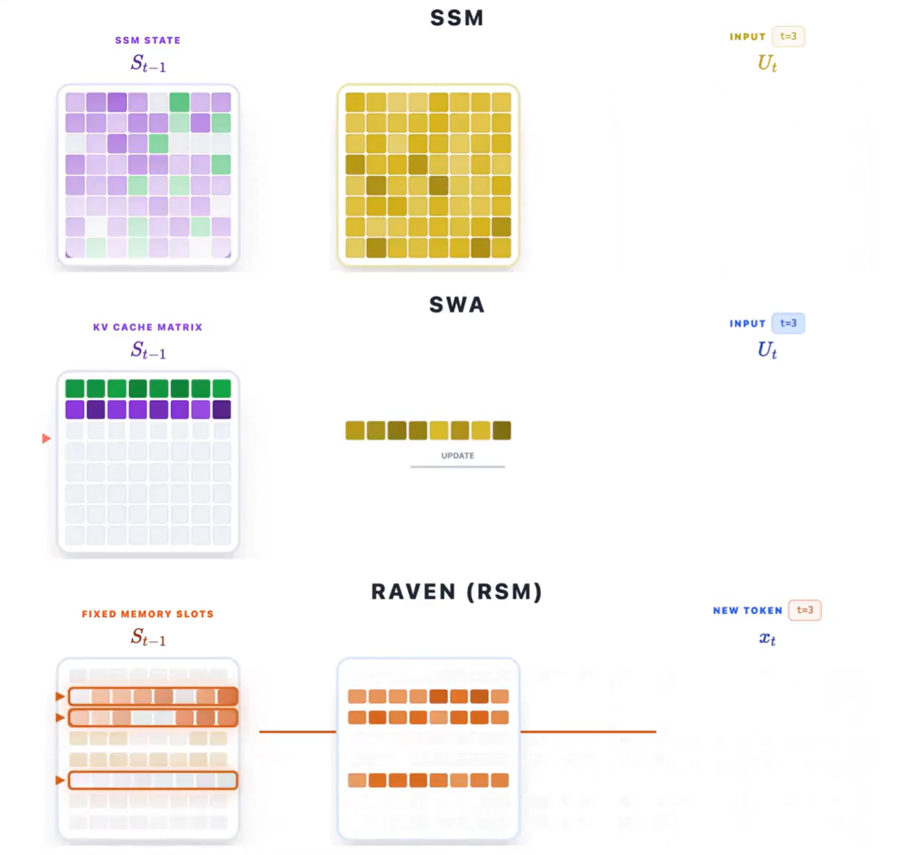

# Sparse Linear Attention: Viewing SWA from the Perspective of Linear Attention

Because linear attention contains decay factors, its context capability is usually limited to some extent, so it can be viewed as a kind of sliding-window attention (SWA) with a very long window. From another perspective, however, SWA can also be viewed as a highly discretized form of linear attention: the KV cache preserved by SWA can be regarded as a highly discretized state space in linear attention. Next, we discuss these two perspectives separately and introduce some related papers, such as Raven.

## Background: Linear attention

A normal linear state model maintains a fixed-size state matrix $\mathbf S_t$. When each new token arrives, the model first decays the old state, then writes new information using the outer product of the current key and value, and finally reads with the query:

$$ \mathbf S_t=\mathbf S_{t-1}\mathbf A_t+\mathbf v_t\mathbf k_t^\top,\qquad \mathbf o_t=\mathbf S_t\mathbf q_t. $$

Here, $\mathbf A_t$ controls how much historical information is retained, $\mathbf v_t\mathbf k_t^\top$ is responsible for writing, and $\mathbf q_t$ is responsible for reading. Starting from this fixed-state update, we can reinterpret SWA.

*Figure 1: An SSM densely updates the entire state, SWA updates one row of the KV cache in FIFO order, and Raven uses routing to select which fixed slots to update.*

## Viewing SWA from the linear-state perspective

In SWA, every time a token is added, one row is added to the KV cache while the other rows remain unchanged. If every row of the SWA KV cache is viewed as a slot, its update can be written as

$$ \mathbf S_t=(\mathbf 1-\mathbf e_t)\odot\mathbf S_{t-1}+\mathbf e_t\mathbf u_t^\top. $$

$\mathbf e_t$ is a periodically changing one-hot vector that selects only one row at a time: it clears the old K/V and writes the new token, while the remaining rows stay unchanged. Because only the KV cache inside the window remains visible, once the cache reaches the window length, the earliest content is removed. This is FIFO (first in, first out).

To make comparison with the state of linear attention convenient, let the window size be $d$. The KV cache is then fixed as a $d\times d$ state space. Therefore, the token written at step $t+1$ can be viewed as being written into the slot at row $t+1$, showing that writes to the state space are sparse.

## Viewing the linear state from the SWA perspective

Conversely, we can also use SWA-style slots to understand the linear-attention or SSM update above.

If we continue to view every row of $\mathbf S_t$ as a slot, SWA uses the one-hot vector $\mathbf e_t$ for writing, whereas $\mathbf v_t$ in a linear state is usually dense: every token writes to all slots simultaneously. $\mathbf A_t$ continuously decays the old state, so the contribution of historical tokens gradually becomes smaller instead of being removed all at once at the SWA window boundary. Therefore, linear attention with decay can be understood as a “soft SWA” with no hard boundary, whose window length is dynamically determined by the decay.

> Note that decay is not present in every linear-attention model; naive linear attention may simply accumulate the state.

## Sparse linear memory: The middle ground

We can therefore build an initial intuition: SWA updates one slot at each step, while traditional linear attention updates every slot at each step. Is there a compromise that preserves both the expressive capability of linear attention and the sparse updates of SWA?

This suggests updating only a subset of slots at each step, making updates to the state space sparse. This is where sparse linear memory comes from. There are many ways to select the slots, such as the $Top-K$ routing used by [Raven](https://goombalab.github.io/blog/2026/raven-part2/#from-framework-to-model) and the product-key used by [SDM](https://arxiv.org/abs/2607.07386). Suppose $K$ slots are selected. When $K=1$ and the selection rotates periodically with complete coverage, it reduces to SWA. When $K=M$, it approaches a dense SSM only in its write behavior. When $1<K<M$, it forms sparse linear memory between the two. It trades the complexity of a router and sparse kernels for less write interference and longer retention of important memories.

## Long-term questions for sparse linear memory

I still have some questions about this idea. Although sparse writes reduce interference, they do not remove finite capacity. Perhaps the method can extrapolate to 5M tokens, but what happens after that? Can a model obtain genuine long-context memory capability in this way?

In addition, the longer the text becomes, the more likely fixed slots are to collide. After the memory is expanded, the model must find the target with a limited read budget. A larger state space also greatly increases GPU-memory consumption and infrastructure requirements.

More fundamentally, writing happens before the future query, so the model cannot predict which ordinary token will become important later. The pattern is data-independent and already fixed during training. How can it continue learning instead of merely making the state larger?
