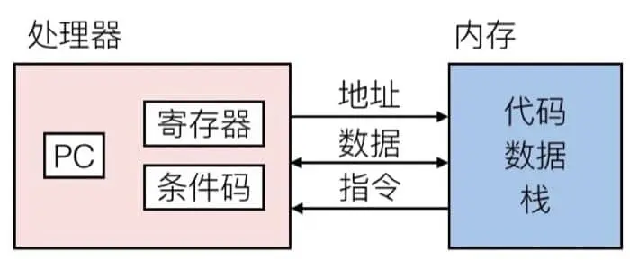

# Chapter 3 程序的机器级表示
## 3.1 发展历史
1978 年，Intel 发布了第一款 x86 指令集的微处理器——Intel 8086，以此拉开了 Intel x86 系列发展的序幕。IA32 是 x86-64 语言的 32 位前身，是 Intel 在 1985 年提出的。目前现有的 Intel 的大部分操作系统也可以向后兼容 IA32 机器语言。

#### 摩尔定律（Moore's Law）
是由 摩尔（Gordon Moore， Intel公司的创始人之一）在1965年提出的，他认为集成电路上可容纳的晶体管数目，约每隔18个月便会增加一倍，性能提升一倍。
- 摩尔定律在技术不断发展的当下被认为将会很快失效（截止2026.3.23）

## 3.2 程序编码
```
linux> gcc -Og -o p p1.c p2.c
```
What happens when we run the cmd above?

- -Og 参数表示编译器会使用符合原始C代码整体结构的机器代码，在编译时不会优化代码结构（如 -O1 -O2 -Ofast）
- **预处理:** 预处理器扩展源代码，插入用`#include`指定的文件，扩展用`#define`定义的宏
- **编译：** 编译器将预处理过后的文件编译为汇编代码，生成 `p1.s`和 `p2.s`
- **汇编：** 汇编器将汇编代码翻译为机器代码，生成*二进制目标代码文件* `p1.o`和 `p2.o`
- **链接：** 链接器可执行目标文件与实现库函数（如printf）的代码链接，生成*可执行文件* `p`

## 3.3 机器级代码
*指令集架构*（Instruction Set Architecture, ISA）是软件和硬件的*接口*，它为机器代码指令提供统一的格式和含义。

x86-64 就是现在 Intel 和 AMD 处理器广泛使用的指令集架构。

```
// 代码文件: sum.c
long plus(long x, long y);

void sumstore(long x, long y, long *dest)
{
    long t = plus(x, y);
    *dest = t;
}
```
对应的汇编代码：
```
sumstore:

    pushq   %rbx
    movq    %rbx, %rbx
    call    plus
    movq    %rax, (%rbx)
    popq    %rbx
    ret
```
在汇编代码中，第一个字符串叫做操作符，后面可能跟着 1/2/3 个以逗号分隔的操作数，为什么是以这样的形式呢？这就要从处理器的运算方式讲起了，先来看看处理器是如何配合内存进行计算的

- 程序计数器(PC, Program counter) - 存着下一条指令的地址，在 x86-64 中称为 RIP
- 寄存器(Register) - 用来存储数据以便操作
- 条件代码(Codition codes) - 通常保存最近的算术或逻辑操作的信息，用来做条件跳转
处理器能够执行的操作非常有限， 只有4种，分别是：**存储、读取、计算、跳转**，其中，存储和读取是在内存和寄存器之间进行的，计算是在寄存器或内存上进行的，跳转是改变程序计数器的值。

我们拿前面程序中的两条指令来具体说明一下从 C 到汇编再到机器代码的变化

```
// C 代码
*dest = t;

// 对应的汇编代码
movq    %rax, (%rbx)

// 对应的对象代码
0x40059e:   46 89 03
```
C 代码的意思很简单，就是把值 `t` 存储到指针 `dest` 指向的内存中。对应到汇编代码，就是把 8字节（也就是四个字, Quad words）移动到内存中（这也就是为什叫做 `movq`）。t 的值保存在寄存器 `%rax` 中，dest 指向的地址保存在 `%rbx` 中，而 `*dest` 是取地址操作，对应于在内存中找到对应的值，也就是 `M[%rbx]`，在汇编代码中用小括号表示取地址，即 `(%rbx)`。最后转换成 3 个字节的指令，并保存在 `0x40059e` 这个地址中。

> [!TIP] 如何展示程序（例如上面的mstore）的二进制目标代码
> 可以使用反汇编器确定改代码的长度是14字节，例如`linux> objdump -d mstore.o`
> 然后在mstore.o上运行GNU调试工具GDB，输入命令： `(gdb) x/14xb multstore`， `x`是显示的简写