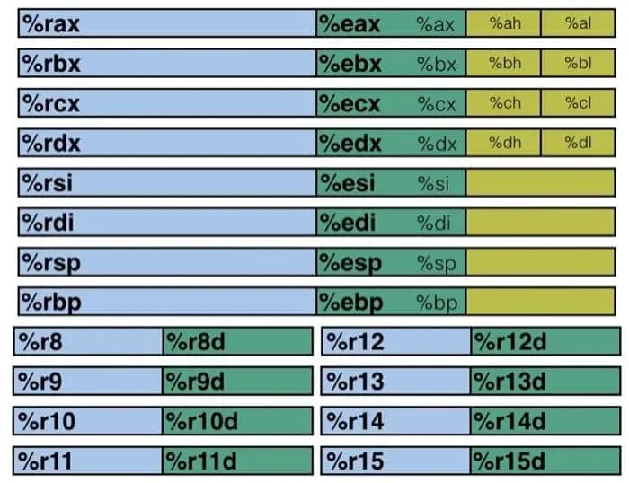
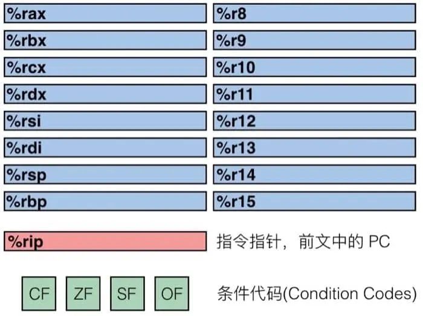
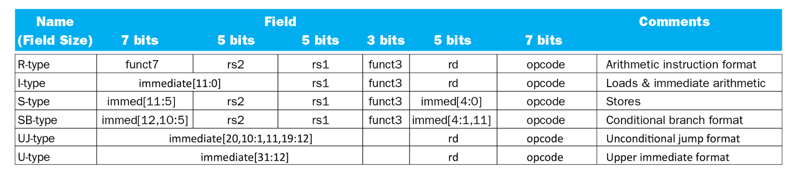

# Chapter 3 程序的机器级表示
## 3.1 发展历史
1978 年，Intel 发布了第一款 x86 指令集的微处理器——Intel 8086，以此拉开了 Intel x86 系列发展的序幕。IA32 是 x86-64 语言的 32 位前身，是 Intel 在 1985 年提出的。目前现有的 Intel 的大部分操作系统也可以向后兼容 IA32 机器语言。

#### 摩尔定律（Moore's Law）
是由 摩尔（Gordon Moore， Intel公司的创始人之一）在1965年提出的，他认为集成电路上可容纳的晶体管数目，约每隔18个月便会增加一倍，性能提升一倍。
- 摩尔定律在技术不断发展的当下被认为将会很快失效（截止2026.3.23）

## 3.2 程序编码
```
linux> gcc -Og -o p p1.c p2.c
```
What happens when we run the cmd above?

- -Og 参数表示编译器会使用符合原始C代码整体结构的机器代码，在编译时不会优化代码结构（如 -O1 -O2 -Ofast）
- **预处理:** 预处理器扩展源代码，插入用`#include`指定的文件，扩展用`#define`定义的宏
- **编译：** 编译器将预处理过后的文件编译为汇编代码，生成 `p1.s`和 `p2.s`
- **汇编：** 汇编器将汇编代码翻译为机器代码，生成*二进制目标代码文件* `p1.o`和 `p2.o`
- **链接：** 链接器可执行目标文件与实现库函数（如printf）的代码链接，生成*可执行文件* `p`

## 3.3 机器级代码
*指令集架构*（Instruction Set Architecture, ISA）是软件和硬件的*接口*，它为机器代码指令提供统一的格式和含义。

x86-64 就是现在 Intel 和 AMD 处理器广泛使用的指令集架构。

```
// 代码文件: sum.c
long plus(long x, long y);

void sumstore(long x, long y, long *dest)
{
    long t = plus(x, y);
    *dest = t;
}
```
对应的汇编代码：
```
sumstore:

    pushq   %rbx
    movq    %rbx, %rbx
    call    plus
    movq    %rax, (%rbx)
    popq    %rbx
    ret
```
在汇编代码中，第一个字符串叫做操作符，后面可能跟着 1/2/3 个以逗号分隔的操作数，为什么是以这样的形式呢？这就要从处理器的运算方式讲起了，先来看看处理器是如何配合内存进行计算的

- 程序计数器(PC, Program counter) - 存着下一条指令的地址，在 x86-64 中称为 RIP
- 寄存器(Register) - 用来存储数据以便操作
- 条件代码(Codition codes) - 通常保存最近的算术或逻辑操作的信息，用来做条件跳转
处理器能够执行的操作非常有限， 只有4种，分别是：**存储、读取、计算、跳转**，其中，存储和读取是在内存和寄存器之间进行的，计算是在寄存器或内存上进行的，跳转是改变程序计数器的值。

我们拿前面程序中的两条指令来具体说明一下从 C 到汇编再到机器代码的变化

```
// C 代码
*dest = t;

// 对应的汇编代码
movq    %rax, (%rbx)

// 对应的对象代码
0x40059e:   46 89 03
```
C 代码的意思很简单，就是把值 `t` 存储到指针 `dest` 指向的内存中。对应到汇编代码，就是把 8字节（也就是四个字, Quad words）移动到内存中（这也就是为什叫做 `movq`）。t 的值保存在寄存器 `%rax` 中，dest 指向的地址保存在 `%rbx` 中，而 `*dest` 是取地址操作，对应于在内存中找到对应的值，也就是 `M[%rbx]`，在汇编代码中用小括号表示取地址，即 `(%rbx)`。最后转换成 3 个字节的指令，并保存在 `0x40059e` 这个地址中。

> [!TIP] 如何展示程序（例如上面的mstore）的二进制目标代码
> 可以使用反汇编器确定改代码的长度是14字节，例如`linux> objdump -d mstore.o`
> 然后在mstore.o上运行GNU调试工具GDB，输入命令： `(gdb) x/14xb multstore`， `x`是显示的简写



观察寄存器的分布，我们可以发现有不同的颜色以及不同的寄存器名称，黄色部分是 16 位寄存器，也就是 16 位处理器 8086 的设计，然后绿色部分是 32 位寄存器（这里我是按照比例画的），给 32 位处理器使用，而蓝色部分是为 64 位处理器设计的。这样的设计保证了令人震惊的向下兼容性，几十年前的 x86 代码现在仍然可以运行！

前六个寄存器(%rax, %rbx, %rcx, %rdx, %rsi, %rdi)称为通用寄存器，有其『特定』的用途：

- %rax(%eax) 用于做累加
- %rcx(%ecx) 用于计数
- %rdx(%edx) 用于保存数据
- %rbx(%ebx) 用于做内存查找的基础地址
- %rsi(%esi) 用于保存源索引值
- %rdi(%edi) 用于保存目标索引值

而 `%rsp(%esp)` 和 `%rbp(%ebp)` 则是作为栈指针和基指针来使用的。下面我们通过 movq 这个指令来了解操作数的三种基本类型：**立即数(Imm)、寄存器值(Reg)和内存值(Mem)**。

### movq 与指针
对于 movq 指令来说，需要源操作数和目标操作数，源操作数可以是立即数、寄存器值或内存值的任意一种，但目标操作数只能是寄存器值或内存值。指令的具体格式可以这样写 `movq [Imm|Reg|Mem], [Reg|Mem]`，第一个是源操作数，第二个是目标操作数，例如：

- `movq Imm, Reg` -> `mov $0x5, %rax` -> `temp = 0x5`;
- `movq Imm, Mem` -> `mov $0x5, (%rax)` -> `*p = 0x5`;
- `movq Reg, Reg` -> `mov %rax, %rdx` -> `temp2 = temp1`;
- `movq Reg, Mem` -> `mov %rax, (%rdx)` -> `*p = temp`;
- `movq Mem, Reg` -> `mov (%rax), %rdx` -> `temp = *p`;
这里有一种情况是不存在的，没有 `movq Mem, Mem` 这个方式，也就是说，我们没有办法用一条指令完成内存间的数据交换。如果非要完成这个操作，需要借助寄存器，例如：
```
movq (%rax), %rdx
movq (%rbx), %rax
movq %rdx, (%rbx)
```

上面的例子中有些操作数是带括号的，括号的意思就是寻址，这也分两种情况：

- 普通模式，`(R)`，相当于 `Mem[Reg[R]]`，也就是说寄存器 R 指定内存地址，类似于 C 语言中的指针，语法为：`movq (%rcx), %rax` 也就是说以 `%rcx` 寄存器中存储的地址去内存里找对应的数据，存到寄存器 `%rax` 中
- 移位模式，`D(R)`，相当于 `Mem[Reg[R]+D]`，寄存器 R 给出起始的内存地址，然后 D 是偏移量，语法为：`movq 8(%rbp),%rdx `也就是说以 `%rbp` 寄存器中存储的地址再加上 8 个偏移量去内存里找对应的数据，存到寄存器`%rdx` 中


因为寻址这个内容比较重要，所以多说两句，不然之后接触指针会比较吃力。对于寻址来说，比较通用的格式是 `D(Rb, Ri, S) -> Mem[Reg[Rb]+S*Reg[Ri]+D]`，其中：

- `D `- 常数偏移量
- `Rb` - 基寄存器
- `Ri` - 索引寄存器，不能是 %rsp
- `S` - 系数
除此之外，还有如下三种特殊情况

- `(Rb, Ri) `-> `Mem[Reg[Rb]+Reg[Ri]]`
- `D(Rb, Ri)` -> `Mem[Reg[Rb]+Reg[Ri]+D]`
- `(Rb, Ri, S)` -> `Mem[Reg[Rb]+S*Reg[Ri]]`
我们通过具体的例子来巩固一下，这里假设 %rdx 中的存着 0xf000，%rcx 中存着 0x0100，那么

- `0x8(%rdx)` = `0xf000 + 0x8` = `0xf008`
- `(%rdx, %rcx)` = `0xf000 + 0x100` = `0xf100`
- `(%rdx, %rcx, 4)` = `0xf000 + 4*0x100` = `0xf400`
- `0x80(, %rdx, 2)` = `2*0xf000 + 0x80` = `0x1e080`

### 算术和逻辑操作
需要两个操作数的指令
```
addq Src, Dest -> Dest = Dest + Src
subq Src, Dest -> Dest = Dest - Src
imulq Src, Dest -> Dest = Dest * Src
salq Src, Dest -> Dest = Dest << Src
sarq Src, Dest -> Dest = Dest >> Src
shrq Src, Dest -> Dest = Dest >> Src
xorq Src, Dest -> Dest = Dest ^ Src
andq Src, Dest -> Dest = Dest & Src
orq Src, Dest -> Dest = Dest | Src
```
需要一个操作数的指令
```
incq Dest -> Dest = Dest + 1
decq Dest -> Dest = Dest - 1
negq Dest -> Dest = -Dest
notq Dest -> Dest = ~Dest
```

### 流程控制


## RISC-V 指令集
### 指令的表示
RISC-V的指令集的指令都可以表示成**32位**的机器码，例如对`add x9, x20, x21`这条指令，用机器码表示就是
```
0           21          20      0       9       51
0000000     10101       10100   000     01001   0110011
funct7      rs2         rs1     funtc3  rd      opcode
```
- `opcode`:操作码，指令的基本操作
- `rd`:谜底操作数寄存器，用来存放操作结果
- `funct3`:一个另外的操作码字段
- `rs1`:第一个源操作数寄存器
- `rs2`:第二个源操作数寄存器
- `funct7`: 一个另外的操作码字段

(在这里补充基本的RISC-V计算操作)

### 基本指令

### 逻辑控制指令
#### 条件操作
```
beq rs1, rs2, L1     如果(rs1==rs2)则转到L1语句
bne rs1, rs2, L1     如果(rs1!=rs2)则转到L1语句
// C 代码
if(i==j) f = g+h;
else f = g-h;
    f,g,... 把存在x19, x20, ...中

// RISC-V 代码
bne x22, x22 Else
add x19, x20, x21
beq x0, x0, Exit

Else: sub x19, x20, x21
Exits: ...
```
#### 循环语句
```
// C代码
while (save[i] == k) i += 1;
// i在x22中，k在x24中，save的地址在x25中

// RISC-V代码：
Loop:   slli x10, x22, 3
        add  x10, x10, x25         
        ld   x9, 0(x10)         
        bne  x9, x24, Exit

        addi x22, x22, 1     
        beq  x0, x0, Loop
Exit:...
```
编译器主要靠识别**基本块**来生成条件跳转指令，基本块是指，没有嵌入分支的连续指令序列，没有分支目标（除非在开头），它的特点是，只有第一个指令可能被跳转到，只有最后一个指令可能跳转到其他地方。  

更多的条件操作：
```
// 有符号   
blt rs1, rs2, L1 如果(rs1<rs2)则转到L1语句
bge rs1, rs2, L1 如果(rs1>=rs2)则转到L1语句
// 无符号
bltu rs1, rs2, L1 如果(rs1<rs2)则转到L1语句
bgeu rs1, rs2, L1 如果(rs1>=rs2)则转到L1语句
```
例子：
```
// C 代码
if (a > b) a+=1;
a保存在x22， b保存在x23

// RISC-V 代码
blt x22, x23, Else
addi x22, x22, 1
Else:
```

### 过程调用（函数调用）
- 过程调用：跳转和链接（jump and link）
`jal x1, ProcedureLabel` 将下一条指令的地址（PC+4）存入x1，然后跳转到目标地址处
- 过程返回：寄存器跳转和链接（jump and link register）
`jalr x0, 0(x1)` 类似jal，但跳转到0 + x1中保存的地址。在 RISC-V 中，x0 是一个特殊的“黑洞”寄存器，它的值永远是 0，写进去的任何数据都会被直接丢弃。

#### 叶子过程
```
// C 代码
long long int leaf_example (long long int g, long long int h,
	                long long int i, long long int j) 
     {
         long long int f;
         f = (g + h) - (i + j);
         return f; 
      }
参数 g, …, j 保存在 x10, …, x13 中
F 保存在 x20 中
x5, x6 保存临时变量
需要把 x5, x6, x20 存入栈中

// RISC-V 代码
leaf_example:
	addi sp,sp,-24   // sp为栈指针，要将3个寄存器存到栈中需要24个字节，所以sp减去24
	sd   x5,16(sp)   // 将x5存到栈中，地址为sp+16
	sd   x6,8(sp)    // 将x6存到栈中，地址为sp+8
	sd   x20,0(sp)   // 将x20存到栈中，地址为sp+0
	add  x5,x10,x11  // x5 = x10 + x11
	add  x6,x12,x13  // x6 = x12 + x13
	sub  x20,x5,x6
	addi x10,x20,0   // 执行函数运算
	ld   x20,0(sp)
	ld   x6,8(sp)
	ld   x5,16(sp)   // 将刚才存入栈的值重新存回寄存器
	addi sp,sp,24    // 回复栈顶位置
	jalr x0,0(x1)    // 结束函数调用，返回x1中保存的PC地址
```
要将x5,x6,x20移入栈中的原因是，这些寄存器中本来可能保存着调用该函数之前的某些值，直接修改可能会影响到调用该函数之前的某些值，所以需要将这些值存入栈中，等函数调用结束之后再将这些值从栈中恢复出来。


#### 非叶过程
对于非叶过程，调用者需要在栈中保存
- 它的返回地址（通常是 x1 寄存器）。
- 调用后还需要的任何参数和临时变量（如传入的参数 x10）。
- 当被调用的子过程执行完毕后，再从栈中恢复这些数据 。
```
// C 代码，阶乘函数
long long int fact (long long int n){
    if (n < 1) return 1; 
    else return n * fact(n - 1);  
}
传入的参数 n 保存在 x10 寄存器中，函数最终的计算结果（返回值）也存放在 x10 寄存器中
```
```
// RISC-V 代码
fact：              // 阶乘函数
    addi sp, sp, -16    // 开辟两个寄存器的空间
    sd   x1, 8(sp)      // 将返回地址（x1）保存到栈中
    sd   x10, 0(sp)     // 将当前的参数 n（x10）保存到栈中

    addi x10, x10, -1   // n = n - 1
    bge x5, x10, L1     // 如果 x5 >= 0(即x0)，则跳转到 L1继续递归

    addi x10, x0, 1     // 否则将返回值设为1
    addi sp, sp, 16     // 释放栈空间
    jalr x0, 0(x1)      // 根据x1中的地址，返回PC中的上一层调用

L1：
    addi x10, x10, -1   // 更新 n = n - 1
    jal x1, fact        // 递归返回 fact(n-1)

    // --- 此时子函数已返回，运算结果存在 x10 中 ---
    
    addi x6, x10, 0     // 将子函数返回的 fact(n - 1) 结果暂存到 x6
    
    ld   x10, 0(sp)     // 【恢复现场】从栈中读出原本存进去的 n，放回 x10
    ld   x1, 8(sp)      // 【恢复现场】从栈中读出原本存进去的返回地址，放回 x1 
    addi sp, sp, 16     // 释放当前层的栈空间（出栈），此处不需要保留原值 
    
    mul  x10, x10, x6   // 核心计算：返回值 = n * fact(n-1) 
    jalr x0, 0(x1)      // 带着最新计算的结果，返回上一层

```


### 字符数据操作
在计算机中，字符数据是按字节编码的。常见的字符集包括：
- ASCII：使用 8 位表示 128 个字符（包含 95 个可显示字符和 33 个控制字符）。
- Latin-1：使用 8 位表示 256 个字符，在 ASCII 基础上增加了 96 个可显示字符 。
- Unicode：32 位字符集，涵盖世界上大多数的字母表和符号，常用于 Java 和 C++ 的宽字符 。
- UTF-8 / UTF-16：Unicode 的变长编码实现方式

C 语言中的 char（字节）、short（半字）和 int（字）等不同大小的数据类型，在 RISC-V 中有专门的 Load/Store 指令来处理。

**从内存取数 (Load)**
由于 RISC-V 寄存器是 64 位的，当加载小于 64 位的数据时，需要进行位扩展：

**有符号数加载（符号扩展为 64 位并存入寄存器 rd）：**
- `lb rd, offset(rs1)`：读取 1 个字节 (Byte) 。
- `lh rd, offset(rs1)`：读取半字 (Halfword, 16位) 。
- `lw rd, offset(rs1)`：读取一个字 (Word, 32位) 。
**无符号数加载（零扩展为 64 位并存入寄存器 rd）：**
- `lbu rd, offset(rs1)`：读取无符号字节 。
- `lhu rd, offset(rs1)`：读取无符号半字 。
- `lwu rd, offset(rs1)`：读取无符号字 。

**向内存存数 (Store)**
将寄存器中的数据存入内存时，只会保存寄存器最右侧（低位）的对应位数，其余高位将被忽略 。
- `sb rs2, offset(rs1)`：保存最右端的 8 位 (1 字节) 。
- `sh rs2, offset(rs1)`：保存最右端的 16 位 (半字) 。
- `sw rs2, offset(rs1)`：保存最右端的 32 位 (字) 。

基于上面的内容，我们用字符串复制来看一下数(char)的存取，即按字节（即 C 语言中的 char）一个一个地从源字符串搬运到目标字符串，直到遇到结束符 \0（数值为 0）。

```
// C 代码


```
在编写RISC-V代码前，我们需要先规定需要使用到的寄存器及其角色
- `x10`：目标字符串 x[] 的基地址（指针）
- `x11`：源字符串 y[] 的基地址（指针）
- `x19`：用作数组下标 $i$（因为它是保存寄存器，用之前需要先压栈保护）
- `x5, x7`：计算出来的元素绝对内存地址
- `x6`：当前搬运的 char 字符数据

```
// RISC-V 代码
strcpy:
    add sp, sp, -8  //栈开辟一个寄存器的空间
    sd x19, 0(sp)        
    addi x19, x0, x0    // 将x19归零，用来存i
L1:                     // 进入while循环
    add x5, x11, x19     // 将y[i]的下表更新
    lbu x6, 0(x5)       // 将x5下标对应的y[i]元素存入x6
    addi x7, x10, x19    // 将x[i]的下标更新
    sb x6, 0(x7)        // 将x6里面存的char存入x7对应的内存地址中

    beq x6, x0, L2      // 如果y[i] == 0，退出

    addi x19, x19, 1    // i = i+1
    jal x0, L1          // while 循环的地址不用返回直接丢到x0就行
L2：    
    // 恢复栈指针
    ld x19, 0(sp)
    addi sp, sp, 8
    jalr x0, 0(x1) 
```

**指令中的32位常量**

因为 RISC-V 单条指令长度只有 32 位，装不下 32 位的数字，必须拆成 高 20 位 + 低 12 位 分批运送：
- 运送高 20 位：使用 `lui `指令，把数值塞进寄存器的 [31:12] 位。
- 运送低 12 位：使用 `addi` 指令，把剩下的数值累加到寄存器的低位上。

### RISC-V 中指令编码格式总结


### 数据竞争(Data Race)和同步
**数据竞争（Data Race）**：
多个处理器同时访问同一个内存位置，且至少有一个是写操作。结果取决于谁跑得快（不确定性），因此我们需要硬件级别的强制同步机制。

**原子操作（Atomic Operations）**

要解决上述问题，我们需要**“原子操作”。
“原子（Atom）”在古希腊语中意为“不可分割”。在计算机里，原子操作意味着“读、修改、写回”这三个步骤必须一气呵成，中间不能被任何人打断**。

实现原子操作通常有两种流派：

- 单一复杂指令：一条指令直接锁住总线，完成内存交换。
- 指令对（Load-Reserved / Store-Conditional）：RISC-V 采用的精简流派。

预留取数 和 条件存数
- ` lr.d rd, (rs1)` (Load-Reserved)

    动作：从内存地址 rs1 读出数据放到 rd。

    潜台词：“我在这放了个标记（预留），我待会还要回来写数据，谁也别动！”

- `sc.d rd, (rs1), rs2` (Store-Conditional)

    尝试把 rs2 的值写入内存地址 rs1。
    成功（返回 0）：如果从刚才 lr 标记后，没有任何人改过这个地址，那么写入成功。

    失败（返回 非0）：如果中间有其他处理器偷偷改了数据，那么写入失败!

例子
原子交换：
```
目标：把寄存器 x23 里的新值，和内存 (x20) 里的旧值互换。
again: 
  lr.d  x10, (x20)      # 从内存 (x20) 读出当前值（旧值），存到 x10 里。同时对这个内存地址进行“预留”标记。
  sc.d  x11, (x20), x23 # 把 x23 的新值尝试写入内存 (x20)。
                        #   - 硬件会自动检查标记。
                        #   - x11 会收到这次尝试的“执行状态反馈”（0 代表成功，非 0 代表失败）。
  bne   x11, x0, again  # 比较 x11 和 0 (x0)。
                        #  如果不相等，说明刚才存数失败了，被别人抢先修改了内存，那就乖乖跳转回 again 标签，从头再来一次。
  addi  x23, x10, 0     #  此时内存里已经是 x23 的新值了。我们再把刚才暂存在 x10 里的“旧值”复制回 x23 (x10 + 0 -> x23)。
```
加锁与解锁（Spinlock）
```
addi x12, x0, 1       # x12 = 1,手里先捏好一把“闭锁用的锁头”（数值 1）。

again:  lr.d x10, (x20)       # 看一眼锁现在的状态，存入 x10，并留下标记。
        bne  x10, x0, again   #  - 如果 x10 != 0（别人已经锁上了）,直接跳回 again 继续盯着（这叫“自旋等待”）。
                              #   - 如果 x10 == 0正好空闲，继续往下走。

        sc.d x11, (x20), x12  # 【步骤 3：抢占锁】既然刚刚看是空闲的，赶紧把我手里的 1 (x12) 塞进内存 (x20) 里去上锁！
                              #   - x11 记录这次抢占动作是成功 (0) 还是失败 (非0)。

        bne  x11, x0, again   # 【步骤 4：第二重检查 - 我抢赢了吗？】
                              #   - 虽然刚才看是空闲的，但可能在我动手塞 1 的那零点几纳秒里，被另一个处理器抢先塞了 1！
                              #   - 如果 x11 != 0 (写入失败，说明被截胡了)，郁闷地跳回 again 重新排队。
                              #   - 如果 x11 == 0，恭喜！这把锁彻底归我了，接下来可以安心执行我的私密代码了。
```